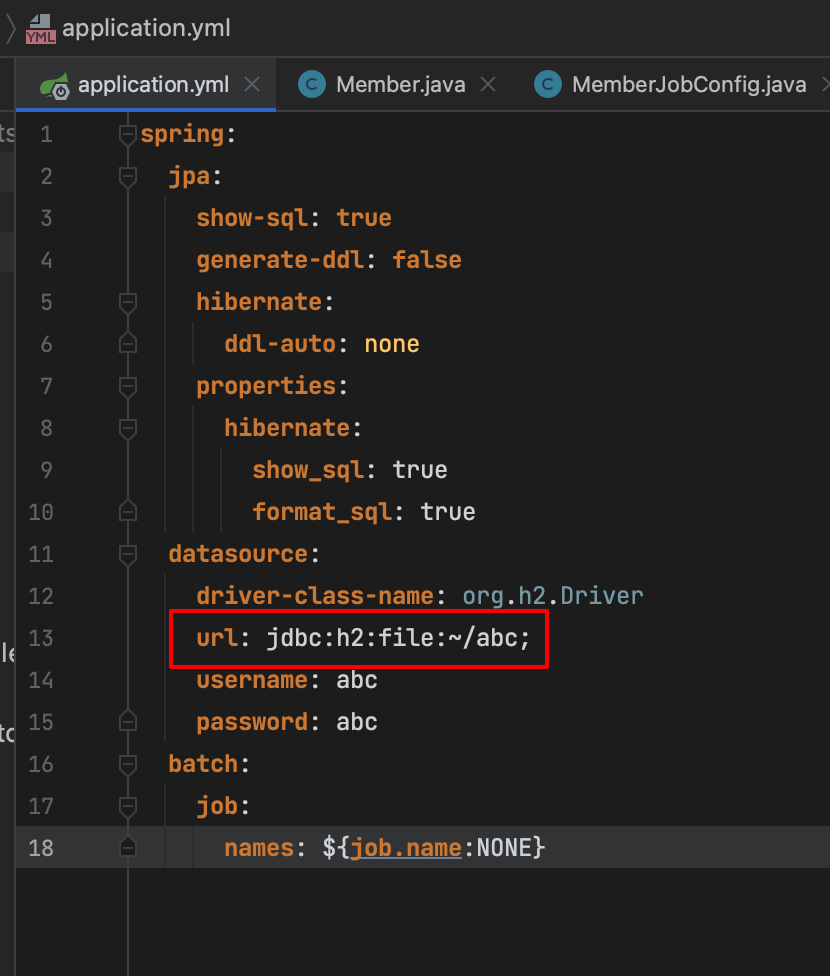
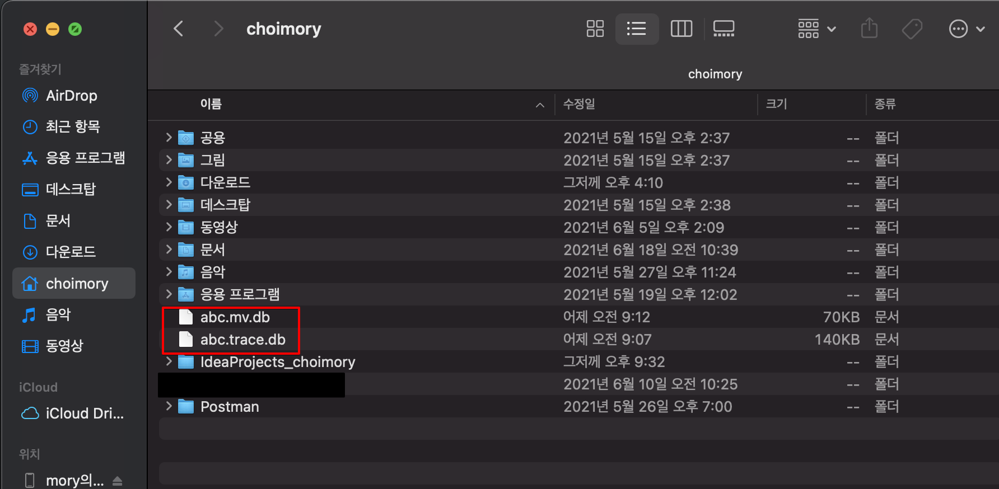

# 개요

- 간단하게 개발용으로 H2를 사용하고 싶은데 앱이 종료될때 마다 휘발되는것이 곤란할때, 파일형태로 저장하여 휘발되지 않는 H2를 사용할 수 있음

# 사용법

- `jdbc:h2:file:경로/스키마명;`
    - 예: `jdbc:h2:file:~/abc;`

# 사용시

- 사용하게 되면 작성한 경로및에 `스키마명.trace.db`와 `스키마명.mv.db` 파일이 생성됨