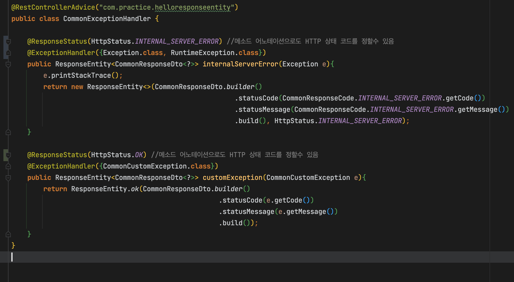

# 개요

- Exception Handler를 작성하여 패키지범위별로 해당 패키지 내에서 이루어지는 예외들을 전역적으로 캐치하여 핸들링 하여 응답 할 수 있음

# 예시

# 특정 경로의 예외를 책임질 클래스임을 지정

- 클래스에 `@ControllerAdvice("패키지경로")`, `@RestControllerAdvice("패키지경로")`를 사용하여 특정 경로의 예외를 담당할 클래스임을 지정한다
- `@ControllerAdvice`는 @Controller에 대응하는 어노테이션으로 View를 리턴, `@RestControllerAdvice`는 @RestController에 대응하는 어노테이션으로 JSON를 리턴한다.

# 특정 예외를 책임질 메소드임을 지정

- 메소드에 `@ExceptionHandler({예외클래스.class...})`를 붙여줌으로써 해당 예외를 해당 메소드에서 처리하도록 할 수 있다

# HTTP 상태코드 지정

- 메소드에 `@ResponseStatus(상태코드)`를 붙여줌으로써, 어노테이션으로 해당 메소드 응답의 상태코드를 정해줄수도 있다