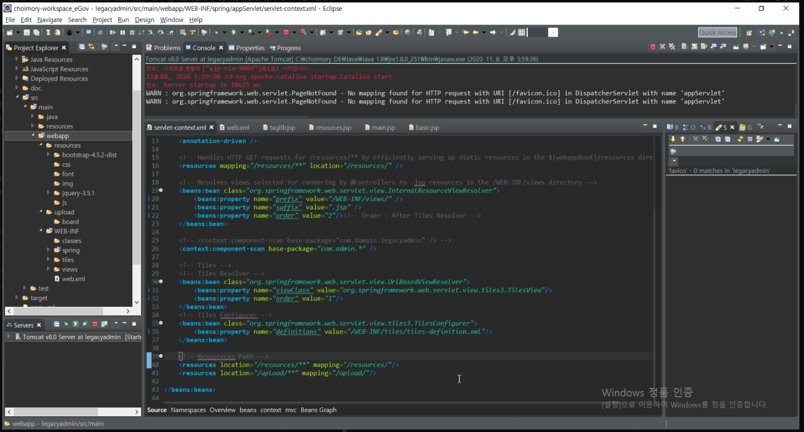
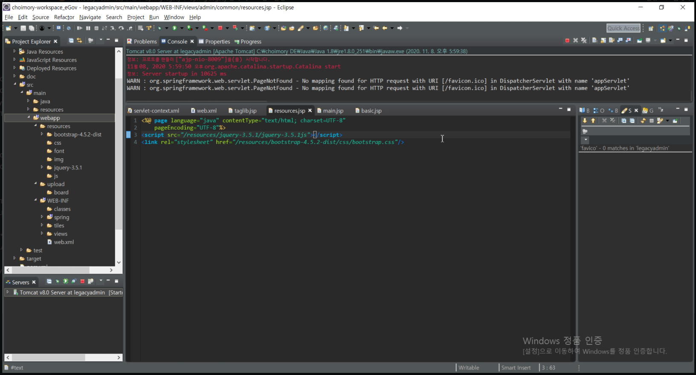

# **개요**

- 정적 리소스 css, js, img, font 등 정적 리소스 파일들은 빌드 대상에서 제외되며, 이에 따라 물리적 파일들이 보통 프로젝트 밖에(소스코드들 한단계 위에) 위치됨
    - Spring으로 치면 webapp와 WEB-INF 사이에 위치함
        - webapp은 최상위루트, WEB-INF은 빌드가 필요한 파일들
        - webapp
        - webapp/resources/js, css, img, font..
        - webapp/upload/board, gallery...
        - webapp/WEB-INF/classes, spring, tiles-def, views...
        - webapp/WEB-INF/views/main, board, mypage...
- Spring legacy에서 WEB-INF 상위에 위치하고 있는 이 정적 리소스들은, 경로를 별도로 서블릿 컨테이너에 따로 설정해주어야 인식할 수 있음. (같은 WEB-INF보다 한단계 위에 있기 때문에)

# **Servlet-context.xml**

