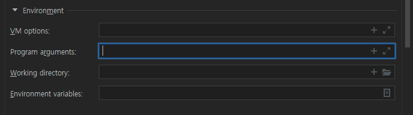

# 개요

- `VM options`: JVM이 앱을 구동시키면서 참고할 옵션
- `Program arguments`: 자바 메인메소드의 String[] args에 바인딩 될 파라미터
- `Environment variables`: 앱 구동시 OS의 환경변수에 더해서 지정하는 옵션
- 우선순위: `Program arguments` > `VM options` > `Environment variables`

# VM Options

- 앞에 `-D`를 붙이고 작성 (e.g. `-Dspring.profiles.active=real`)
- 도커파일에 이 옵션을 사용하여 이미지를 생성할 수 있음

# Program Arguments

- 앞에 `--`를 붙이고 작성 (e.g. `--job.name=mybatch`)

# Environment Variable

- `;`를 구분자로 여러개 작성 가능 (e.g. `spring.active.profiles=dev;job.name=mybatch;`)
- 도커 이미지를 run할시 이 옵션을 사용하여 이미지를 구동할 수 있음

# 참고

- [https://yangbox.tistory.com/44](https://yangbox.tistory.com/44)