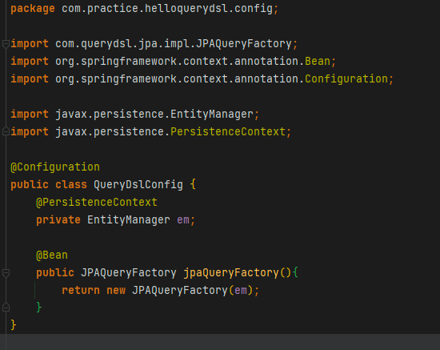
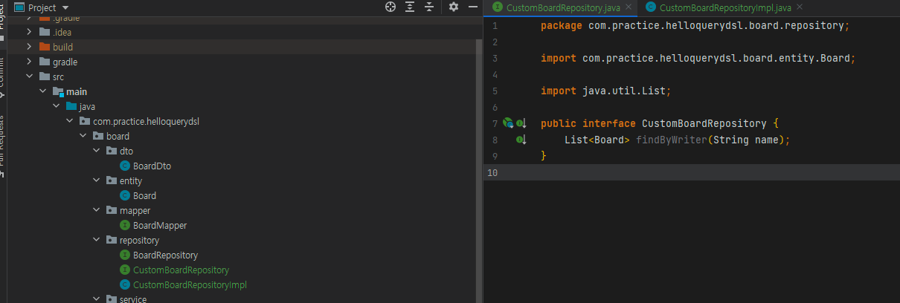
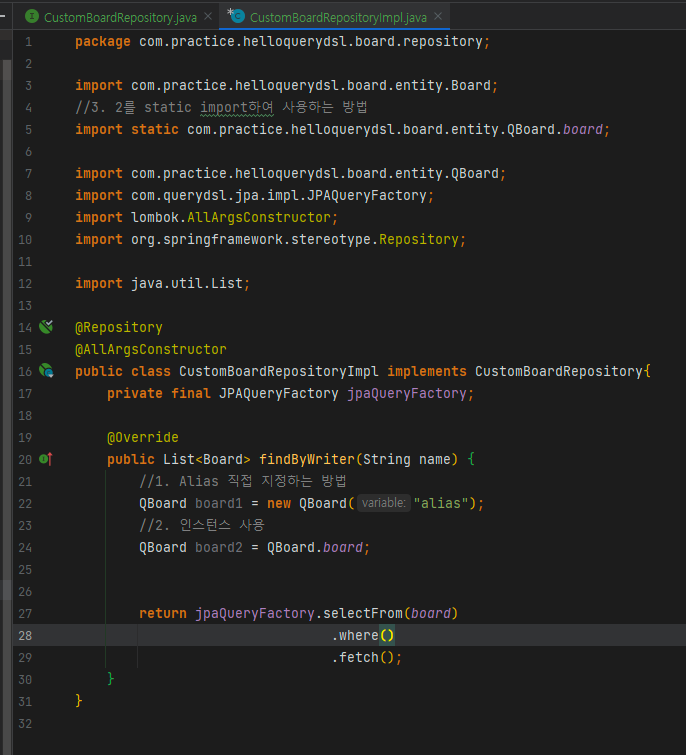
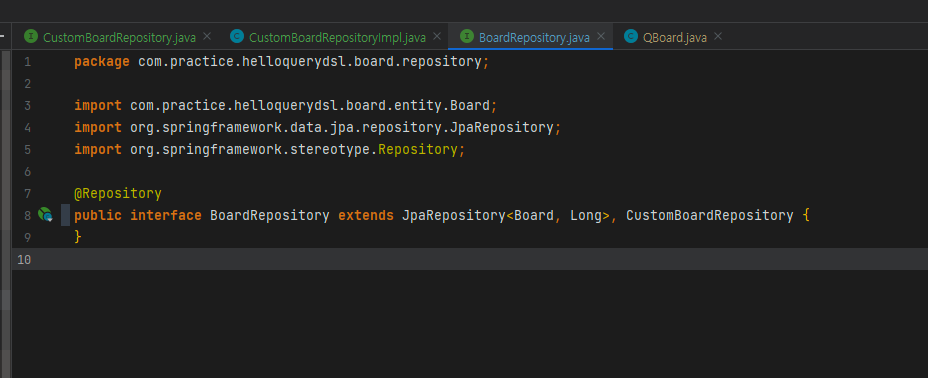

# 개요

- 라이브러리 추가
- 쿼리팩토리 인스턴스 생성 설정 작성
- 리포지토리 커스텀과 구현클래스 작성
    - 구현클래스에 QueryDsl 제공 클래스와 쿼리팩토리 필드선언
- 서비스에서 호출하여 사용

# 라이브러리 추가

## Gradle

```jsx
dependencies {
    implementation 'com.querydsl:querydsl-jpa:4.2.2'
    implementation 'com.querydsl:querydsl-core:4.2.2'
    implementation 'com.querydsl:querydsl-apt:4.2.2'
    annotationProcessor 'com.querydsl:querydsl-apt:4.2.2:jpa'
    annotationProcessor 'jakarta.persistence:jakarta.persistence-api'
    annotationProcessor 'jakarta.annotation:jakarta.annotation-api'
}
```

## Maven

- 생략

# @Configuration



# Repository 작성

## 빌드하여 QEntity 생성


- QueryDsl을 사용할때 쿼리타입이라는 클래스가 사용되는데 이건 빌드시 자동 generate되는 클래스임.

## 기본 사용법

- 별도로 상세작성

## Spring Data JPA의 CustomRepository 이용법



- Custom엔티티명Repository 인터페이스 작성



- Custom엔티티명Repository 구현 클래스 작성
- 쿼리 날릴때 쿼리타입(Q엔티티) 인스턴스를 인자로 제공해야하는데 3가지 방법이 있음
    - new 연산자로 alias를 직접 지정하여 생성
    - 기본 인스턴스 사용
    - 기본 인스턴스를 static import하여 사용

  

- Custom엔티티명Repository 다중상속
- 서비스에서 호출하여 사용