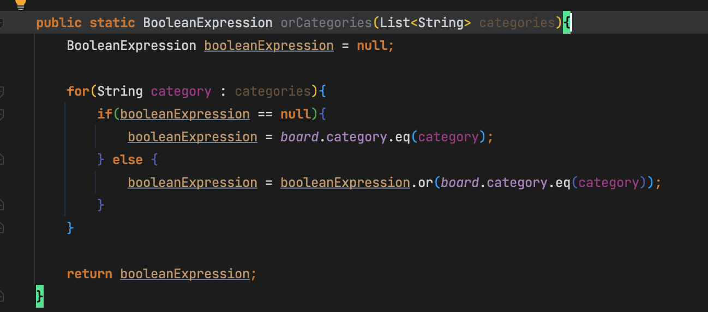

# 개요

- WHERE 컬럼1=파라미터1 or 컬럼1=파라미터2 or 컬럼1=파라미터3...하고 싶을때
    - 참고로 IN은 or가 아닌 and의 반복이다

# 사용법



```java
public BooleanExpression 메소드명(컬렉션 파라미터){
	BooleanExpression booleanExpression = null;

	for(String 파라미터 : 파라미터 컬렉션){
		if(booleanExpression == null){
			booleanExpression = Q엔티티.조건
		} else {
			booleanExpression = booleanExpression.or(Q엔티티.조건)
		}
	}

	return booleanExpression;
}
```

- null로 BooleanExpression 변수를 선언해놓는다
- 컬렉션의 매개변수를 반복 돌려서 booleanExpression = booleanExpression.or(조건)
    - 첫번째 반복때는 booleanExpression변수가 null이므로 npe를 피하기 위해 널체크
    - 인스턴스 생성을 위해 booleanExpression = 조건