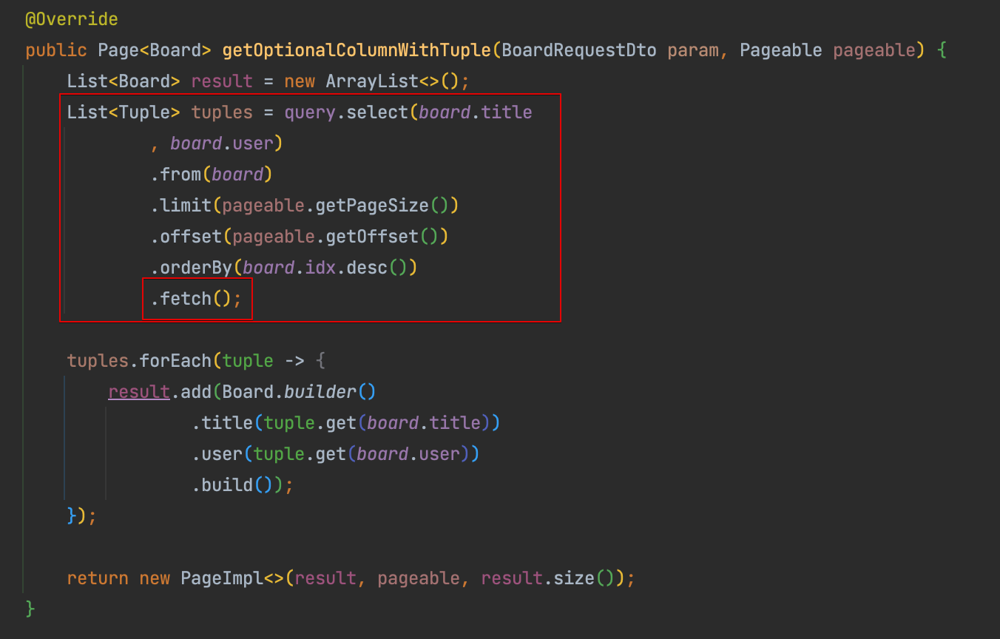
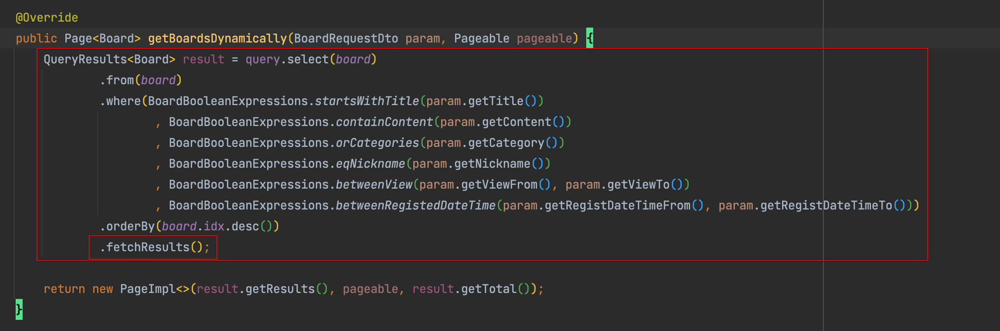
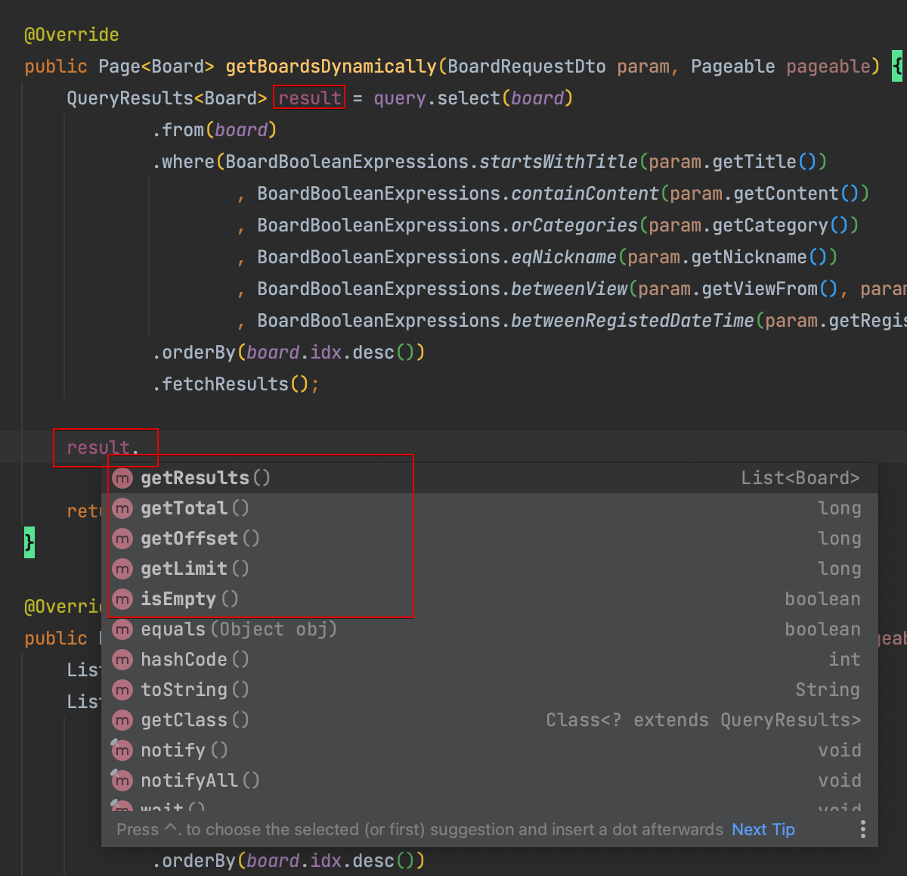
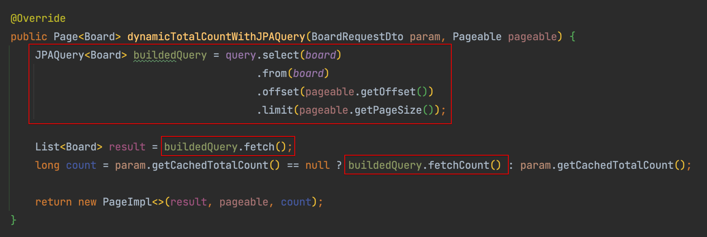

# 개요

- QueryDsl에서 JPAQueryFactory를 통해 쿼리를 작성 및 수행할때 리턴받을수 있는 여러 타입들에 대해 알아봄

# 요약

- List<T> : fetch()를 통해 content만 받음
- QueryResults<T> : fetchResults()를 통해 content 및 count()를 받음
- JPAQuery<T> : fetch()를 실행하지 않아, 쿼리가 수행없이 완성만 되있는 상태.

# List<T> - fetch()

- fetch()를 호출하는것으로 쿼리를 수행할경우 오롯이 결과타입만을 반환받을 수 있다
- count() 조회없이 레코드만을 조회한다

# QueryResults<T> - fetchResults()

- fetchResults()를 호출하는것으로 쿼리를 수행할경우, 결과 컬렉션 외에도 totalCount, offset, limit, empty 여부 등도 제공해주는 QueryResults<T> 객체를 반환받는다
- count 정보도 제공해주는만큼 fetchResults()를 호출하면 결과조회 외에 count() 조회 쿼리도 수행하게 된다

# JPAQuery<T>

- JPAQuery<T>는 단순 쿼리문이다
- 쿼리를 작성만 하고 수행은 하지 않은 상태이다
- 작성된 쿼리로 결과만 조회할지, 카운트만 조회할지, 둘 다 조회할지를 선택하여 수행할 수 있다