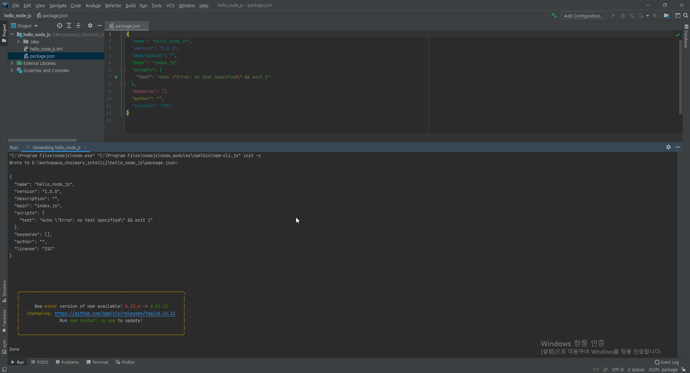
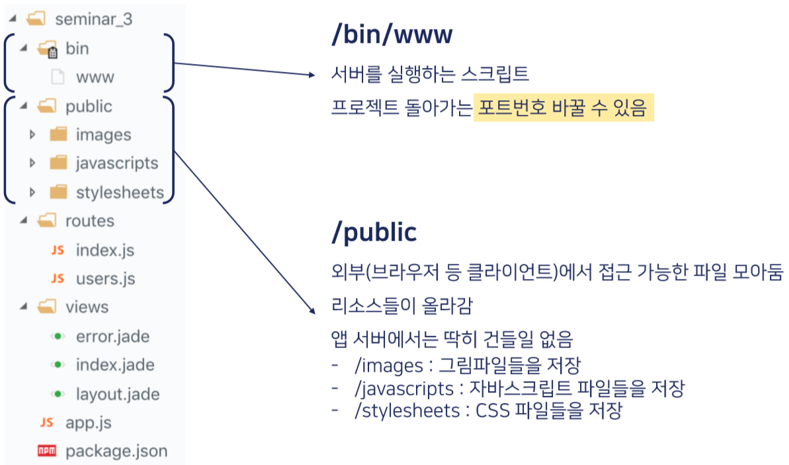
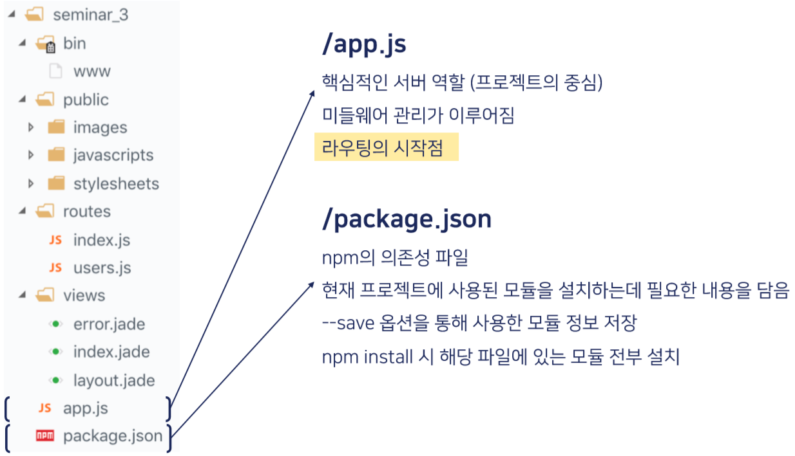
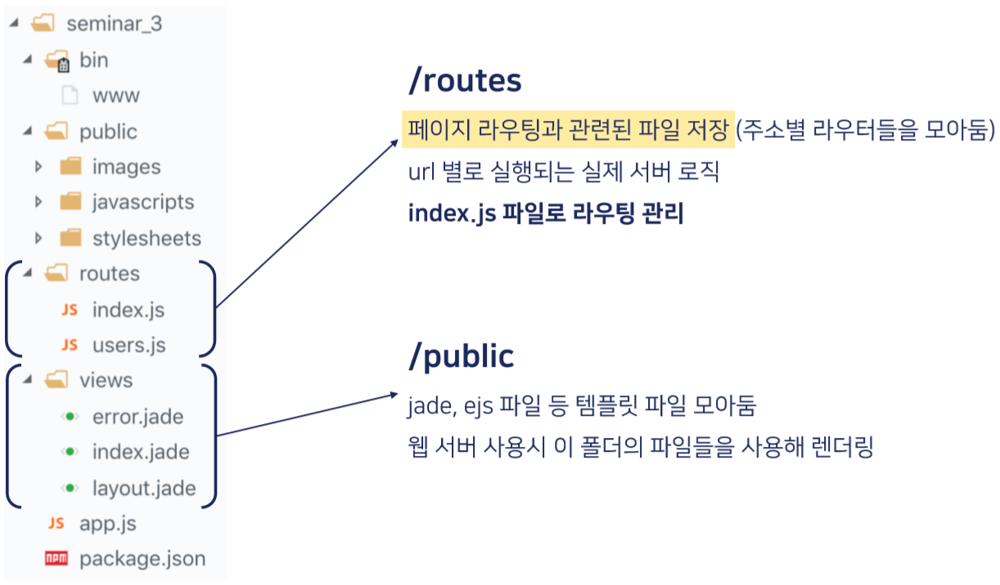
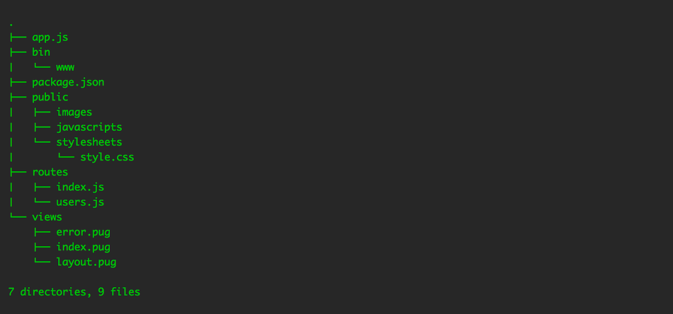

# 프로젝트 첫 생성시

프로젝트 첫 생성시엔 아무것도 없음. 기본 구조조차 제공해주지 않음. 거의 java 프로젝트 생성하는 수준. 그래서 보통 추가 프레임워크인 express.js나 nest.js를 추가로 가져가서 해당 프레임워크로 프로젝트를 생성함.

# 기본적인 express.js 구조

## 참고#1

[https://aonee.tistory.com/26](https://aonee.tistory.com/26)

## 참고#2

[https://jinbroing.tistory.com/106](https://jinbroing.tistory.com/106)