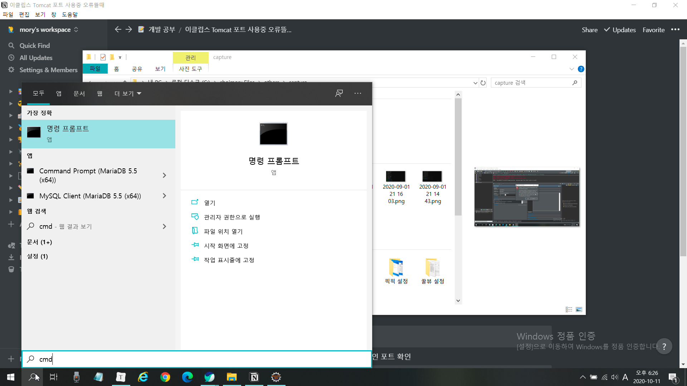
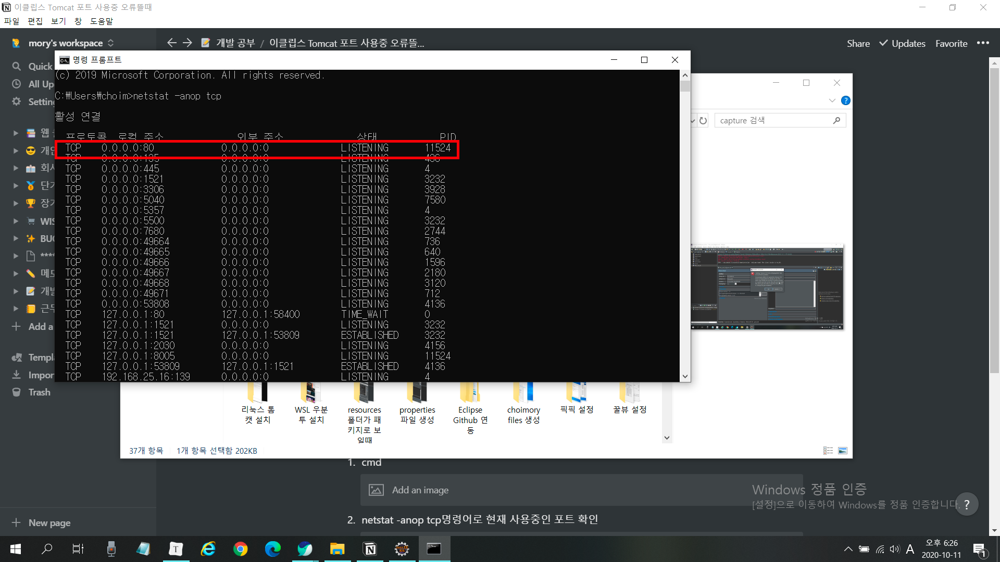
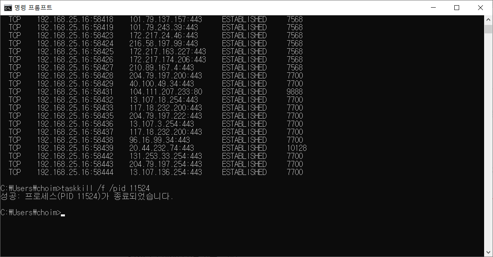

# 오류 메시지

> Several ports (8005, 8080, 8009) required by Tomcat v7.0 Server at localhost are already in use. 이하 생략

# 요약

톰캣서버를 가동했는데 이미 사용중인 포트라면서 포트 충돌로 오류가 나는 상황. 톰캣을 종료했는데도 오류가 난다면, 종료했음에도 프로세스에 좀비프로세스가 살아서 돌고 있기 때문에 나는 오류. 해당 프로세스를 완전히 죽여주면 됨

# 해결방법

## cmd에서 콘솔 명령어를 날려 포트 사용 제거

1. cmd

   

2. netstat -anop tcp명령어로 현재 사용중인 포트 확인

   

3. taskkill /f /pid [pid번호] 명령어로 해당 포트 제거

   