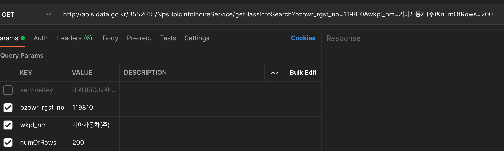
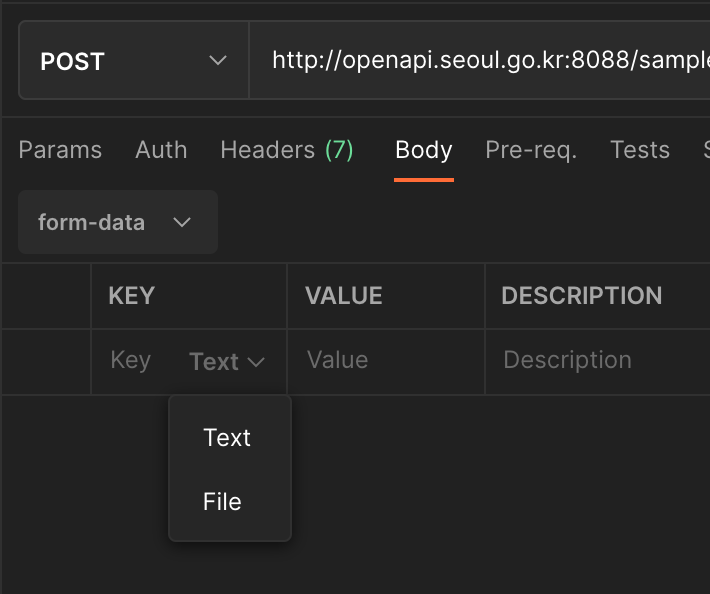
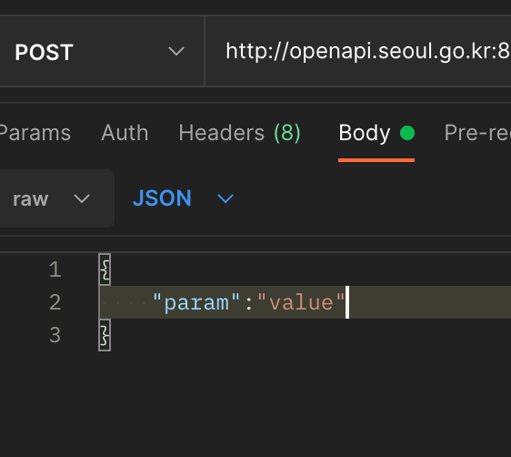
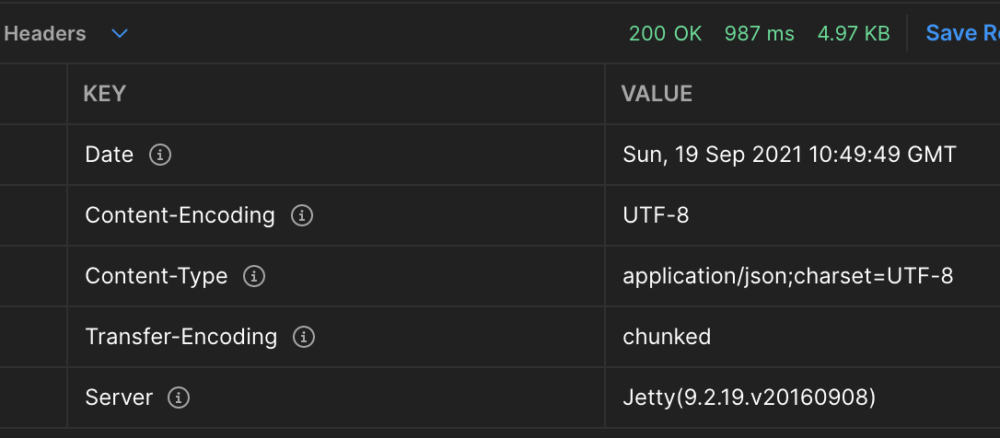
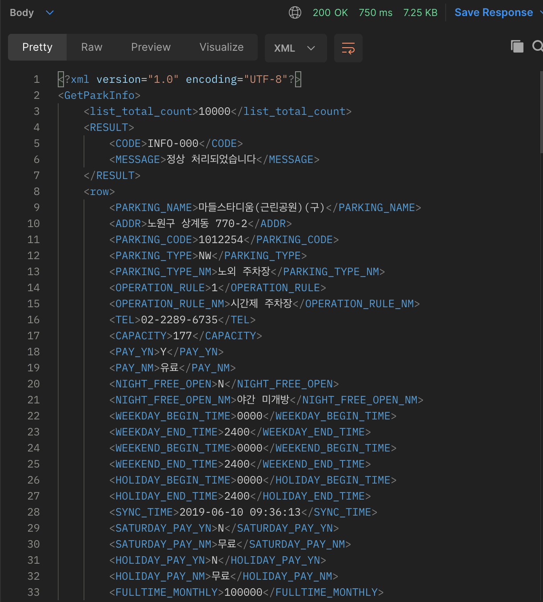
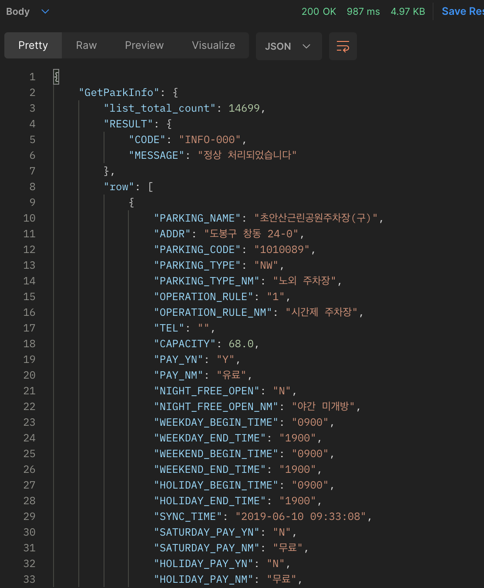

# 개요

- HTTP 요청 및 응답에서의 요소들을 알아봄

# Request Header

> 주로 보낼 요청의 설정 혹은 인증과 관련된 보안이 필요한 요소들을 Request Header에 담아서 보내게 된다

- Accept
- Content-type
- Basic Auth
- OAuth
- Secret key, Service key...
- JWT

# Request Parameter

> 노출걱정없고 간략한 내용의 값들을 전달할때 사용

- 주소에 덧붙여 값을 전달하는 방식
    - `주소?param1=value1&param2=value2...`
- 주소에 붙여 보내므로 값이 노출된다
- 길이에 제한이 있다
- GET 방식에서는 전달할 값을 Request Parameter로만 보낼 수 있다

# Request Body

> 복잡한 내용의 값을 전달할때 사용

- 요청 바디를 이용해 값을 전달하는 방식
- 파일을 전달할때, JSON등의 특정 형식으로 전달할때 등 많이 사용됨
- GET방식에서는 사용할 수 없음
- 주요 종류
    - form (txt, file)
    - text (json, html, javascript, html, xml)
    - binary
    - GraphQL
    - x-www-form-urlencoded

# Response Header

> 응답의 설정 정보를 담고 있는 내역

- content-type
- content-encoding

# Response Body

> 응답값들이 담겨 있음. JSON일지, XML일지, 구조가 어떨지는 순전히 제공하는 측이 정하게 된다.

