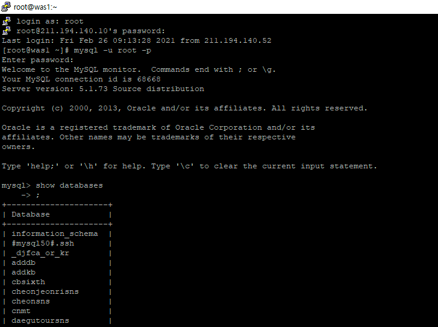

# 개요

> ssh로 리눅스 원격 접속 후 해당 명령어 사용함

# MySQL 접속

> 접속 후 MySQL 명령어를 사용하기 위해선 먼저 MySQL 접속 명령어로 DB에 접속해야함

1. putty로 서버 로그인.
2. mysql 접속 명령어 입력
3. 계정 비밀번호 입력으로 mysql 접속 완료.
4. 이후 CLI에 일반적인 mysql 명령어 실행이 가능함.
5. 종료할시 exit
- `mysql -u [ID] -p[PW] [DBNAME]`
    - -p 뒤에 [PW]는 같이 입력하지 않아도 되며, -p만 입력하여 진행할시 비밀번호 별도 입력창이 뜬다
    - [DBNAME]는 같이 입력하지 않아도 되며, 그렇게 진행할 시 ROOT로 접속한다. (이후 use database..로 사용할 DB 입력하여 접속)

# dump

- `mysql -u[ID] -p [DBNAME] > /저장경로/파일명.sql`
- `mysql -u[ID] -p [DBNAME] [TBNAME] > /저장경로/파일명.sql`

# SQL 파일 적용

> 테이블 하나를 복구하던 전체를 복구하던, 해당 DB에 적용하는것은 변하지 않으므로 명령어가 달라지지 않음

> 단 특정 내용만 dump 하였을시, 해당 sql파일의 스크립트 문에 기존 내용 지우고 다시 적용하는 내용의 스크립트가 있을 경우, 모든것이 날아가고 특정 내용만 남을 수 있음에 매우 주의.

- mysql -u[ID] -p [DBNAME] < filename.sql