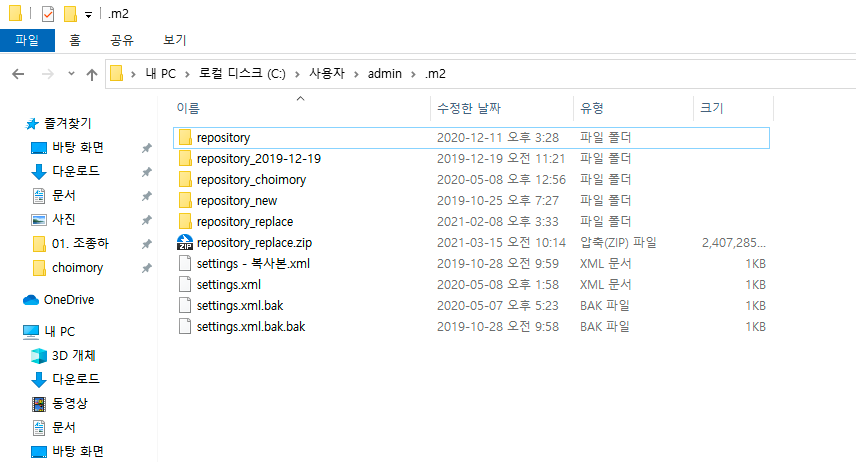
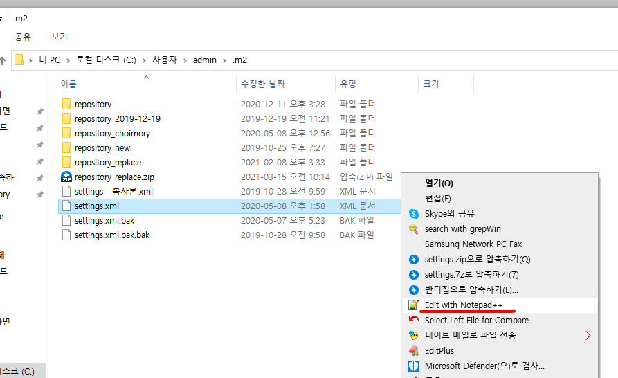
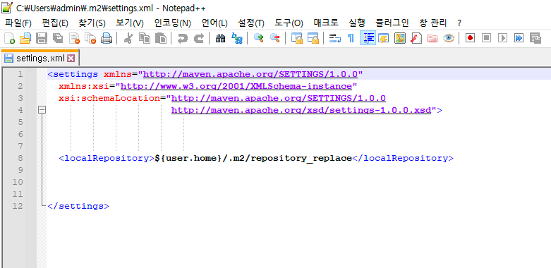
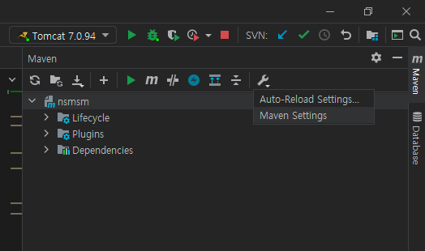
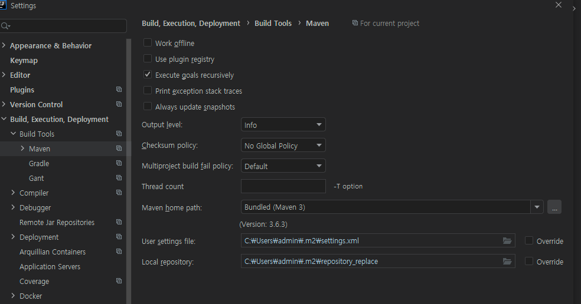
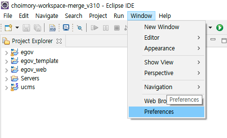
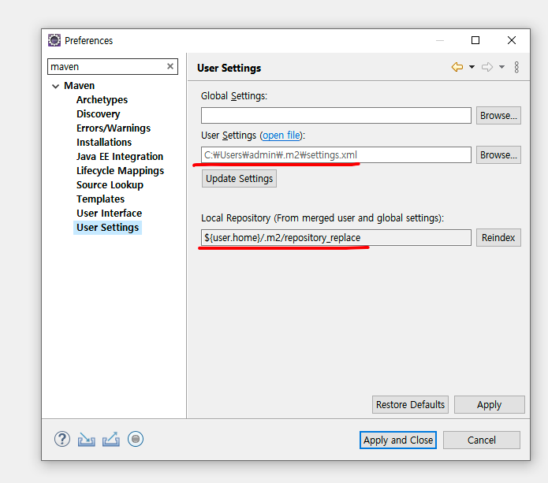

# 저장 경로

> Maven은 이런 저런 프로젝트들에서 Maven으로 내려받은 라이브러리 Jar 파일들을, 사용자 PC 내 별도의 Maven Repository에 한곳에 모아 관리한다.

> 과거엔 받아졌으나 현재는 지원이 끊겨 Maven으로 못받는 라이브러리들이 pom.xml에 정의되어 있어 오류가 날땐, repository에 직접 jar파일을 내려놓아주어야 한다.

- ``C: \ 사용자 \ 사용자명 \ .m2 (숨김 폴더) \ repository name`

# 관리

> .m2 폴더 내의 settings.xml에 어떤 폴더를 Maven Repository로 설정할 지 작성할 수 있다.

> IDE는 보통 settings.xml을 직접 핸들링 하지 않고도 수정할 수 있도록, Maven 설정 기능을 제공한다.

## settings.xml

## IntelliJ

## Eclipse

