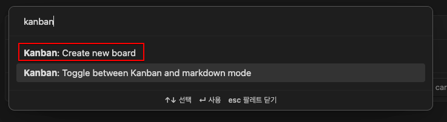
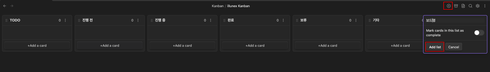
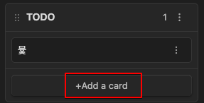
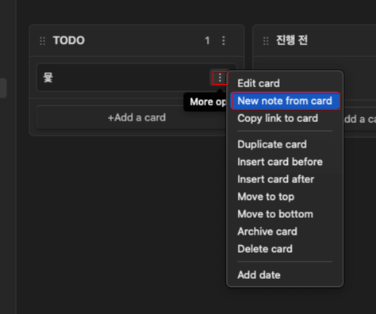
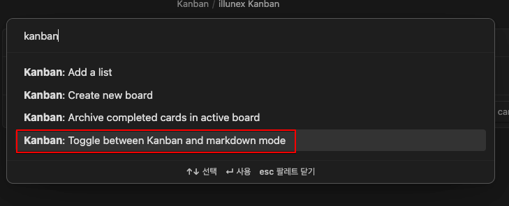
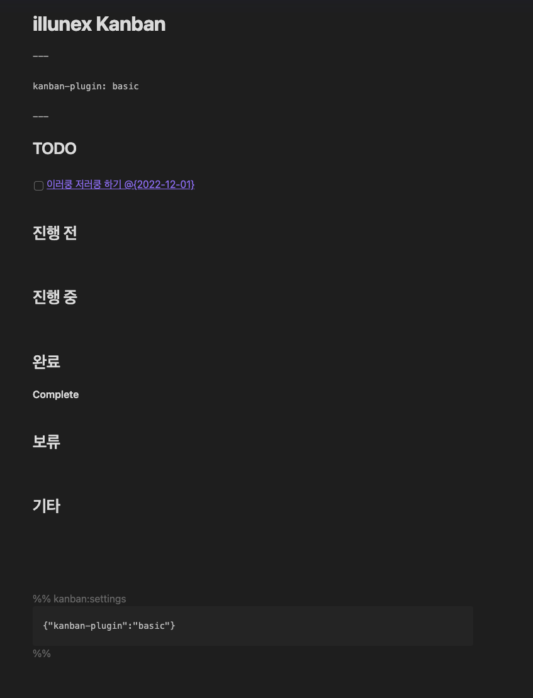

# 설치

- 커뮤니티 플러그인에서 `Kanban` 플러그인을 설치한다

# 칸반 보드 생성

- `cmd + p` 후 kanban 검색하여 create new kanban board 선택
- 새로운 옵시디언 노트가 생성됨

# 칸반 리스트 생성

- add list 선택 후, 리스트명 작성하여 추가
- radio 옵션 체크시 해당 리스트로 옮겨진 카드는 완료처리 됨
- 칸반 리스트는 헤딩 형태로 구분됨

# 칸반 카드 생성

- add a card 선택 후, 카드명 입력시 자동 생성됨
- 칸반 카드는 해당 리스트(헤딩) 하위의 checkbox 형태로 생성됨 

# 카드 상세내용 적기

- 카드의 케밥 누른 뒤, New note from card를 클릭시 해당 카드의 내용을 적을 수 있음
- 새로운 옵시디언 노트가 생성되며, 해당 카드 제목에 링크가 생성됨

# 칸반을 마크다운 소스로 보기

- `cmd+p` 후 toggle between kanban and markdown mode를 선택
- 칸반모드와 마크다운 모드를 toggle 형태로 on/off 한다

- 마크다운 형태로 본 칸반 보드

# 참고

- [https://matthewmeye.rs/obsidian-kanban/](https://matthewmeye.rs/obsidian-kanban/)