# 개요

- Slack 노티 채널을 만들고 어플리케이션을 Slack과 연동하여, 특정상황에 대한 메시지를 수신해보자
- 보통 대부분의 스택들이 Slack과의 통합(Integration)을 자체 지원하지만, 지원하지 않는 경우가 있는데 이럴때 웹훅을 통해 직접 작성하여 구현하게 된다.

# Slack 채널 생성

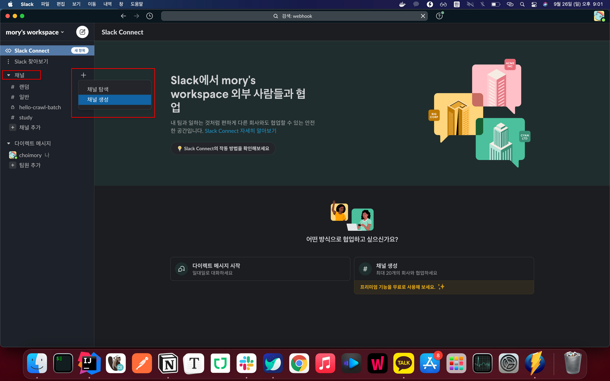

# 채널에 웹훅 추가


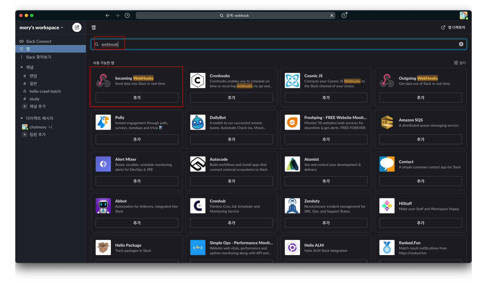

- 어플리케이션 → Slack으로의 수신을 원한다면 Incoming Webhook
- Slack에서 외부로의 발신을 원한다면 Outcoming Webhook을 선택한다
- 이 중 Incoming Webhook를 작성함

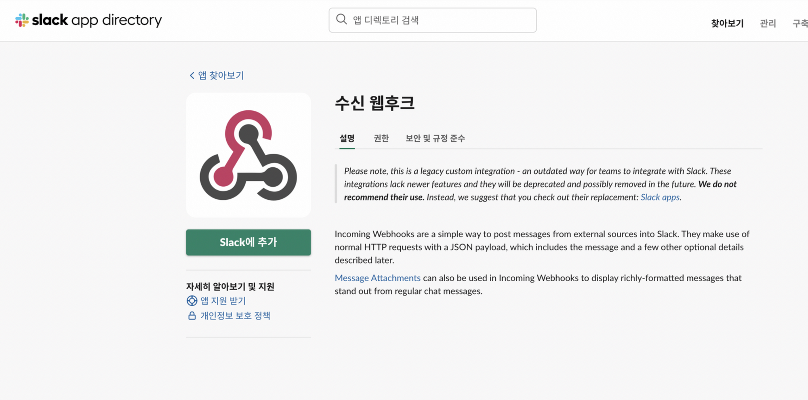

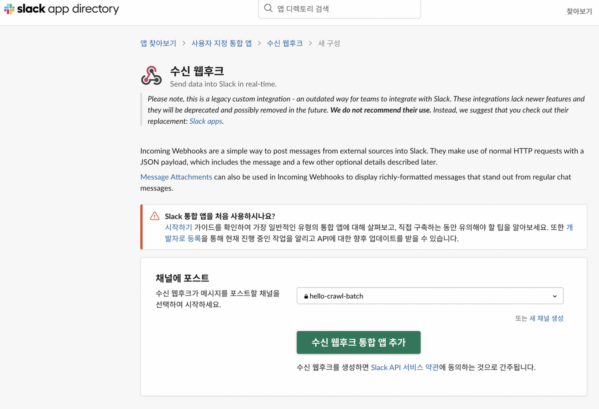

- 수신받을 채널 선택 후 추가

# 웹훅 설정

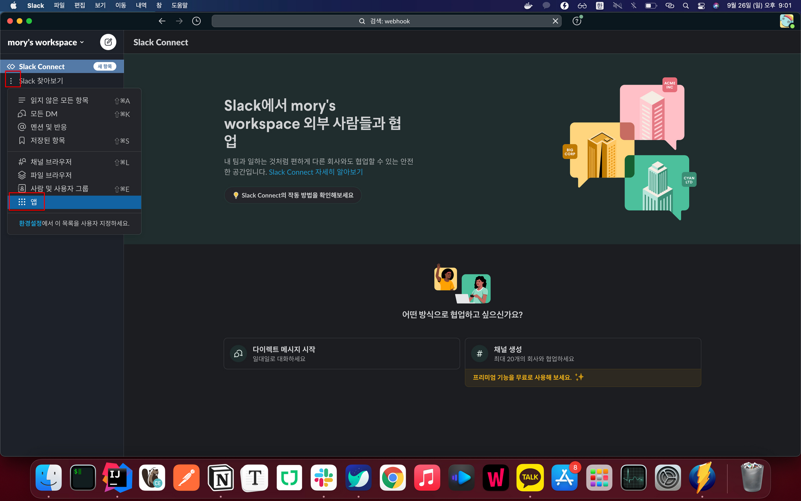

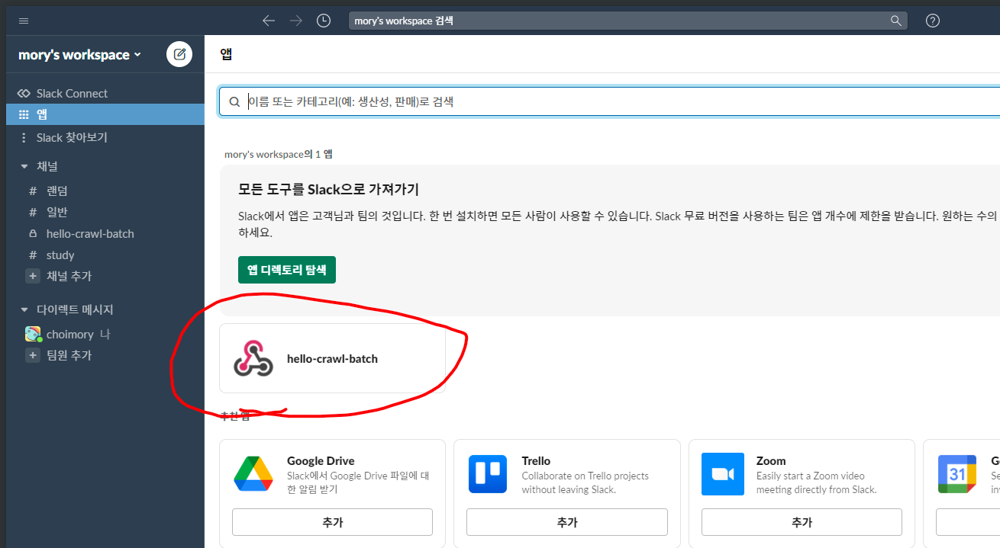

- 다시 앱에 들어가보면 방금 생성한 웹훅이 보임

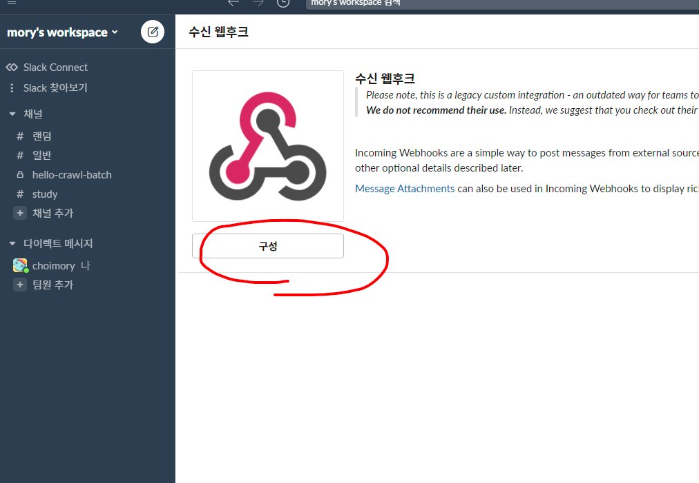

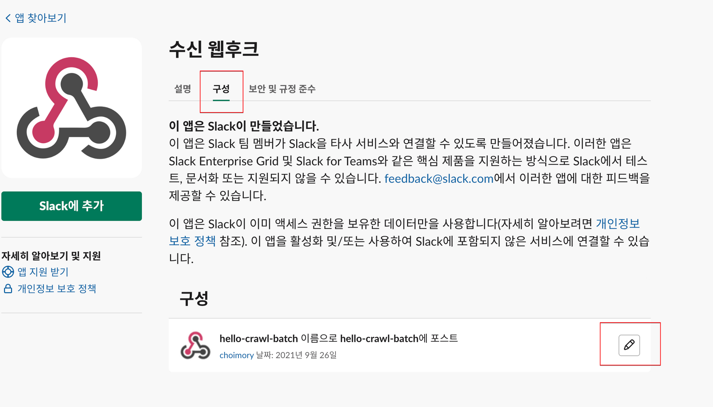

- 구성→설정하고자 하는 웹훅의 편집 아이콘 클릭

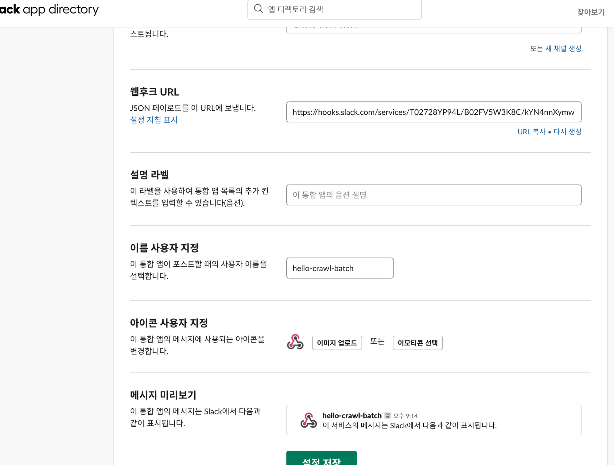

- 해당 페이지에서 메시지를 보낼 웹훅 URL를 확인할 수 있고, 아이콘, 제목, 설명등의 내용을 수정할 수 있음

# 발송

위에서 발급받은 웹훅 API URL에 POST 요청을 보내면 되며, 파라미터는 다음과 같음

```java
//request body
{
	"channel":"보낼 채널명 (#채널명), 필수아님",
	"username":"메시지 보내는 유저명, 필수아님",
	"icon_url":"메시지 아이콘 주소 (http://www.naver.com/img.png), 필수아님",
	"icon_emoji":"메시지 아이콘을 이모지로 쓰고싶을때 텍스트 (:ghost:), 필수아님"
	

	"text": "텍스트내용"
}
```

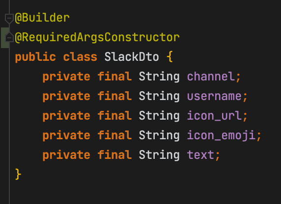

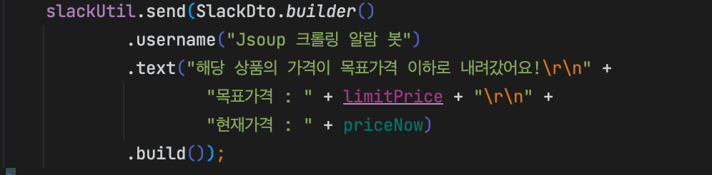

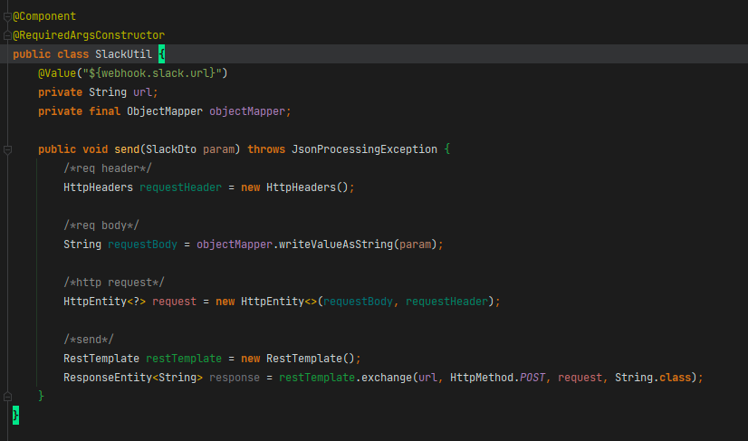

# 참고

- [https://jojoldu.tistory.com/552](https://jojoldu.tistory.com/552)
- [https://leeborn.tistory.com/entry/Spring-Boot-슬랙-webhook-메시지-보내기](https://leeborn.tistory.com/entry/Spring-Boot-%EC%8A%AC%EB%9E%99-webhook-%EB%A9%94%EC%8B%9C%EC%A7%80-%EB%B3%B4%EB%82%B4%EA%B8%B0)
- [https://cheese10yun.github.io/slack-bot-spring/](https://cheese10yun.github.io/slack-bot-spring/)