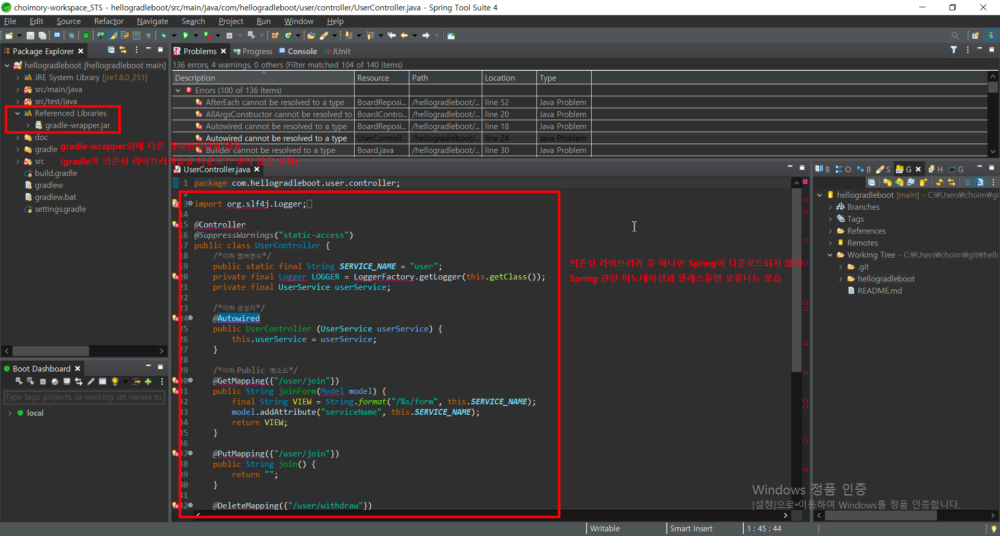
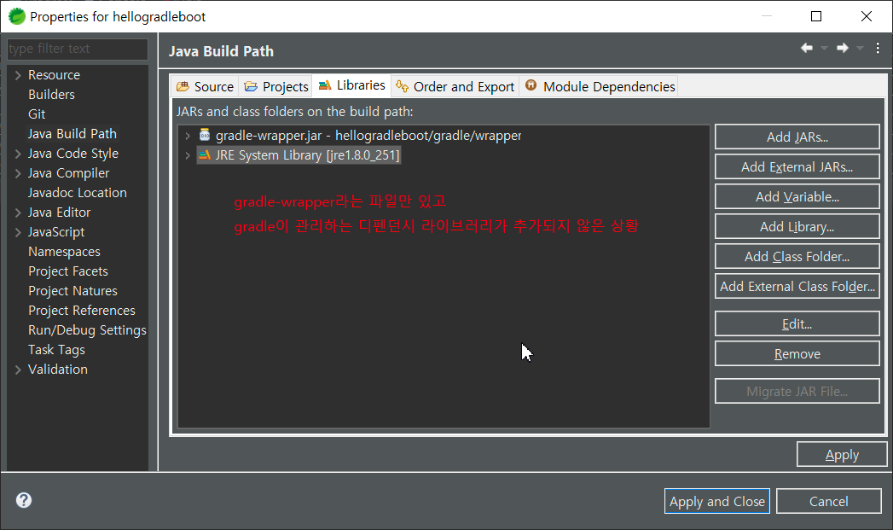
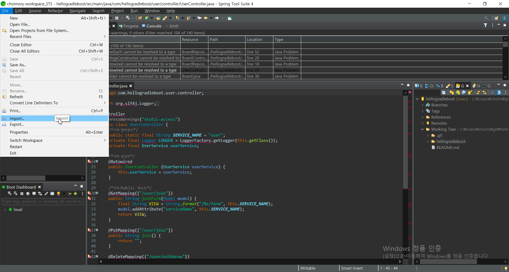
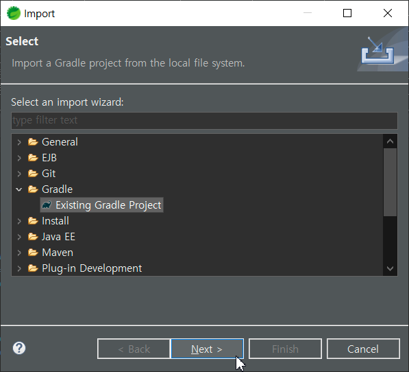
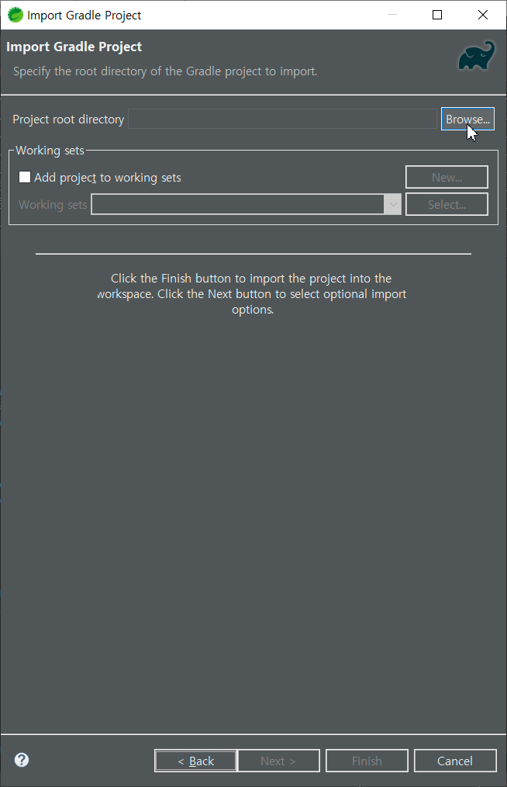
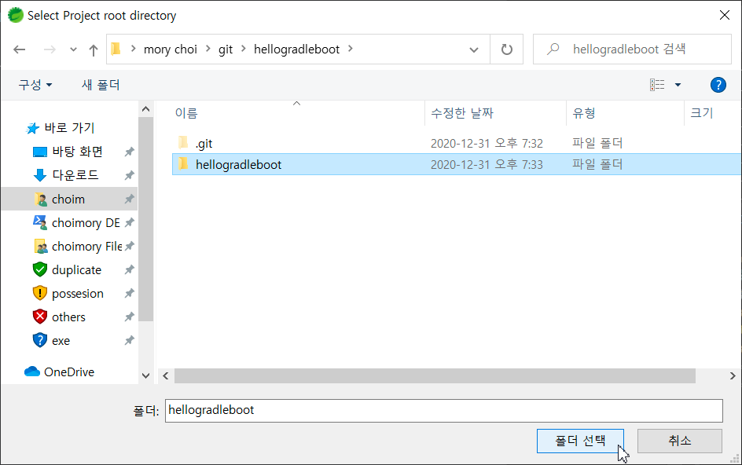
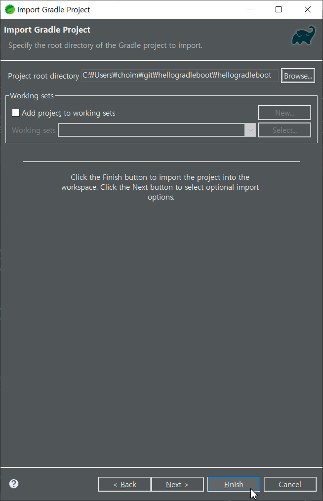
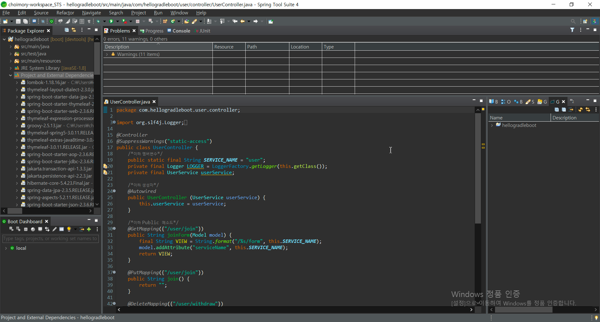

# 개요

Eclipse에서 Maven 프로젝트를 체크아웃할때는 Maven에 적힌 의존성 라이브러리가 자동으로 다운로드 된다.

하지만 Eclipse에서 Gradle 프로젝트를 체크아웃할때는 Gradle에 적힌 의존성 라이브러리를 자동 다운로드 하지 않는 경우가 있다.

그땐 직접 Gradle를 Init하여 의존성 라이브러리를 다운로드 받아 디펜던시 라이브러리를 추가하여 빌드하는 작업을 직접 수행해야 한다.

# 프로젝트를 체크아웃 했는데

프로젝트를 체크아웃했는데 의존성 라이브러리가 추가되지 않아, Java외에 아무것도 없는 상황.

그래서 Spring 등 의존성 라이브러리의 내용들이 오류가 나고 있음.

Gradle이 돌아가지 않은것.

# Gradle 의존성 라이브러리들 다운로드 받기

Eclipse 기준 File→Import→Gradle-Existing Gradle Project 이후 프로젝트 폴더를 선택하면, Gradle의 디펜던시 라이브러리가 추가되면서 의존성 라이브러리들을 다운받는다.