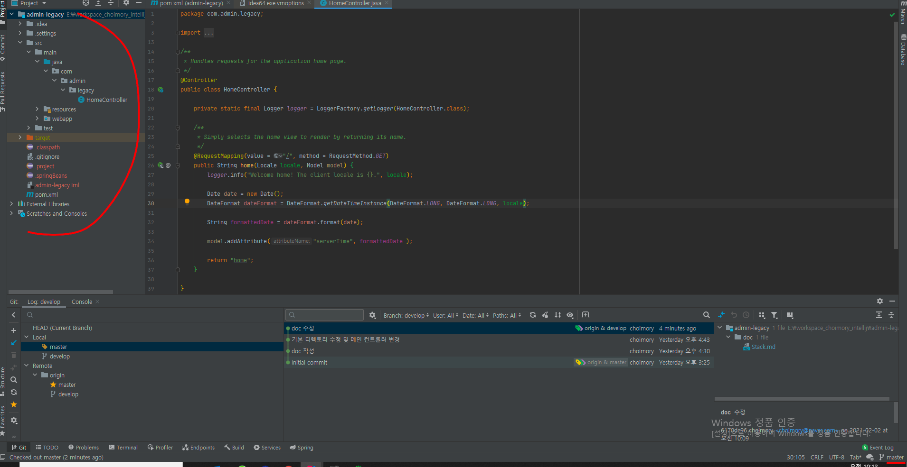
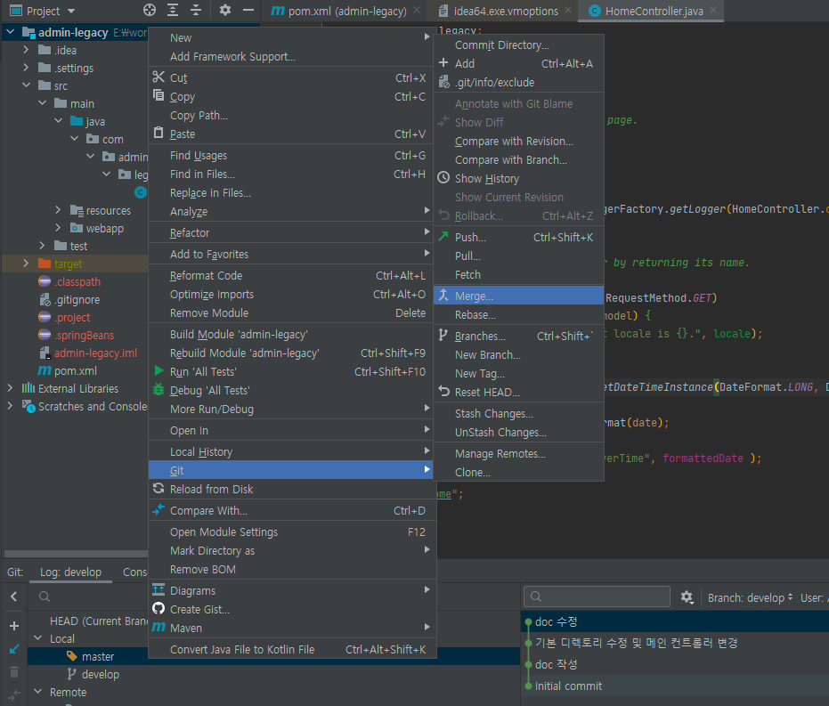
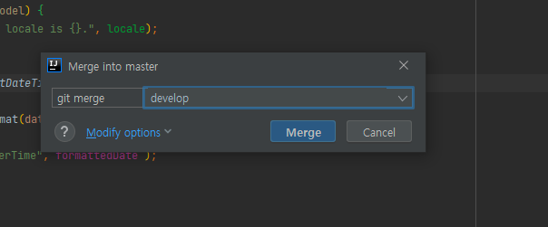
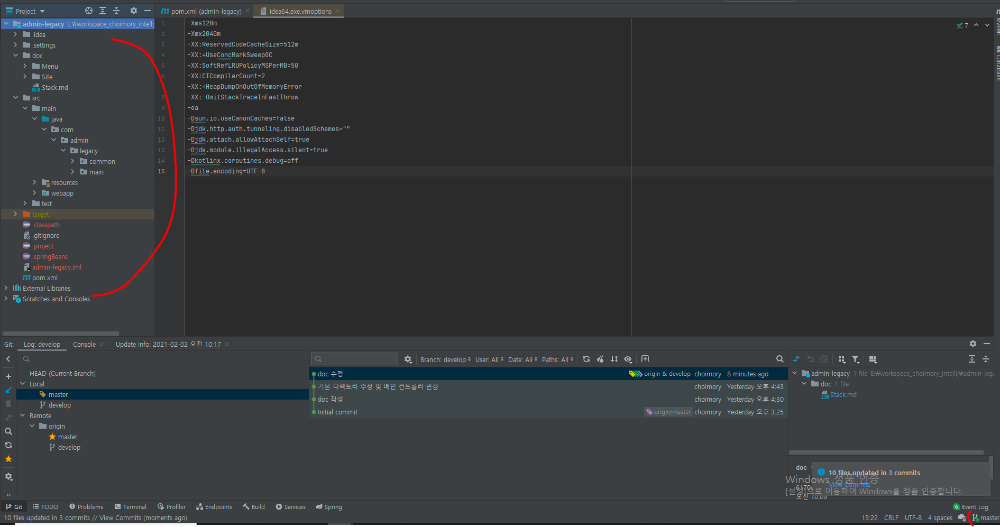

# 개요

- develop 브랜치에서 작성한 내용을 master 브랜치에 반영할때, feature 브랜치에서 작성한 내용을 develop 브랜치에 반영해야할때
- 이때 두가지 선택이 있는데 A 브랜치에서 B 브랜치의 작업 내용을 Merge해서 받아오던지, B 브랜치의 작업내용을 들고 A 브랜치로 Rebase하여 이동하던지
- Merge가 Rebase보다 깔끔하고 안전하며 좋은 선택이고, Rebase는 위험하고 과감한 선택임

# 방법

- develop 브랜치에서 작성한 내용을 master에 적용하기 위해 master 브랜치를 체크아웃함
- master에는 develop 브랜치에서 작성한 내용 반영되지 않은 상태인것 확인

- merge 선택

- 내려받아 Merge할 브랜치 선택

- 변경사항이 받아졌으며 원격저장소로의 Push가 활성화된것 확인 (로컬로의 Commit은 활성화되지 않음)