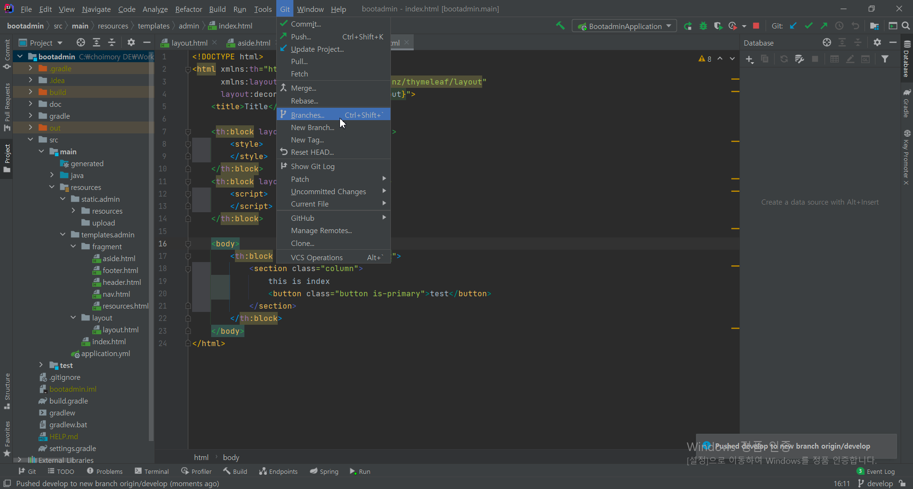
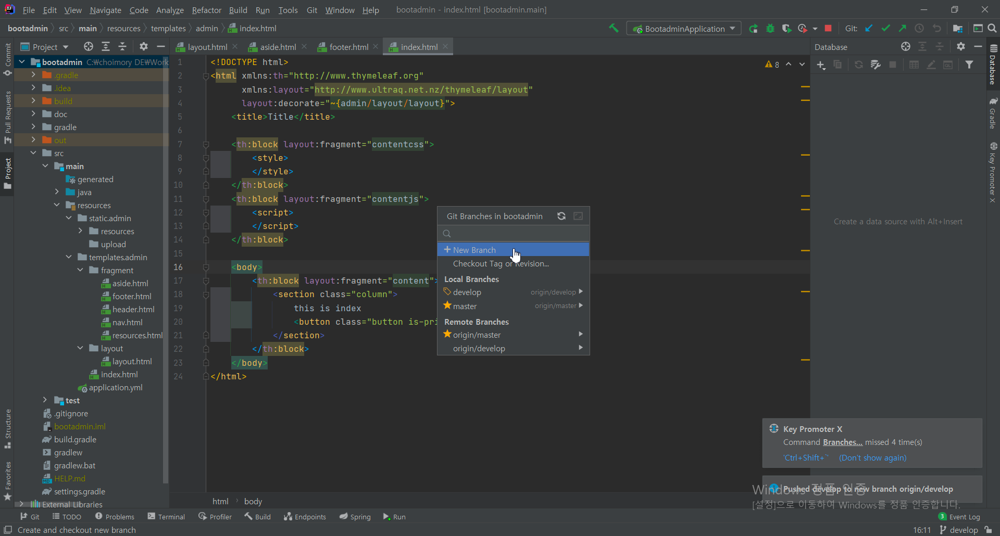
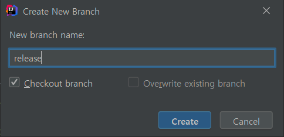
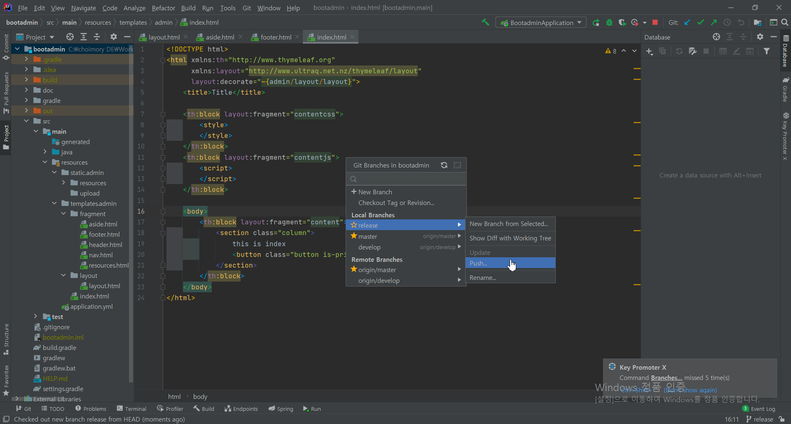
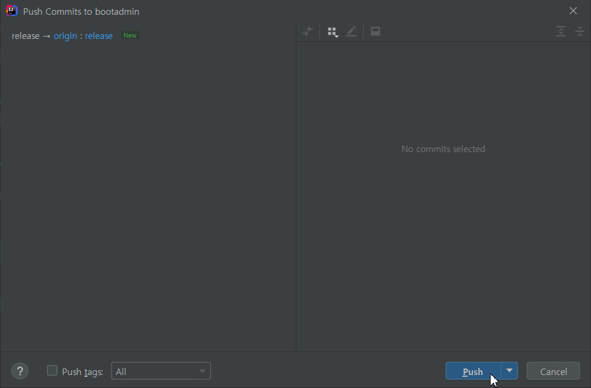
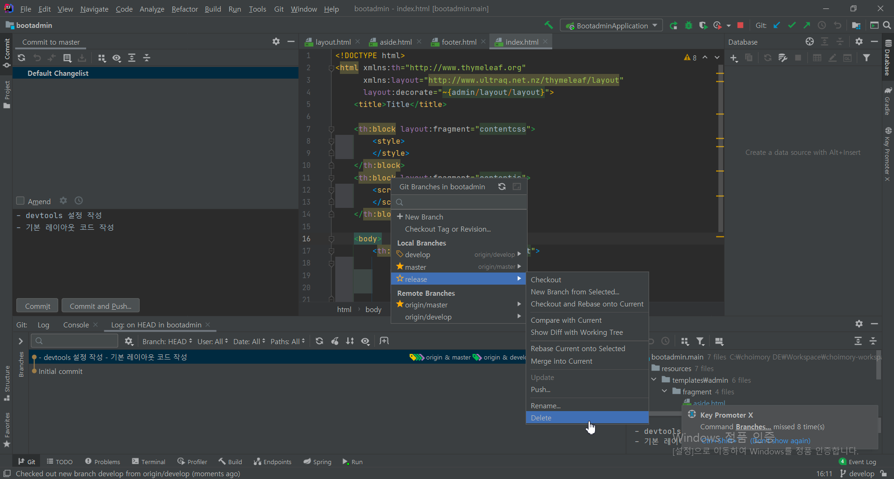

# 새 local branch 생성

- IntelliJ는 기본적으로 branch를 local에 생성함.
- 저장소 branch를 생성하고 싶으면 local branch를 생성한뒤 올리는식으로 거쳐감

# local branch를 원격저장소로 push

# local branch 삭제

# branch 변경

- 원하는 브랜치에서 Checkout 선택