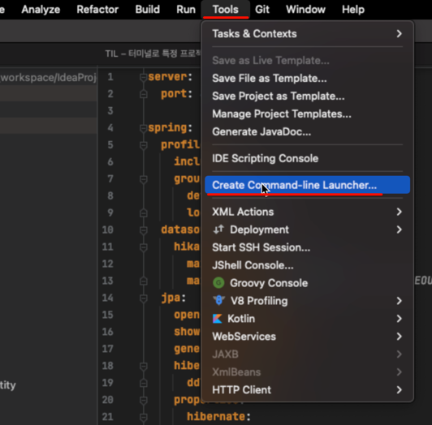
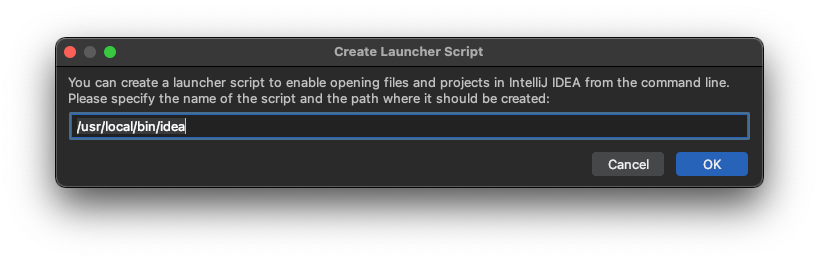
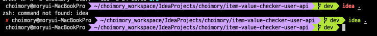

# 요약

- IntelliJ의 create command-line launcher를 이용해, 명령어만으로 인텔리제이를 실행할 수 있다

# Create command-line launcher

- Tools의 create command-line launcher 클릭
- 아무 프로젝트에서나 처음 딱 한번만 해주면 모든곳에서 적용된다

- 경로지정. 기본경로로 선택하였음

# 실행

- 프로젝트 디렉토리로 들어가 `idea .`를 입력해주면 구동된다
- 처음엔 안되던 명령어가 생성 후 정상 실행되는 모습

