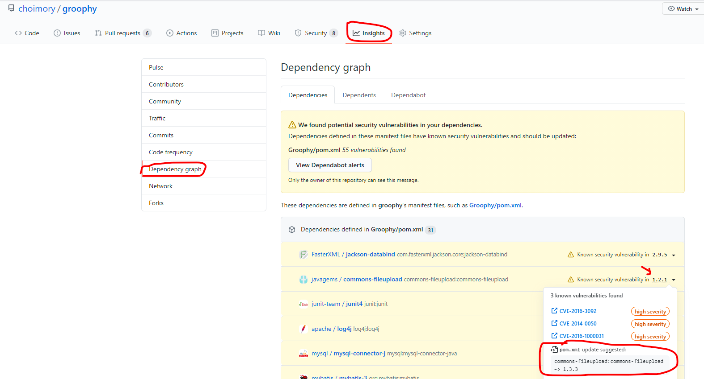
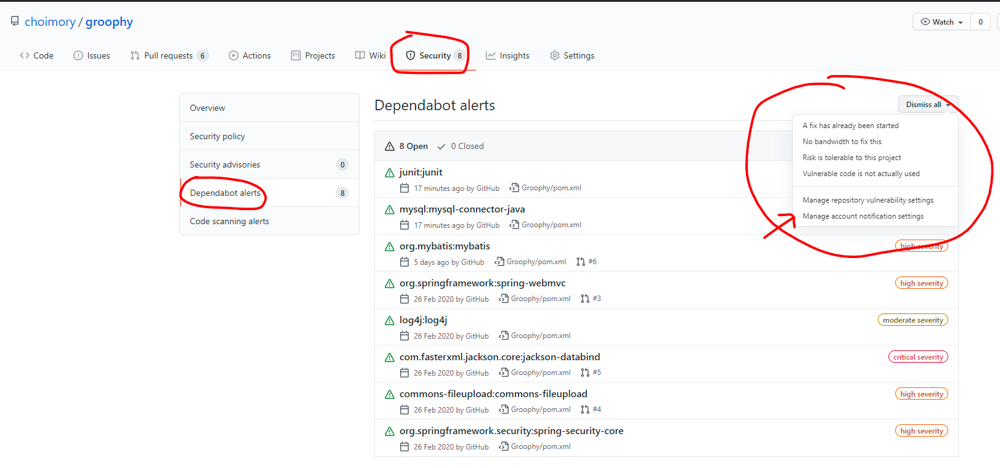
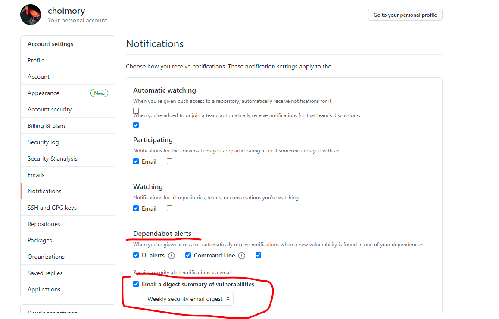

# 개요

- Github Repository에 올린 프로젝트에서 취약점에 문제가 발견된 버전의  라이브러리를 사용할 시 Github의 Dependabot이 이를 발견하고 경고를 보낸다
- Dependabot이 권장하는 버전으로 라이브러리의 버전을 변경해주면 해결된다
- 그러고 싶지 않을시 알람을 꺼서 귀를 막는다...

# 버전 바꾸기

- Insights → Dependency graph에 들어가 위험항목이 검출된 라이브러리에서 우측항목을 클릭
    - 사용중인 버전의 라이브러리가 어떤 위험항목들이 존재하는지와 함께, 권장하는 라이브러리 버전을 확인 할 수 있다.
    - pom.xml(Maven) 혹은 build.gradle(Gradle)에서 권장하는 버전으로 라이브러리를 수정해주면 해결된다.

# 알림 끄기

호환성, 프로젝트 설정의 번거로움 등의 문제로 라이브러리 버전을 수정하는것이 곤란할땐 알림을 꺼서 계속해서 날아오는 경고 메일등을 받지 않을 수 있다.

