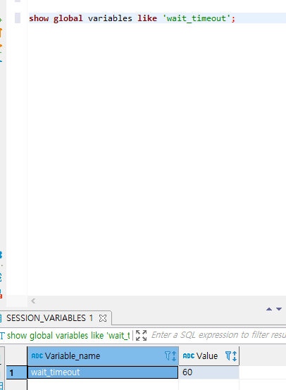
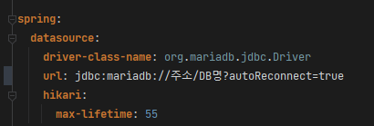
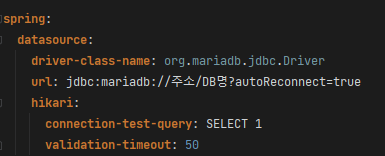

# 개요

```java
java.sql.SQLNonTransientConnectionException: (conn=82610) Connection reset by peer
```

- 배치 프로세싱 진행 중, 해당 오류가 발생하며 배치가 자꾸 죽었다.
- 검색해보니 DB 커넥션이 종료되어 버려서 생기는 오류로 추정된다.

# 원인

- DB는 `wait_timeout`설정이 존재하여 해당 시간동안 쿼리 수행이 없을시, 쿼리 수행이 없는 커넥션을 해제해버린다.
- 스프링 배치에서는 Reader → Proccess → Writer의 과정 중, Reader에서 DB 작업을 수행하고 이후 Process에서 비즈니스 로직을 수행하는 시간동안 DB관련 로직이 없어  `wait_timeout`의 시간을 넘어서 버려서 커넥션이 제거되어 버린 것으로 보인다.
- 결국 이 문제를 해결하기 위해선 커넥션을 관리하는 커넥션풀 측에서, 커넥션을 계속해서 유지시켜줘야 하는데, 사용하는 커넥션풀의 종류에 따라 관리되는 방법이 다르므로, 본인이 사용하는 CP에 따라 적절한 방법을 적용시켜 준다.

# 해결



```java
show global variables like 'wait_timeout';
```

- 먼저 해당 DB의 커넥션 대기시간 설정값을 확인한다
    - show variables가 아닌 show global variables(전역변수)로 확인하여야 한다

## DBCP의 경우

> DBCP의 경우 쿼리 수행이 없는 커넥션을 유지시키기 위해, 더미 쿼리를 날리는 방식을 사용한다

```xml
<bean id="dataSource" class="org.apache.commons.dbcp.BasicDataSource" destroy-method="close">
	...기본 설정 생략...

	<property name="url" value="접속주소?autoReconnect=true"/>
	<property name="validationQuery" value="select 1"/> #더미쿼리 내용
	<property name="testWhileIdle" value="true"/> #더미쿼리 수행여부
	<property name="timeBetweenEvictionRunsMillis" value="50"/> #더미쿼리 수행 시간(ms)
</bean>
```

- 고로 timeBetweenEvictionRunsMillis의 값으로는 `wait_timeout`의 값보다 낮은 값을 설정해주고, validationQuery로 의미없는 쿼리를 수행하도록 작성한뒤, testWhileIdle를 true로 하여 더미 쿼리를 특정시간마다 수행하게 해주어 커넥션을 유지시켜 주면 된다.

## Hikari CP의 경우

> Hikari CP의 경우 DBCP와는 다른 방식으로 커넥션을 관리하는데, 기존 커넥션으로 더미쿼리를 날려 기존 커넥션을 계속 살리는 대신, `wait_timeout`전에 선제적으로 기존 커넥션을 새 커넥션으로 갱신하는 방식을 택한다.



- 고로 Hikari CP의 `max-lifetime`을 DB의 `wait_timeout`보다 낮게 설정해주어, 커넥션이 해제되기 전 Hikari CP가 원할하게 커넥션을 교체할 수 있도록 설정해준다
- 보통 `wait_timeout`보다 2~3초 낮게 잡아주는것을 권장하는데, 네트워크 환경에 따라 달라질 수 있으므로 인지하여야 한다. 필자의 경우 3초 낮게 잡아도 문제가 발생하여 5초를 낮게 잡아 해결하였다.

### Hikari CP인데 JDBC 드라이버가 4를 지원하지 않는 경우

> JDBC4 미만의 경우 Hikari CP라도 DBCP처럼 더미쿼리를 날려 커넥션을 유지하는 방식을 채택하는것을 고려해야한다.



- DBCP와 같은 내용으로 `connection-test-query`는 DBCP의 `validationQuery`, `validation-timeout`은 `timeBetweenEvictionRunsMillis`에 대응한다

# 참고

## Hikari CP

- [https://brunch.co.kr/@jehovah/25](https://brunch.co.kr/@jehovah/25)
- [https://freedeveloper.tistory.com/250](https://freedeveloper.tistory.com/250)
- [https://jojoldu.tistory.com/526](https://jojoldu.tistory.com/526)
- [https://bamdule.tistory.com/166](https://bamdule.tistory.com/166)

## DBCP

- [https://kakaocommerce.tistory.com/45](https://kakaocommerce.tistory.com/45)
- [https://d2.naver.com/helloworld/5102792](https://d2.naver.com/helloworld/5102792)
- [https://www.leafcats.com/237](https://www.leafcats.com/237)
- [https://www.egovframe.go.kr/home/qainfo/qainfoRead.do?pagerOffset=710&searchKey=&searchValue=&menuNo=69&qaId=QA_00000000000018967](https://www.egovframe.go.kr/home/qainfo/qainfoRead.do?pagerOffset=710&searchKey=&searchValue=&menuNo=69&qaId=QA_00000000000018967)
- [https://web-obj.tistory.com/221](https://web-obj.tistory.com/221)