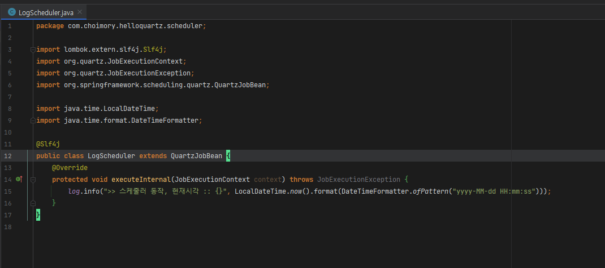
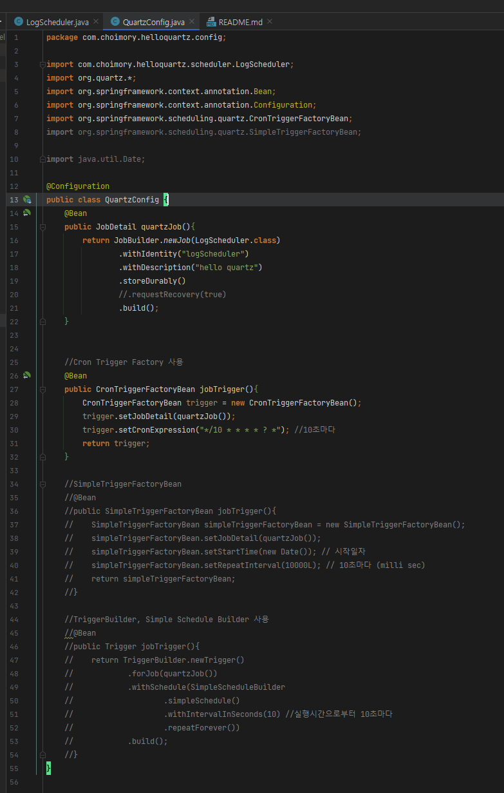
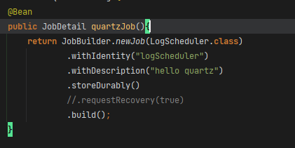
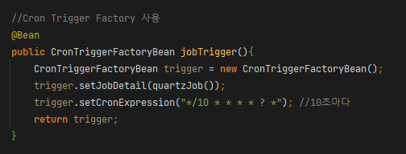
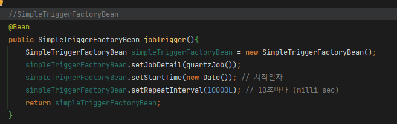
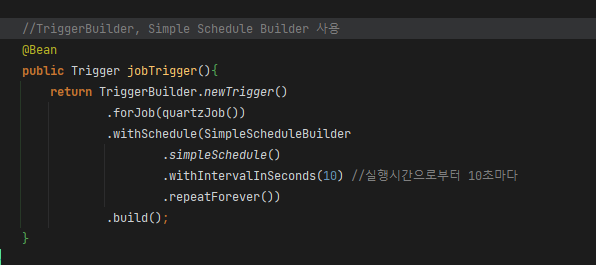

# 개요

- 소스코드 : [https://github.com/choimory/hello-quartz](https://github.com/choimory/hello-quartz/tree/02d9baec47d4d5138cbb3db02394ac1f100cfdde)

# QuartzJobBean 상속, executeInternal 오버라이드

- QuartzJobBean 클래스를 상속
- executeInternal 메소드를 오버라이드
- QuartzJobBean을 상속한 클래스를 JobDetail 빈으로 등록시, executeInternal 메소드가 스케줄링 돌게 된다

# @Configuration

## @Configuration

- 단순 @Configuration
- JobDetail과 JobTrigger 두개의 Bean을 생성해준다

## Quartz Job

- 배치에는 특정 역할을 수행하는 배치 Job이 있듯이, 쿼츠에는 특정 스케줄을 수행하는 쿼츠 Job이 있다
- 쿼츠 Job에 대한 인스턴스는 JobDetail이라고 함
- 배치는 Job Instance가 있듯이, 쿼츠는 Job Detail이 있다

### JobDetail

- JobBuilder를 통해 Job의 ID, 설명 등을 설정 후 반환하여, JobDetail을 Bean으로 등록해준다
- `storeDurably()` : 트리거가 존재하지 않더라도 JobDetail을 유지시킬지 여부
- `requestRecovery()` : 복구 혹은 실패, 오버 등의 상황이 발생시 Job을 다시 실행해야 하는지 여부

## Quartz Job Trigger

- JobDetail의 스케줄을 설정해주는 내용은 JobTrigger이다
- CronTrigger, SimpleTrigger, SimpleScheduler 세가지를 작성함

### CronTriggerFactoryBean

- CronTriggerFactoryBean을 생성 후, 설정하여 반환하는것으로 CronTriggerFactoryBean을 Bean으로 등록

### SimpleTrigger

- SimpleTriggerFactoryBean을 생성 후, 설정하여 반환하는것으로 SimpleTriggerFactoryBean을 Bean으로 등록

### Trigger

- TriggerBuilder와 SimpleScheduleBuilder를 이용해 Trigger를 반환하는것으로 Trigger를 Bean으로 등록