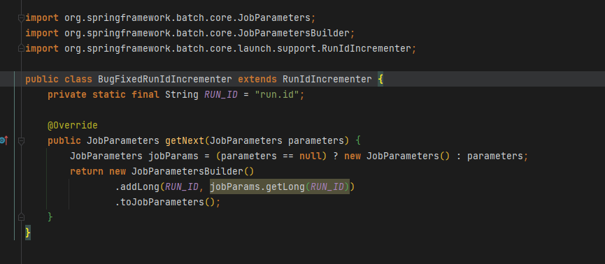
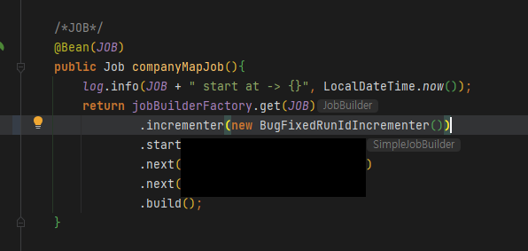
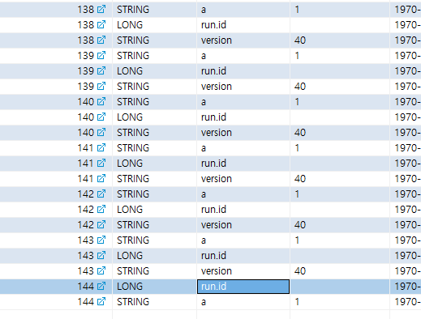

# 개요

- RunIdIncrementer는 같은 Job Parameter로 계속 실행하고 싶을때, Job Instance ID를 자동증가시킴으로써 반복 사용할 수 있게 해주는 객체임
- 스케쥴링을 걸때라던지 등에 사용가능
- RunIdIncrementer는 현재 이전에 실패했거나, 누락된 Job Parameter가 계속 섞여서 실행되는 버그가 있는 상태
- RunIdIncrementer를 상속한 클래스를 작성하여 사용하는것으로 버그를 해결가능함

# 작성

- RunIdIncrementer 상속
- getNext 오버라이드

# 사용

- incrementer() 인자로 RunIdIncrementer 대신 상속받아 새로 작성한 클래스를 넘겨줌

# 결과

- version을 param으로 보내지 않았는데도 계속 사용되던 version이, 변경사항을 적용한 id 144에선 없어지는것을 확인