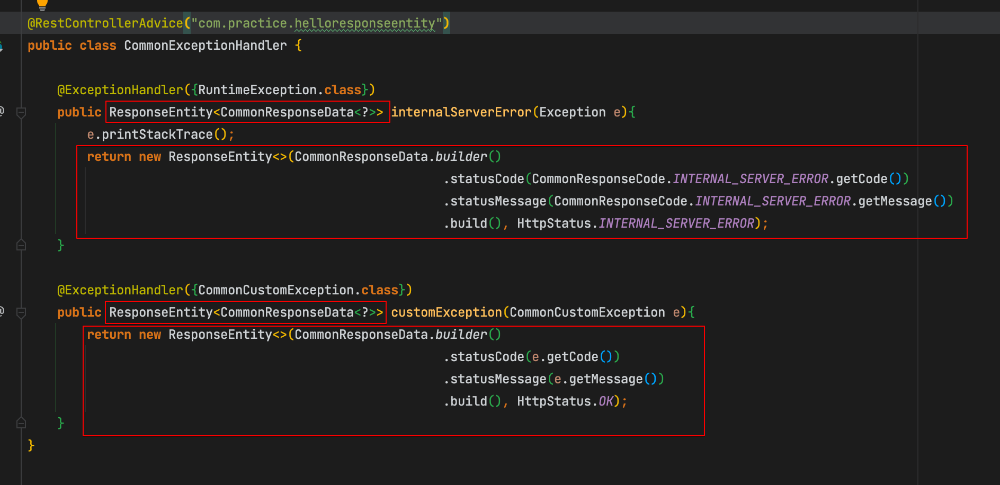
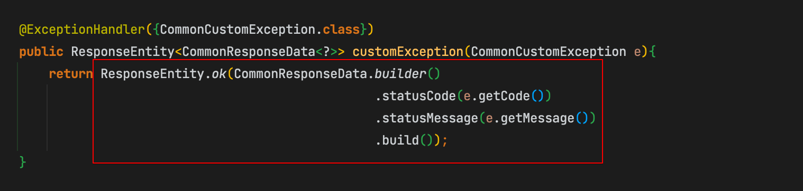
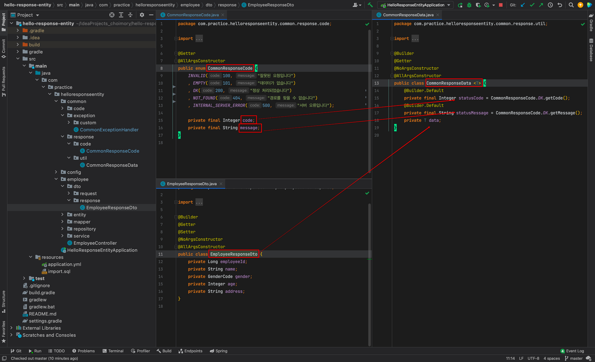
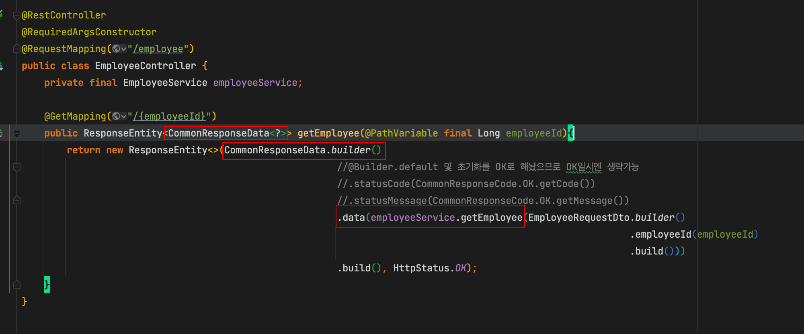
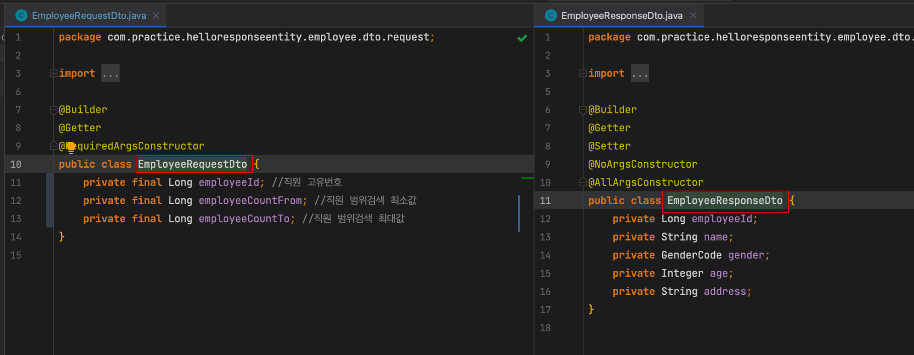
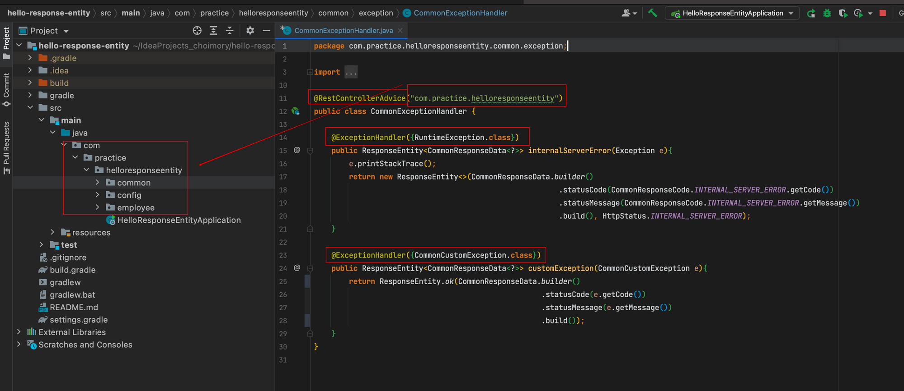

# 개요

- REST API 서버를 개발할때 기본적으로 가져갈만한 구성들에 대해 작성함
- 소스코드

  [choimory/hello-response-entity](https://github.com/choimory/hello-response-entity)

# ResponseEntity

> ResponseEntity는 ResponseBody만 리턴하는것과 달리, HttpStatus 코드 등 ResponseHeader까지 원하는대로 변경하여 디테일하게 보낼수 있다는 장점이 있음

## 사용법

```java
//사용법 1
return new ResponseEntity<T>(responsebody, HttpStatusCode);

//사용법2 - HttpStatusCode가 OK일시, 이렇게도 가능하다
return ResponseEntity.ok(responsebody);
```





- HttpStatus코드가 가장 많이 사용하는 HttpStatus.OK일 경우 ResponseEntity.ok(responsebody)를 이용하여 보낼 수도 있음

# ResponseClass

> 단순히 데이터 DTO 객체(ResponseEntity<DTO>)만을 리턴하는 대신, 코드+메시지+데이터를 포함한 클래스(ResponseEntity<ResponseClass<DTO>>)를 리턴함으로써 유용한 내용들을 리턴해줄수 있음





- 공통응답객체를 만든뒤
    - 코드와 메시지는 공통코드객체에서 가져오고
    - 데이터는 DTO에서 가져와서
    - 공통응답객체 하나에 모아서 보냄

# DTO의 Request, Response 구분

> 단순히 요청시 클라이언트 측 parameter를 받아야하기 위해 DTO에 필드를 추가하는 경우가 많은데, 이 DTO를 그대로 response 로도 활용하면 응답 내용이 지저분하기때문에, 요청용 DTO - 응답용 DTO를 구분하여 DTO를 작성할 수 있음



## 요청용 DTO

- 요청값이 변경될 일이 없으므로 Setter를 제거하고 Getter만 작성함
- 요청값이 변경될 일이 없으므로 final 변수로 작성하고 생성자로만 주입되게함
- 검색창에서 날아오는 parameter들에 대한 것들을 필드로 가지고 있음

## 응답용 DTO

- 응답에 보낼 최소한의 필드, Entity와 같은 필드를 가지고 있음
- Entity ↔ DTO간의 변환작업에서 Setter가 필요하므로 Setter를 제거하지 못했고, final을 부여하지 못했음

# Exception Handler

> 글로벌 예외 핸들러를 작성하여 예외를 한곳에서 받은 뒤, 오류메시지를 던져주는것으로, API 서버 전체에 대한 예외를 핸들링 할 수 있음



## RestControllerAdvice

- 글로벌 예외 핸들러가 적용될 범위를 패키지 단위로 지정함

## @ExceptionHanlder

- 캐치할 예외클래스를 지정
- 복수지정 가능, 세부적인 예외를 디테일하게 지정 가능