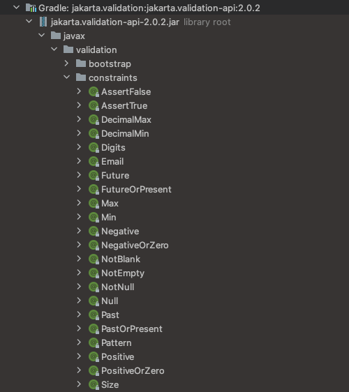

# 개요

- 기본적인 검증을 진행해주는 Spring Validation 사용법을 알아본다

# 의존성

```yaml
implementation 'org.springframework.boot:spring-boot-starter-validation'
```

# 기본 검증 어노테이션들



- Spring Validation 라이브러리의 해당 경로 내 어노테이션들로 기본 검증 사용이 가능하다

# 객체 내 필드 검증

```java
@Builder
@RequiredArgsConstructor
@Getter
public class MemberJoinRequest {
    @NotNull
    @Size(min = 5, max = 15)
    @Pattern(regexp = "[a-zA-Z0-9]*$", message = "ID에 영문, 숫자 외 문자가 포함되어 있습니다")
    private final String identity;
    @NotNull
    @Size(min = 8, max = 20)
    @Pattern(regexp = "[^a-zA-Z0-9 가-힣ㄱ-ㅋㅏ-ㅣ]", message = "특수문자 포함되어야 함")
    private final String password;
    @NotNull
    private final String nickname;
    @NotNull
    @Email
    private final String email;
    @NotNull
    private final AuthLevel authLevel;
}
```

- 요청값을 담을 객체를 만들고 각종 어노테이션을 붙여준 뒤

```java
@RestController
@RequiredArgsConstructor
@RequestMapping("/member")
public class MemberController {
    private final MemberService memberService;
    
    @PutMapping
    @ResponseStatus(HttpStatus.CREATED)
    public MemberJoinResponse join(@RequestBody @Valid final MemberJoinRequest param) throws Exception {
        return memberService.join(param);
    }
}
```

- 해당 요청 객체를 컨트롤러 매개변수로 선언하고 @Valid 어노테이션을 붙여준다

# 복수의 값 검증

```java
@Builder
@RequiredArgsConstructor
@Getter
public class MemberJoinRequest {
    private final List<
            @NotNull
            @Size(min = 5, max = 15)
            @Pattern(regexp = "[a-zA-Z0-9]*$", message = "ID에 영문, 숫자 외 문자가 포함되어 있습니다")
                    String> identity;
    @NotNull
    @Size(min = 8, max = 20)
    @Pattern(regexp = "[^a-zA-Z0-9 가-힣ㄱ-ㅋㅏ-ㅣ]", message = "특수문자 포함되어야 함")
    private final String password;
    @NotNull
    private final String nickname;
    @NotNull
    @Email
    private final String email;
    @NotNull
    private final AuthLevel authLevel;
}
```

- Class<T>에서 T 앞에 검증 어노테이션 붙여줌으로써 복수의 값을 각각 검증하는것이 가능하다
- ~~ID는 예시를 위해 잠시 컬렉션으로 바꾼것이니 신경 쓸 필요 없다~~

# 컨트롤러 단일 파라미터 검증

```java

@RestController
@RequiredArgsConstructor
@RequestMapping("/member")
@Validated
public class MemberController {
    private final MemberService memberService;

    @GetMapping("/{identity}")
    public MemberViewResponse view(@PathVariable @Valid @Size(max=5) final String identity) {
        return memberService.view(identity);
    }
}
```

- 컨트롤러에 @Validated 어노테이션을 붙인 뒤
- 컨트롤러 파라미터에 @Valid를 붙이고 각종 검증 어노테이션을 사용한다

# 검증실패 핸들링

## 요청 객체 검증 실패 예외

```java
@ExceptionHandler({MethodArgumentNotValidException.class})
@ResponseStatus(HttpStatus.BAD_REQUEST)
public CommonResponse<List<CommonNotValidResponse>> methodArgumentNotValidException(MethodArgumentNotValidException e){
    return CommonResponse.<List<CommonNotValidResponse>>builder()
            .status(HttpStatus.BAD_REQUEST.value())
            .message(HttpStatus.BAD_REQUEST.getReasonPhrase())
            .data(e.getFieldErrors()
                    .stream()
                    .map(fieldError -> CommonNotValidResponse.builder()
                            .field(fieldError.getField())
                            .rejectedValue(fieldError.getRejectedValue())
                            .message(fieldError.getDefaultMessage())
                            .build())
                    .collect(Collectors.toUnmodifiableList()))
            .build();
}
```

- 요청객체 검증에 걸린 경우 MethodArgumentNotValidException를 던지므로 해당 예외를 핸들링하는 핸들러를 작성해준다
- MethodArgumentNotValidException의 FieldErrors에 Valid에 걸린 모든 요청관련 정보가 담겨있다
- AllErrors는 그 외 백엔드의 패턴이나 요청 객체정보 등 모든 것을 확인할 수 있으나 보안을 위해 이것까지 응답하는것은 위험하다

## 컨트롤러 파라미터 검증 실패 예외

```java
@ExceptionHandler({ConstraintViolationException.class})
@ResponseStatus(HttpStatus.BAD_REQUEST)
public CommonResponse<List<CommonNotValidResponse>> constraintViolationException(ConstraintViolationException e){
    return CommonResponse.<List<CommonNotValidResponse>>builder()
        .status(HttpStatus.BAD_REQUEST.value())
        .message(HttpStatus.BAD_REQUEST.getReasonPhrase())
        .data(e.getConstraintViolations()
            .stream()
            .map(constraintViolation -> CommonNotValidResponse.builder()
                .field(constraintViolation.getPropertyPath().toString())
                .rejectedValue(constraintViolation.getInvalidValue())
                .message(constraintViolation.getMessage())
                .build())
            .collect(Collectors.toUnmodifiableList()))
        .build();
}
```

- 컨트롤러 파라미터 검증에 걸린 경우 ConstraintViolationException를 던지므로 해당 예외를 핸들링하는 핸들러를 작성해준다
- ConstraintViolationException의 getConstraintViolations에 Valid에 걸린 모든 요청관련 정보가 담겨있다
- 요청값과 메시지는 문제가 없으니 필드정보를 찾지 못했다... getPropertyPath의 NodeImpl 객체에 담겨있는듯 한데 꺼내기 쉽지 않아 toString으로 일단..
    - 이때 필드 외 컨트롤러 메소드명이 노출되는것이 꺼름칙한데 방법이 없을까..