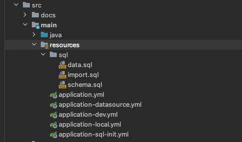
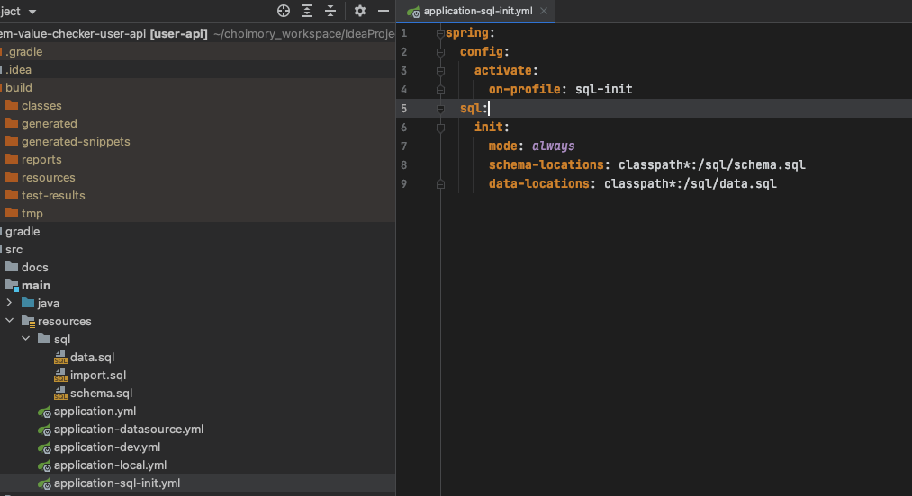
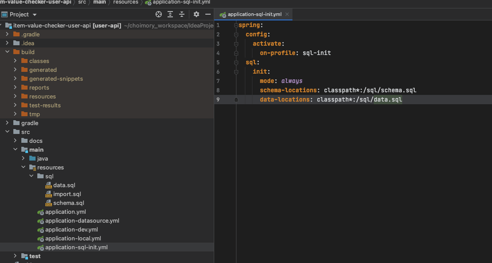
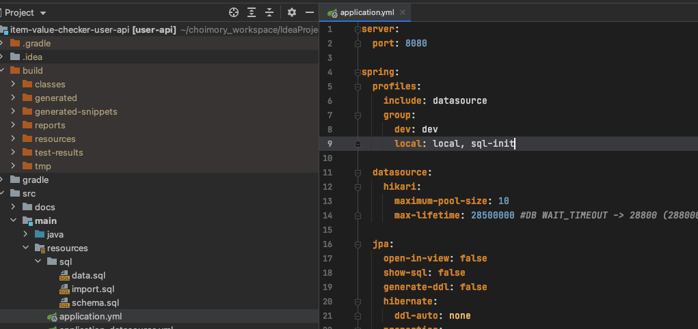

# 요약

# sql 파일 생성



- resources 밑에 원하는 디렉토리를 만들고 .sql 파일을 생성해준다
- sql파일명은 다음과 같아야한다 (설정으로 특별하게 지정할 시는 달라도 된다)
    - `schema.sql`: DDL문
    - `data.sql`: DML문
    - `import.sql`: DDL, DML 모두 작성가능
- 주의할점은 resources 하위에 .sql 파일을 바로 내려놓을시, 모든 프로필에서 해당 파일을 감지하여 자동실행되므로 주의해야 한다.
    - 그러므로 resources 밑 특정 디렉토리에 놓아서 자동실행을 방지하자

# 설정 작성



```shell
spring:
  sql:
    init:
      mode: always (never, embedded)
      schema-locations: classpath*:/sql/schema.sql
      data-locations: classpath*:/sql/data.sql
```

- resources 하위에 .sql 파일을 바로 내려놓을시, 설정 작성 없이도 모든 프로필에서 해당 파일을 감지하여 자동실행된다.
- mode 종류는 단어만으로도 감이 오겠지만, 항상실행(always), 실행안함(never), 인메모리DB만 실행(embedded)이다.

# 특정 프로필만 sql 파일 실행시키기

> 모든 프로필에서 sql을 실행하는것은 매우 위험할 수 있으므로, 특정 프로필에서만 실행하도록 지정할 수 있다.



- 먼저 sql.init 옵션을 별도의 설정으로 분리한뒤

  

- spring.profiles.group을 이용해 특정 프로필에만 해당 설정을 포함시켜준다