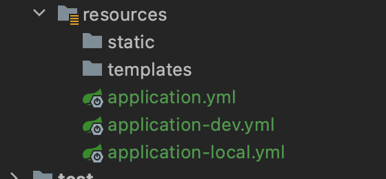
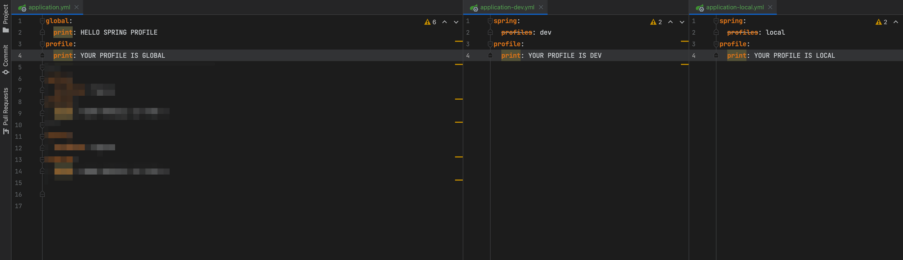
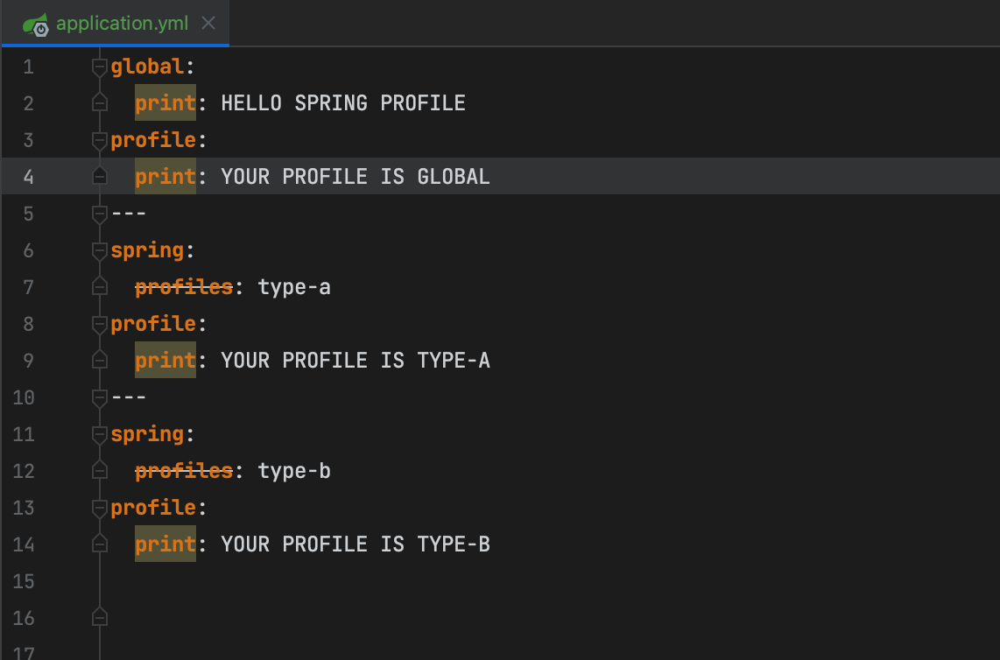
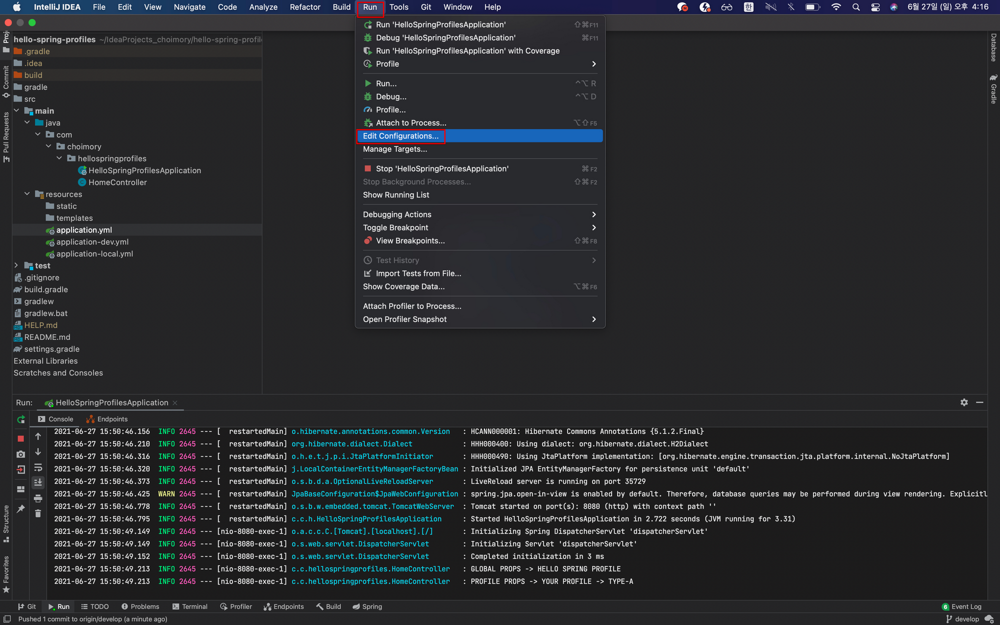
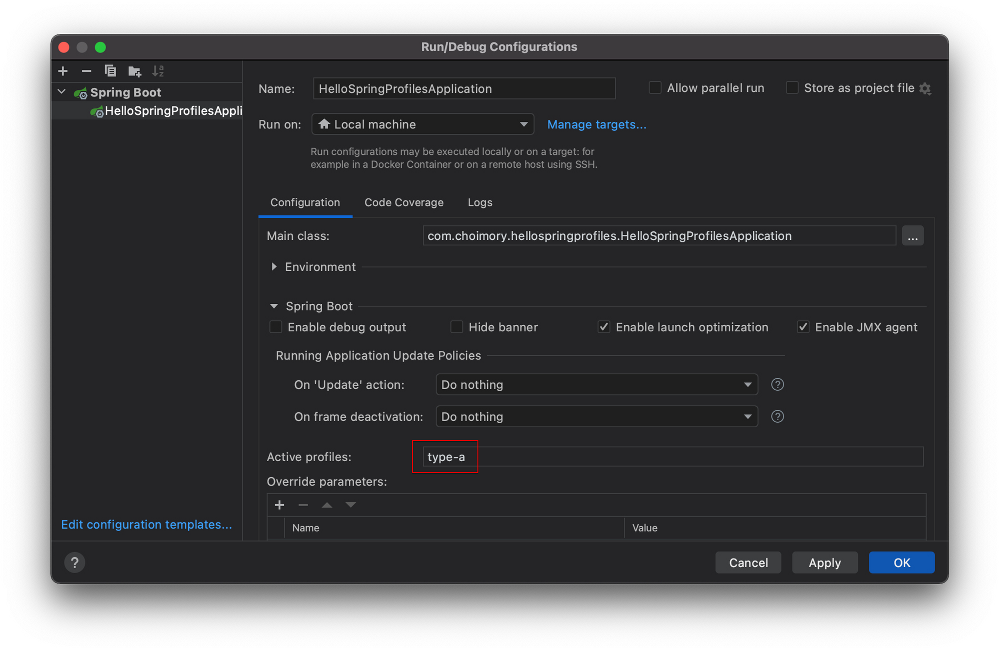

# 개요

- 로컬, 개발, 운영 등 실행환경에 따라 설정값을 변경하여 사용해야 할때 spring.profiles를 이용해 환경별 변경점을 간단히 적용시킬수 있다
- spring.profiles는 2.3까지 사용 가능하며 2.4부터는 사용은 가능하지만 depcrated 되었으니 참고하자
- 소스코드

  [choimory/hello-spring-profiles](https://github.com/choimory/hello-spring-profiles)

# 작성법

> profiles를 설정하지 않은 속성들은 모든 profile에 공통적용된다

## yml 파일을 실행환경별로 생성하여 작성



- 공용설정이 될 파일 외에 별개의 파일을 생성하고



- 각각의 파일에 spring.profiles를 작성하여 구분한뒤 작성할 수 있다
- spring.profiles를 작성하지 않은 yml은 공통적으로 실행된다 (사진의 application.yml 파일)
    - 해당 사진의 application.yml의 `global.print` 설정값은 겹치지 않으므로 모든 profile에 공통 적용된다
    - application.yml의 `profile.print`는 다른 profiles의 설정과 겹치므로, 다른 profile로 실행시 application.yml의 값은 무시된다
- 파일별로 쉽게 구분이 되므로 좋은 방법이다

## 하나의 yml안에 모두 작성

> 하나의 yml안에 여러 spring.profiles을 작성할땐 ---를 구분선으로 구분하여 작성해야 한다



- 구분선 최상단의 `global.print`는 공통적용된다
- 구분선 최상단의 `profile.print`는 실행할 profile을 정하지 않았을시 정해질 구분값이며, 실행할 profile을 정했을시 다른 profile의 값과 겹치므로 무시된다.
- 하나의 yml 파일에 `---`를 구분선으로 구분하여, profile별로 구분될 설정들을 작성한다
- 내용이 많아지면 스크롤이 길어지면서 슬슬 구분하기 힘들어진다

# 사용법

## 로컬 환경 실행



- 실행환경 설정으로 이동



- 실행하길 원하는 profile 작성 후 실행

## 운영 서버 배포

```bash
java -jar 파일명.jar --Dspring.profiles.active=프로필명
```

- 실행시 `--Dspring.profiles.active=프로필명` 옵션 추가