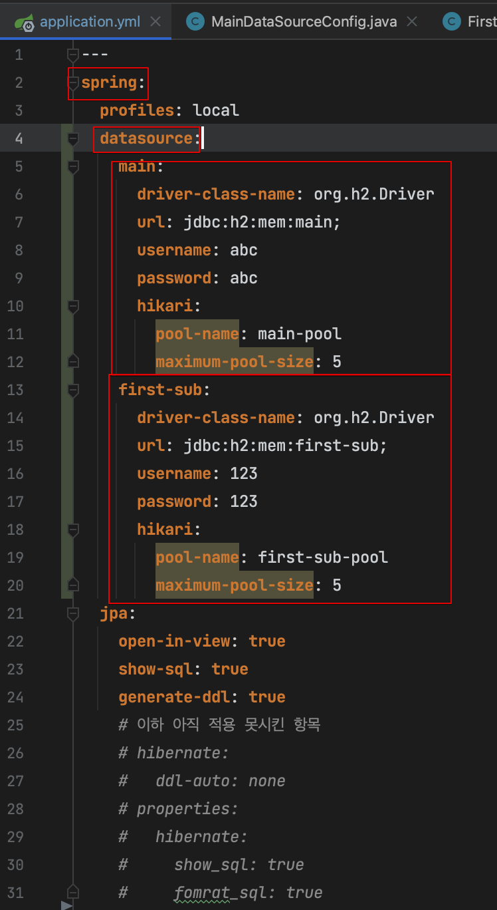
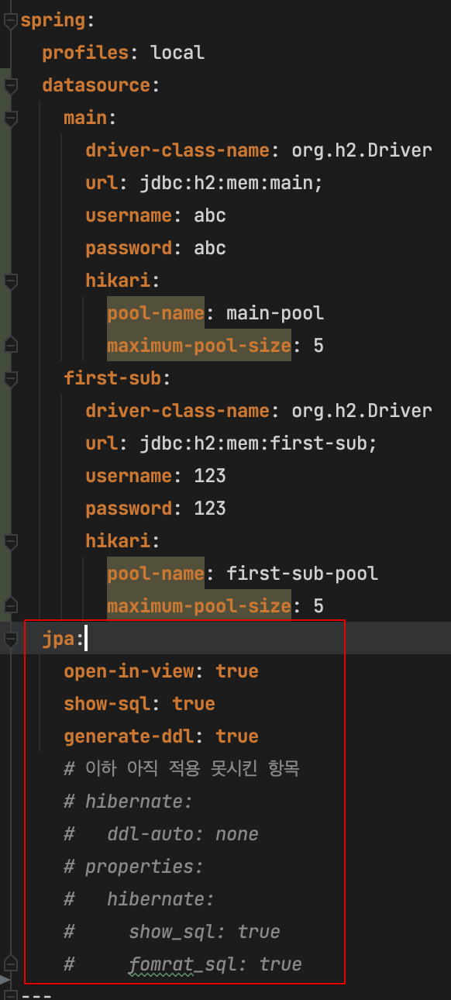
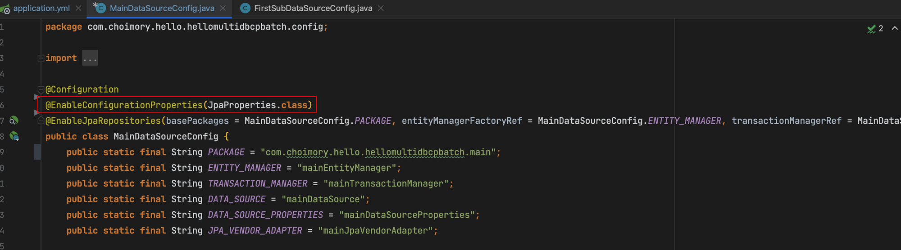
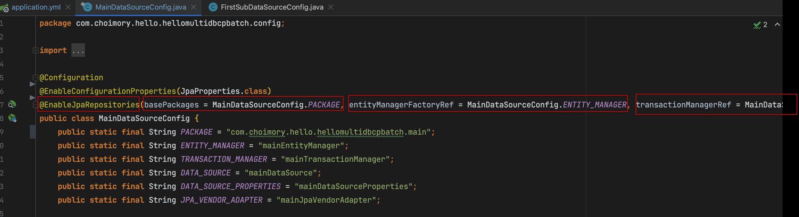
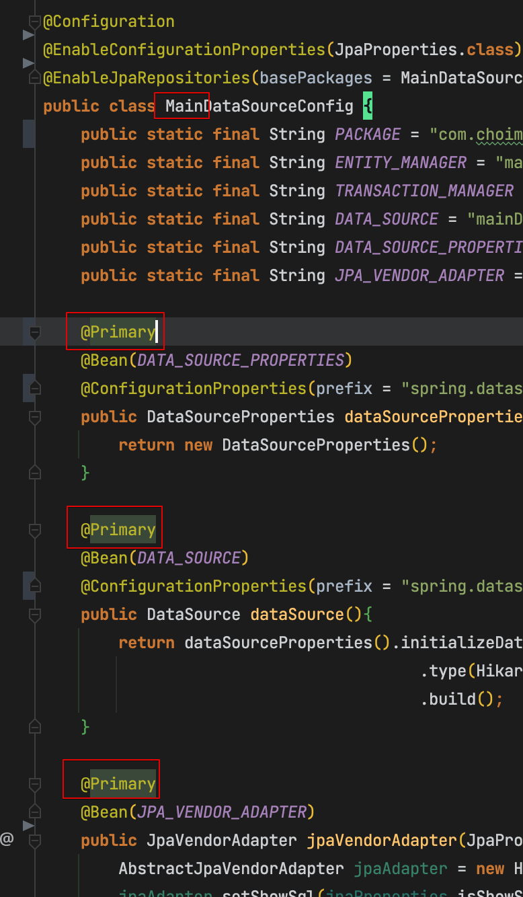
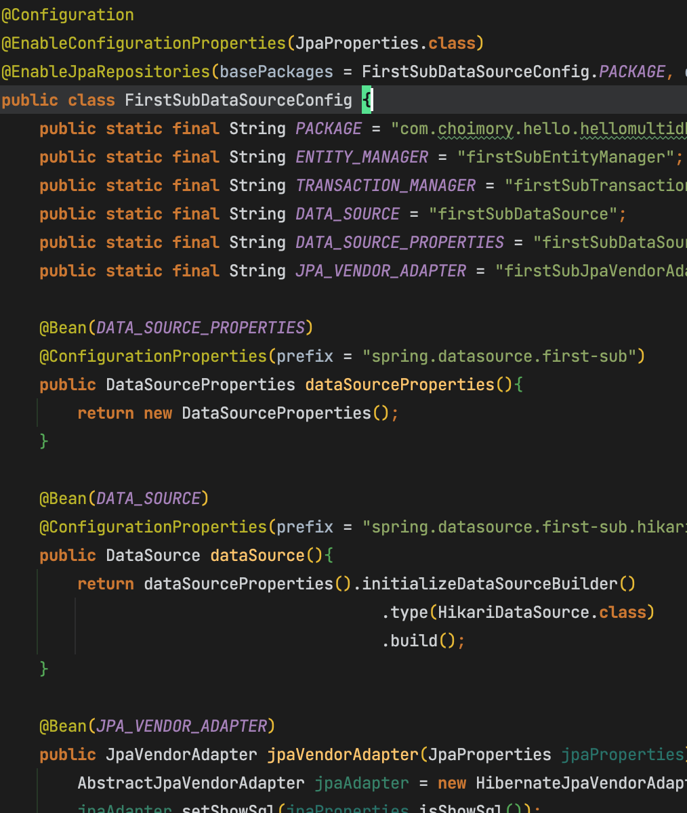
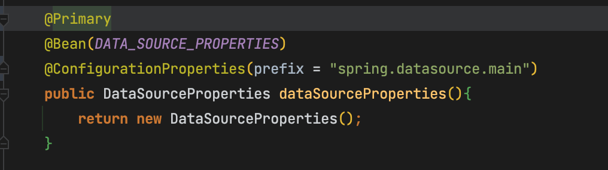
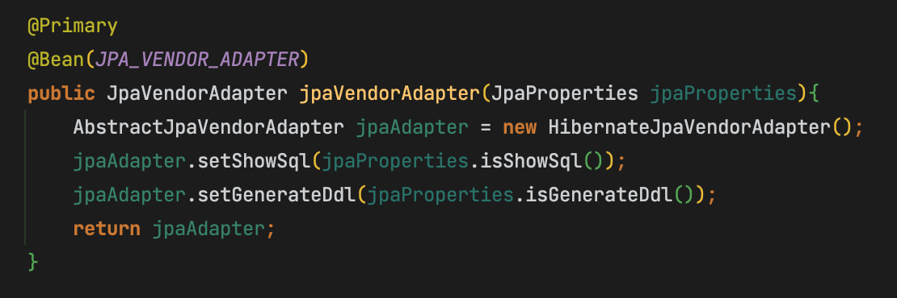
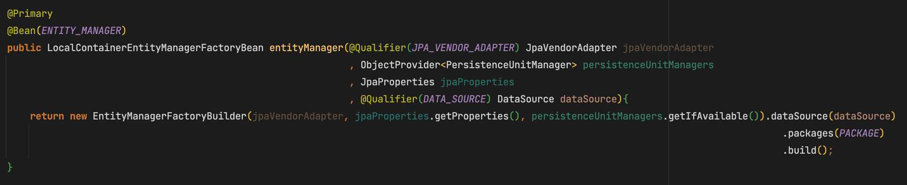
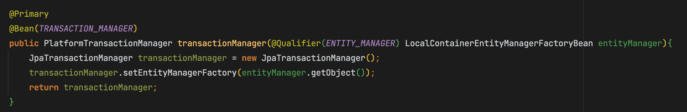

# 개요

- Spring boot에서 한 어플리케이션에서 복수의 DB를 접속해야 할때, 복수개의 DBCP를 사용하는법을 작성
- 소스코드: [https://github.com/choimory/hello-multi-dbcp-batch](https://github.com/choimory/hello-multi-dbcp-batch)

# application.yml 작성

## spring.datasource 설정

- spring.datasource.분류값.설정내용..., spring.분류값.datasource.설정내용... 등 원하는대로 분류하여 여러개의 datasource 설정을 작성
    - 추후 분류하여 작성한 대로 땡겨와서 DataSource를 생성할 수 있음

## spring.jpa 설정

- spring.jpa 기본 속성은 바로 적용됨
    - 적용은 바로 되는데 spring.jpa를 dbcp별로 구분해서 사용하는것까진 못해봄
        - 목적이 dbcp를 구분하는거지, spring.jpa를 구분하는건 아니니까?
        - 그렇다면 어쩔수 없이 그냥 profiles로 구분해서 전역적으로 가져가는 수밖에?
- jpa.properties... 혹은 jpa.hibernate...등의 설정은 적용이 안되고 있음😢

# @Configuration 작성

> 주의사항이 있다면, 한 패키지 내에서는 두개의 DataSource를 사용할 수 가 없다. DataSource를 사용하기 위해 최소 패키지단위로는 분류가 되어야 함.

## @EnableConfigurationProperties 혹은 @ConfigurationProperties

- @ConfigurationProperties는 원하는 설정을 상세하게 사용하고 싶을때, @EnableConfigurationProperties는 간단히 사용하고 싶을때 사용할 수 있음

### @EnableConfigurationProperties

- JpaProperties.class 등 리플렉션을 통해 속성값을 편하게 매핑하여 사용할 수 있음.
- 클래스에만 사용할 수 있는 어노테이션

### @ConfigurationProperties(prefix = "속성경로")

- 특정 경로의 원하는 속성들을 사용하고 싶을때
- 클래스 혹은 메소드에 사용 가능

## @EnableJpaRepositories

- 클래스에 사용
- 속성에 해당 DataSource Configuration을 적용할 패키지, EntityManager, TransactionManager빈을 지정해줌

## @Primary

메인 DataSource Configuration에 @Primary를 붙여줬음

서브 DataSource Configuration은 @Primary 없이 진행

- 복수의 dbcp 중 하나는 반드시 @Primary가 되어야 함
- 스프링배치 프레임워크 사용할시 @Primary 적용된 스키마에만 스프링배치 메타테이블이 존재하면 됨

## DataSourceProperties

- datasource 하위 기본 속성값들을 DataSourceProperties에 매핑하여 DataSourceProperties 객체를 반환

## DataSource

- 위의 DataSourceProperties 객체에 datasource.hikari 속성값들을 더해 최종적으로 DataSource 생성

## JpaVendorAdapter

- Hibernate 속성값 설절
- EnableConfigurationProperties → JpaProperties → 매개변수로 매핑되어 건내진것을 사용

## EntityManager

- 위의 JpaVendorAdapter에서 설정한 기본 설정값, JpaProperties에 있는 spring.jpa.properties 하위값과 위에서 작성한 datasource 빈을 이용해 특정 패키지를 지정하여 EntityManager를 생성함

## TransactionManager

- 위에서 생성한 EntityManager 빈을 이용해 Transaction을 설정함

# 출처

- [https://github.com/choimory/hello-multi-dbcp-batch](https://github.com/choimory/hello-multi-dbcp-batch)
- [https://github.com/jojoldu/spring-boot-multi-datasource](https://github.com/jojoldu/spring-boot-multi-datasource)
- [https://2dongdong.tistory.com/33](https://2dongdong.tistory.com/33)
- [https://eternalteach.tistory.com/67](https://eternalteach.tistory.com/67)