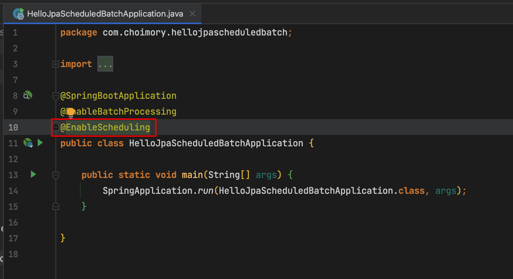
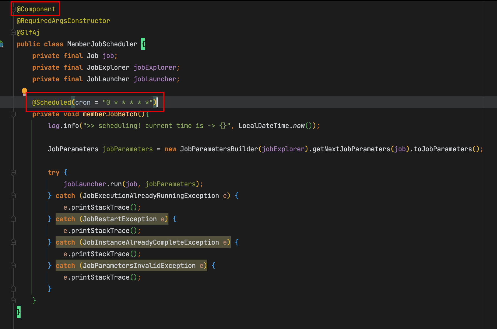

# 개요

- 단순 스케줄링은 스케줄링 프레임워크인 Quartz가 아닌 스프링 자체 제공 기능으로도 스케줄링을 지정할 수 있음
- 소스코드: [https://github.com/choimory/hello-jpa-scheduled-batch](https://github.com/choimory/hello-jpa-scheduled-batch)

# 사용법

- @Configuration 클래스에 `@EnableScheduling` 추가하여 스케줄링 기능을 ON

- 스케줄링 걸고 싶은 메소드에 `@Scheduled(cron = "크론식")`
- 스케줄링 걸 메소드가 존재하는 클래스는 스프링 빈이 생성되는 클래스여야 함 (스프링이 생성된 빈을 이용해 스케줄링을 함)