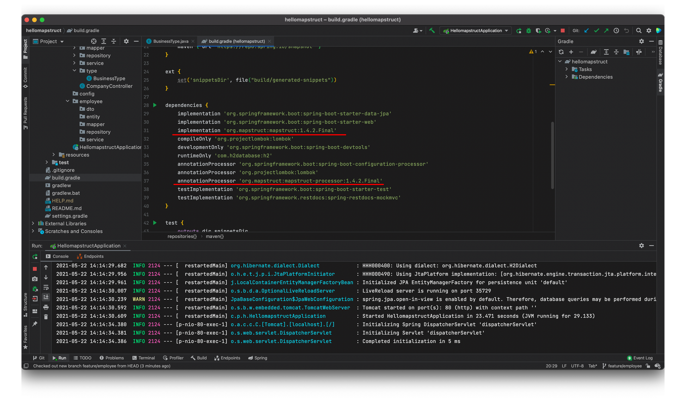
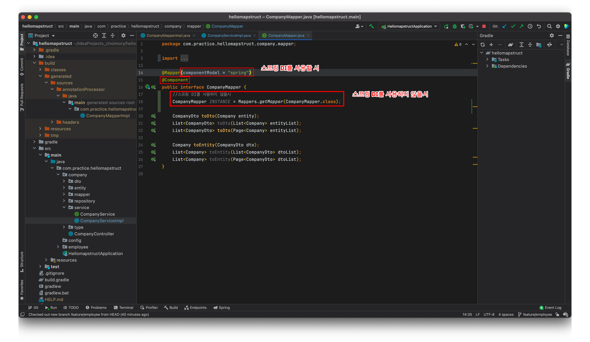
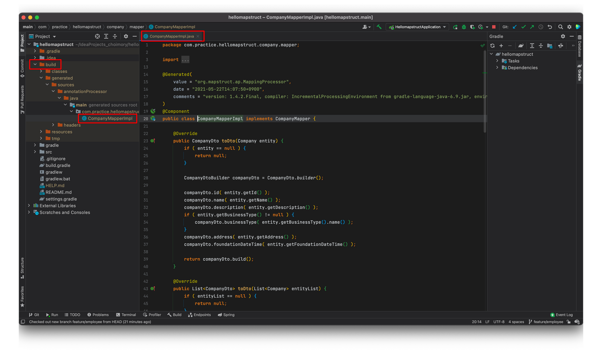

# 개요

- 스프링 MVC패턴에서 Layer를 오갈때 데이터는 보통 DTO에 옮겨담아 이동하는것을 권장한다.
- 이때 JPA등의 영속성 프레임워크를 사용할땐, 또 Persistence Layer에 한해서 DTO가 아닌 Entity에 옮겨담아 사용할것을 권장한다.
- 그래서 Controller Layer와 Service Layer는 DTO로 오가고, Service Layer와 Persistence Layer는 Entity로 오가는 상황이 발생하며 DTO와 Entity간의 변환이 계속해서 발생하게 된다
- 이 변환코드를 도메인마다 모두 작성해주기 번거로워 알아서 처리해주는 라이브러리가 등장했는데 ModelMapper와 MapStruct가 그러하다

# MapStruct?

- MapStruct는 인터페이스에 변환 메소드를 선언만 해놓고 MapStruct의 `@Mapper` 어노테이션을 붙이면, 빌드시 구현부의 변환코드(반복문 돌리고 값을 옮겨담는 로직 등)이 작성되어있는 구현클래스를 자동생성해주는 원리이다.
- 그래서 사용자는 인터페이스를 선언만 하면 된다
- Reflection을 활용하는 ModelMapper에 비해 성능적으로 우수하여 권장받는다.
- 동아시아 3국은 ModelMapper를 선호하나, 그 외에는 MapStruct가 선호받는 분위기이다

# Gradle



```bash
implementation 'org.mapstruct:mapstruct:1.4.2.Final'
annotationProcessor 'org.mapstruct:mapstruct-processor:1.4.2.Final'
```

- MapStruct의 Annotation Processor를 선언할때 Lombok의 Annotation Processor보다 밑에 선언해야 한다는 이야기가 있다

# Mapper Interface



- 인터페이스를 작성하고 `@Mapper` 어노테이션을 붙여 사용한다
    - 스프링을 사용하지 않는 경우에는, 인터페이스에 매퍼 팩토리에서 건내받은 인스턴스를 주입한 필드를 추가 선언하여 사용할 수 있다
    - 스프링을 사용할 경우 스프링 DI를 이용하는것이 더 현명한데, `@Mapper`에 `(componentModel="spring")` 속성을 추가한뒤 `@Component` 어노테이션을 추가로 붙여 스프링 Bean을 생성하여 활용하면 된다.
        - componentModel 속성이 없을시 스프링 빈 생성이 되지 않는다

# 자동 생성된 구현 클래스



- 인터페이스를 선언하고 빌드하자, 변환 로직이 작성된 구현 클래스가 자동 생성되었다

# 사용


- 선언해놓은 변환 메소드를 호출하는것으로 변환을 진행할 수 있다.
- 스프링 DI 미사용시엔, 인터페이스에 선언한 필드를, 스프링 DI 사용시엔 필드에 매퍼필드를 선언하고 스프링 빈을 주입하여 사용하면 된다.