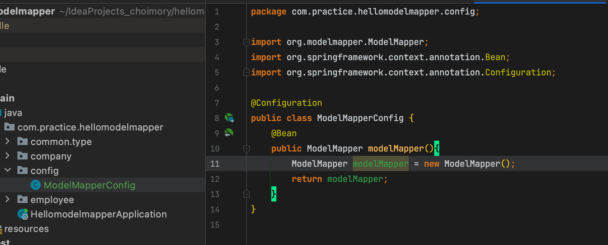
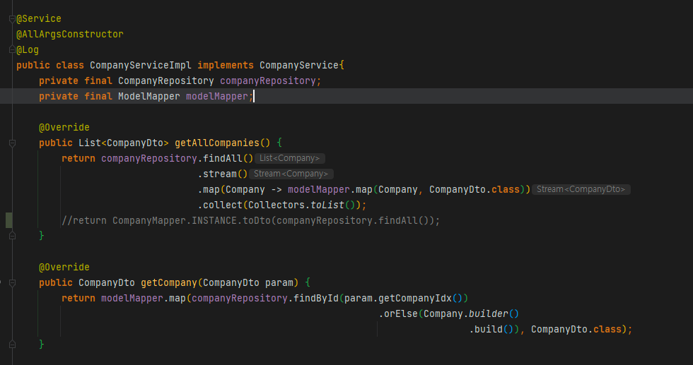

# 개요

- 리플렉션을 사용하므로 Mapstruct보다 성능이 안좋음
- Mapsturct가 사용하기 편함
- 동아시아에서는 ModelMapper를 즐겨쓰나 세계적으로는 Mapstruct 우세

# 사용

## @Configuration 작성

## ModelMapper 사용

- 필드 선언
- List일시 map메소드를 반복호출
- Dto일시 바로 호출