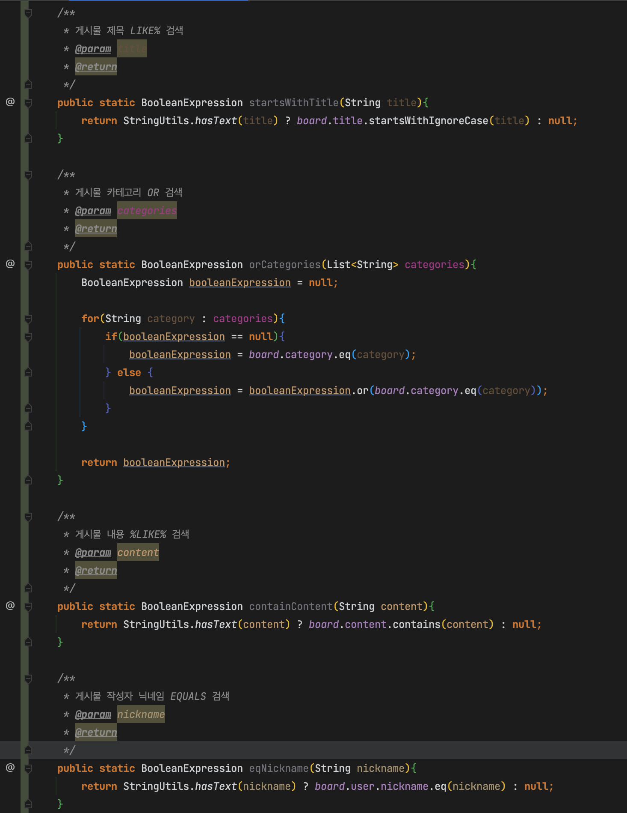
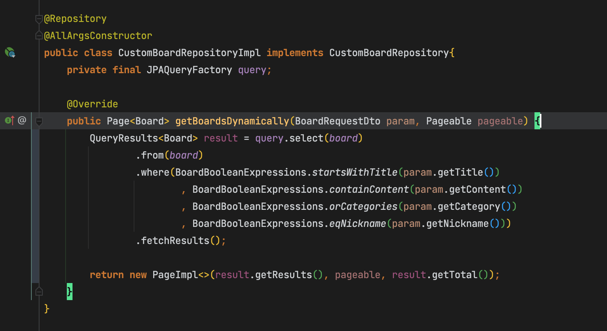
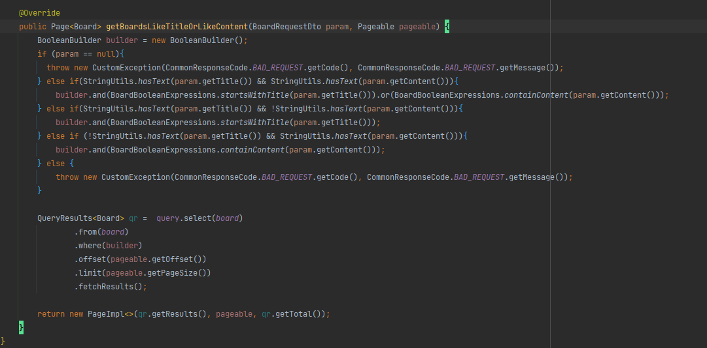

# 개요

- 동적 조건을 작성하기 위해 보통 BooleanBuilder를 사용한다
- 그러나 이는 해당 메소드에 종속적이며 가독성도 떨어진다
- BooleanExpression을 활용하여 BooleanBuilder보다 가독성 및 재사용성이 뛰어난 코드를 작성할 수 있다
- 조건에 따라 BooleanBuilder와 BooleanExpression을 결합하여 유용하게 함께 사용할 수 도 있음
    - 이를테면 inA컬럼 or inB컬럼을 조건으로 할때, inA컬럼 expression과 inB컬럼 Expression 호출을 BooleanBuilder 조건문으로 작성하는것 

# 사용

- BooleanExpression을 반환하는 메소드를 조건별로 작성한다

- 쿼리에서 원하는 조건의 메소드를 호출하여 사용
- 리턴된 BooleanExpression이 null일 경우 쿼리의 Where절 조건에 포함되지 않는다

# BooleanBuilder와 BooleanExpression의 동시 활용

- WHERE절에 조건 or 조건 or 등을 구현해야할때 BooleanBuilder와 BooleanExpression을 모두 활용할 수 도 있다. 

# 참고

[https://jojoldu.tistory.com/394](https://jojoldu.tistory.com/394)
