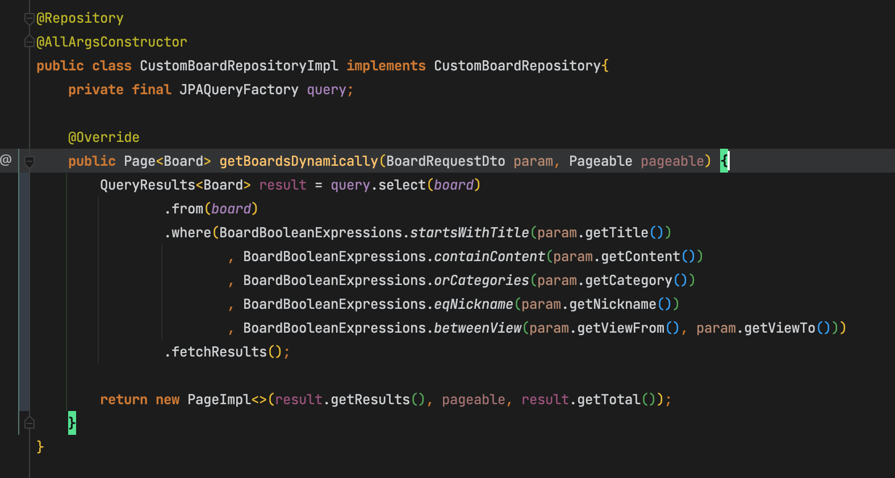

# 개요

- Page<T>를 반환하고자 할시엔 `return new PageImpl<T>(컬렉션, Pageable, totalcount)`

# 사용법

- QueryDsl의 QueryResults<T> 객체는 totalCount가 포함한 객체인데, 이 객체를 리턴받으려면 fetchResults()로 쿼리를 수행하면 된다
- 그 후 new PageImpl<>(List<T>, Pageable, TotalCount); 로 Page<T>객체를 생성하여 반환하면 된다
    - `List<T>`는 `QueryResults<T>.getResults()`
    - `Pageable`은 그냥 받은 매개변수를 다시 돌려주고
    - `TotalCount`는 `QueryResults<T>.getTotal()`

# fetchCount()?

- 하나의 `JPAQuery<T>`에서 `.fetch()`, `.fetchCount()`를 두번 호출하는것은 각각의 쿼리를 한번씩 총 두번 호출하는것이므로 성능문제가 있다
- 반면 `.fetchResults()`로 `QueryResults<T>`를 받아 `.getResults()`, `.getTotal()`을 사용하는것은, 한번의 쿼리로 두개의 값을 받아 단순히 꺼내쓰는것이므로 성능적으로 선택해야 할 방법이다