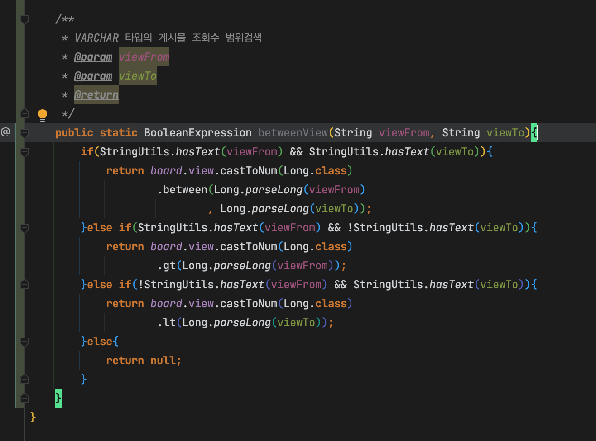

# 개요

- 숫자가 들어가는 컬럼이 VARCHAR로 정의되어 있을때 숫자로 형변환하여 숫자 비교연산 조건을 작성하는 방법

# 사용법

- 범위검색 최소값과 최대값 매개변수를 받는다
- 최소값과 최대값의 empty 여부 체크
- 엔티티 컬럼이 `VARCHAR`일시 `castToNum(Long.class)`를 이용해 Q엔티티 컬럼의 숫자변환
- 파라미터 타입이 `String`일시 `Long.parseLong(변수)`를 이용해 파라미터의 숫자변환
- 이후 변수 존재여부에 따라 `gt`, `lt`, `between`으로 쿼리 조건 생성