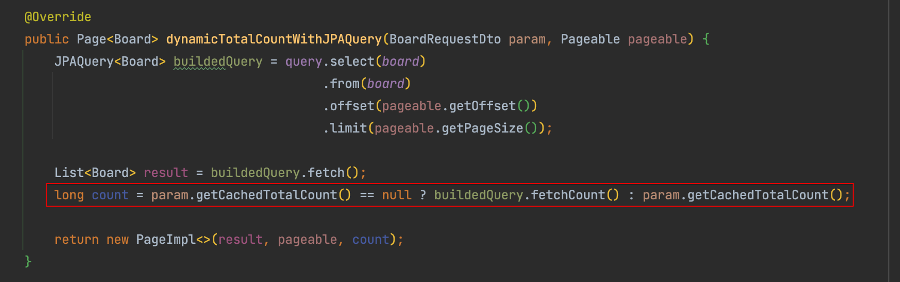

# 개요

- 목록조회 페이지네이션 쿼리시 성능 코스트가 많이 드는 요소들은 다음과 같음
    - offset
    - count()
    - like
    - subquery
    - 1:N Join
- 이 중 total count를 첫 검색시에만 포함시키고, 그 다음 페이지변경부터는 count() 쿼리 없이 기존 total count를 재사용하는 식으로 쿼리에 최소한으로만 포함시키는 방법을 알아봄

# 사용법

## 프론트

- 페이지네이션 버튼을 누를때마다 cachedTotalCount를 파라미터에 포함시켜 같이 보낸다

## 백

- 프론트에서 보낸 cachedTotalCount값이 없을때에만 count() 쿼리를 실행하고 그 외에는 기존 cachedTotalCount를 재사용한다

# 참고

- [https://jojoldu.tistory.com/531](https://jojoldu.tistory.com/531)