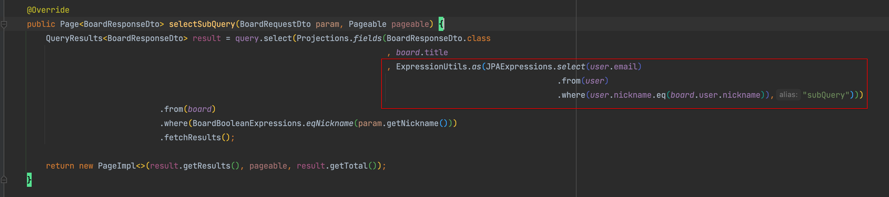
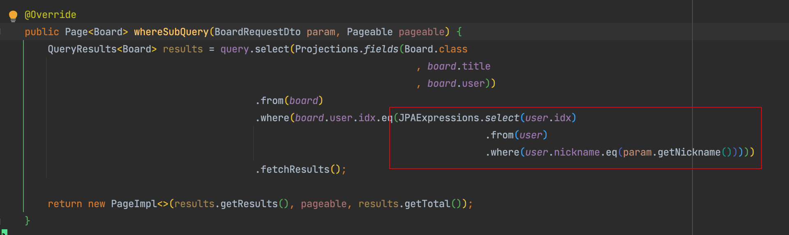

# 개요

- QueryDsl의 서브쿼리는 FROM절 서브쿼리는 지원되지 않으며, SELECT절과 WHERE절 서브쿼리에 한해 사용이 가능
- 구버전의 QueryDsl은 `JPASubQuery`를 사용하며 최신버전의 QueryDsl은 `JPAExpressions`를 사용한다
    - BooleanExpressions... JPAExpressions...
- QueryDsl의 서브쿼리에서는 limit()이 적용되지 않는다
    - JPQL의 원칙
- 소스코드: [https://github.com/choimory/querydsl-in-action](https://github.com/choimory/querydsl-in-action)

# 사용법

## SELECT clause

- `ExpressionUtils.as(JPAExpression.select.from....., "alias명")`
- JPAExpression.쿼리 마지막에 .fetch()는 제외
    - QueryDsl이 실행할 서브쿼리를 만들어 넘기는거지 값을 넘기는건 아님. 값은 쿼리 수행할때 서브쿼리 돌면서 얻어짐

## WHERE clause

- `where 쿼리타입.컬럼.조건(JPAExpression.select().from().where().orderby().limit()...등등.. )`
- JPAExpression.쿼리 마지막에 .fetch()는 제외
    - QueryDsl이 실행할 서브쿼리를 만들어 넘기는거지 값을 넘기는건 아님. 값은 쿼리 수행할때 서브쿼리 돌면서 얻어짐

# 참고

- [https://jojoldu.tistory.com/379](https://jojoldu.tistory.com/379)