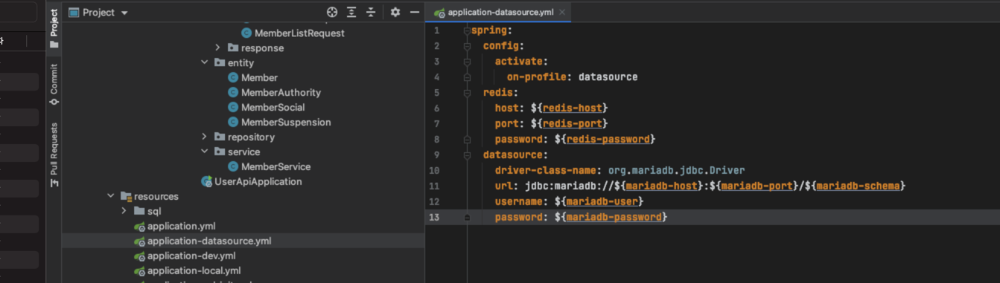

# 요약

- spring boot 2.4 부터 생긴 기능
- 분리된 yml 파일의 설정을 다른 프로필의 설정과 합쳐서 실행할 수 있다.
- 해당 기능이 spring.profiles로 생기면서 기존의 spring.profiles는 deprecated 되고, spring.config.activate.on-profile로 대체 되었다.
- 위의 이유로 해당 설정을 작성한 yml 파일은 프로필로 사용할 수 없다.

# spring.profiles.include

- 모든 프로필에 포함될 공통사항은 include로 작성해준다

# spring.profiles.group

- 특정 프로필에만 포함될 사항은 group으로 작성해준다

# 주의사항

- 해당 내용을 작성한 프로필은 구동되지 않는다
  - 이는 과거에 프로필 이름 지정에 사용되던 spring.profiles(지금은 spring.config.activate.on-profile)과 새로운 spring.profiles의 충돌 때문. 
  - 지금도 spring.profiles로 프로필을 지정하는건 deprecated지만 사용은 가능하도록 처리하면서 새로운 기능이 들어갔기 때문에 충돌이 발생함.

# 참고

- [기본 사용법](https://backtony.github.io/spring/2021-08-21-spring-start-8/)
- [새 속성의 override와 충돌 관련 스택오버플로](https://stackoverflow.com/questions/47368086/spring-spring-profiles-include-overrides)