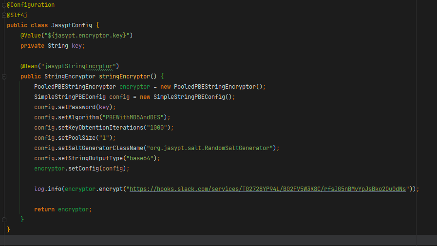
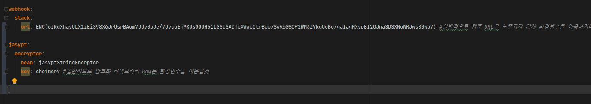

# 개요

- yml에 DB접속정보나 웹훅 URL정보등의 노출하기 곤란한 내용을 작성해야할때
    - 보통은 환경변수를 통해 값을 넘겨주지만
    - jasyptEncryptor를 이용해 yml에 암호화된 내용을 작성하여 넘겨줄 수도 있다

# 의존성 추가

```java
implementation group: 'com.github.ulisesbocchio', name: 'jasypt-spring-boot-starter', version: '3.0.3'
```

# Configuration 작성



```java
@Configuration
@Slf4j
public class JasyptConfig {
    @Value("${jasypt.encryptor.key}")
    private String key;

    @Bean("jasyptStringEncrptor")
    public StringEncryptor stringEncryptor() {
        PooledPBEStringEncryptor encryptor = new PooledPBEStringEncryptor();
        SimpleStringPBEConfig config = new SimpleStringPBEConfig();
        config.setPassword(key);
        config.setAlgorithm("PBEWithMD5AndDES");
        config.setKeyObtentionIterations("1000");
        config.setPoolSize("1");
        config.setSaltGeneratorClassName("org.jasypt.salt.RandomSaltGenerator");
        config.setStringOutputType("base64");
        encryptor.setConfig(config);

				//암호화 하고 싶은값 암호화 결과 로그 출력을 위해 일시적으로 작성
        log.info(encryptor.encrypt("암호화하고 싶은 값"));

        return encryptor;
    }
}
```

- 암호화하고싶은값의 암호화결과를 로그로 출력한 후 해당값을 확인하였으면 로그를 지우도록 한다

# yml 작성



- 암호화한 값을 yml에 작성하고 싶을시 `ENC(암호화된값)`으로 작성한다
- `jasypt.encryptor.bean`에는 stringEncryptor()의 bean 이름을 작성한다
- `encryptor의 비밀번호` (예시에서는 jasypt.encryptor.key)는 소스코드 보존을 위해 yml에 썼지만 보통은 환경변수로 넘기도록 한다

# 참고

- [https://toma0912.tistory.com/82](https://toma0912.tistory.com/82)