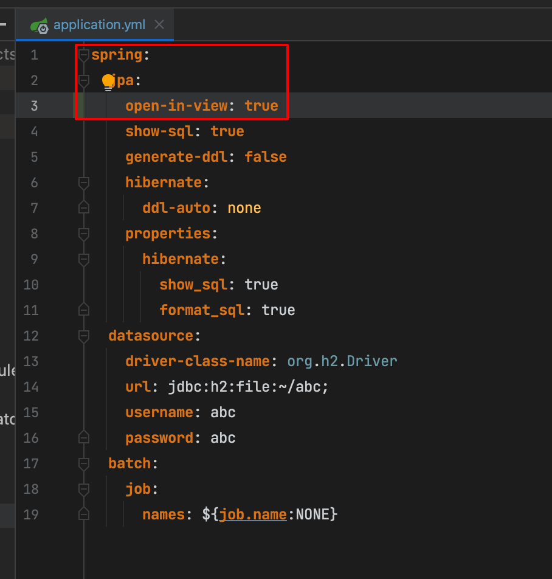

# 개요

- 영속성 컨텍스트의 영속성이 detach() 된 후에 지연로딩을 시도해서 발생하는 오류

# 발생원인

- 지연로딩으로 설정한 필드에 접근하려면, 접근하는 순간에 영속성 컨텍스트가 (@PersistenceContext가 붙은 EntityManager) detach() 되지 않고 살아있어야 한다
- 그런데 스프링부트 기본값 true인 One Session In View 설정을 false로 해두게되면 영속성 컨텍스트가 사용 종료되자 마자 detach된다
    - One Session In View (OSIV) : 영속성 컨텍스트의 스코프를 뷰 렌더링 할때까지 이어지게 하는 설정. 즉 컨트롤러 리턴할때까지 영속성 컨텍스트를 계속 살려둠
        - 여기서 영속성 컨텍스트의 스코프가 길어지므로 커넥션풀 반납시기가 늦어져 성능 이슈가 발생할 수 있으므로 스프링부트는 OSIV 설정값이 true일시 경고를 출력함. (하지만 그러면서도 스프링부트의 OSIV의 기본값은 true임)
- 그래서 그 후 접근시 LazyInitializeException 오류가 발생하는것

# 대응방법

## OSIV (Open-session-in-view)를 true로 설정한다

- spring.jpa.open-in-view: true로 설정하여 영속성 컨텍스트의 생명주기를 뷰 렌더링까지 늘린다
    - 영속성 컨텍스트의 생명주기가 뷰 렌더링까지 늘어난다는것은 Controller가 리턴할때 까지 영속성을 detach()하지 않는다는것으로 사실상 백단에 있는동안 계속 살아 있는 셈이 된다
- 그래서 백단에서 언제 지연로딩 객체에 접근하던 상관이 없다.
- 단 유저당 커넥션풀 반납 시기가 늦어지므로 이슈가 생길수 있다

## @Transactional를 부여한다

- 트랜잭션을 건 범위내에서는 commit or rollback을 위해 영속성 컨텍스트의 영속성을 detach()하지 못하고 계속 나두게 될 수 밖에 없으므로 자연히 생명주기가 길어지는 셈이다
- 대표적으로 트랜잭션을 서비스 메소드에 걸시, 영속성이 서비스 메소드의 종료시까지 살아있게 되므로 해당 서비스 메소드 내에서는 지연로딩 객체에 대한 접근에 부담이 없다
- 조회 관련 로직에도 트랜잭션을 처리할 시 성능이슈 존재할 수 있음

# 참고

- [https://woowacourse.github.io/javable/post/2020-09-11-osiv/](https://woowacourse.github.io/javable/post/2020-09-11-osiv/)