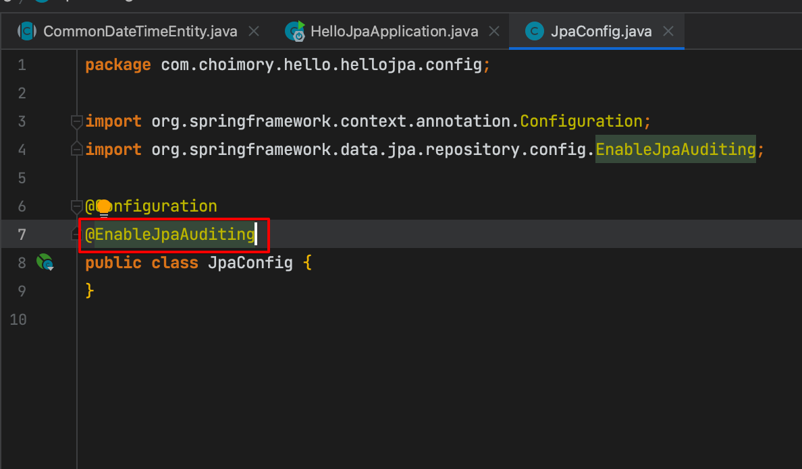
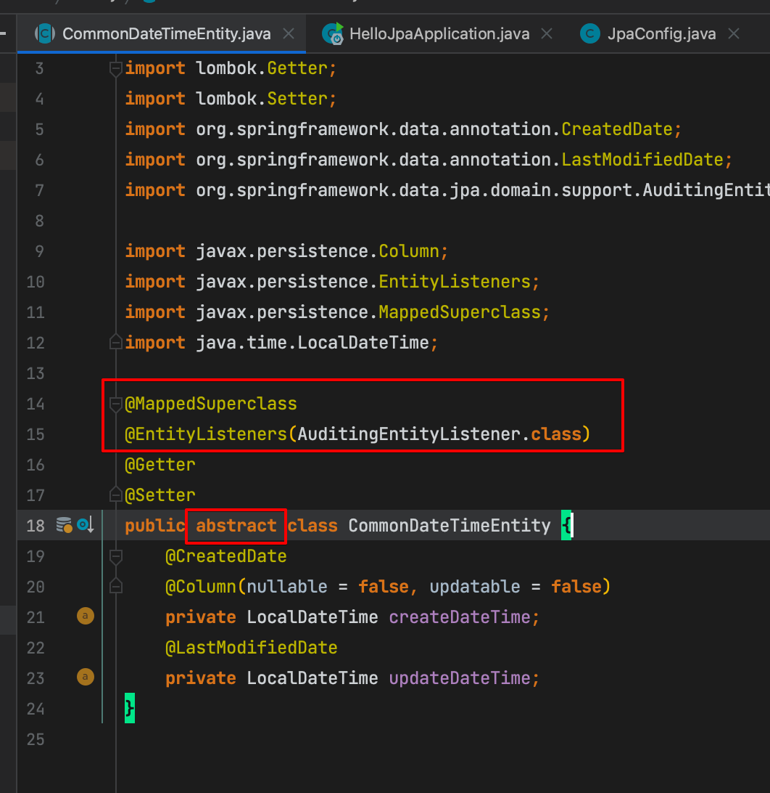
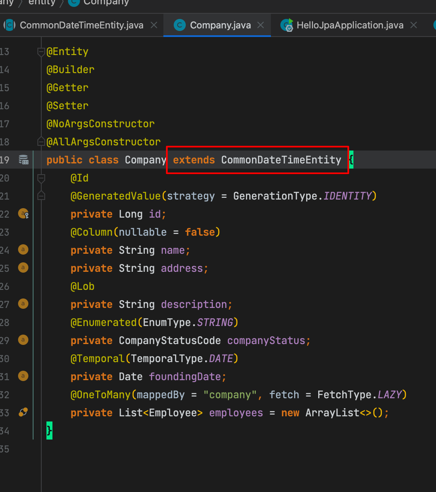

# 개요

- 모든 테이블에 공통적으로 들어가는 등록일, 수정일 등의 컬럼은 JPA Auditing으로 설정해줄수 있다

# 사용방법

- `@Configuration` 클래스에 EnableJpaAuditing 추가

- Auditing 클래스 작성
- MappedSuperClass
    - 해당 엔티티를 상속할시, 해당 엔티티의 컬럼도 물려받게함
- EntityListeners
    - 해당 엔티티를 Auditing 활성화 시킴

- Auditing 엔티티 클래스 상속

# 출처

- [https://jojoldu.tistory.com/251](https://jojoldu.tistory.com/251)