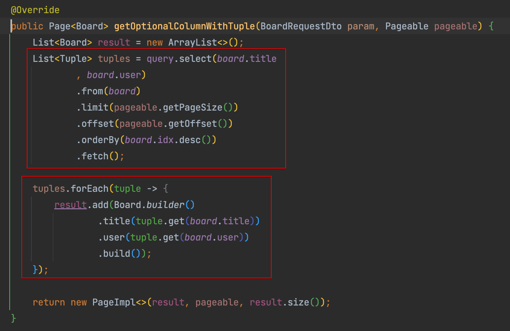
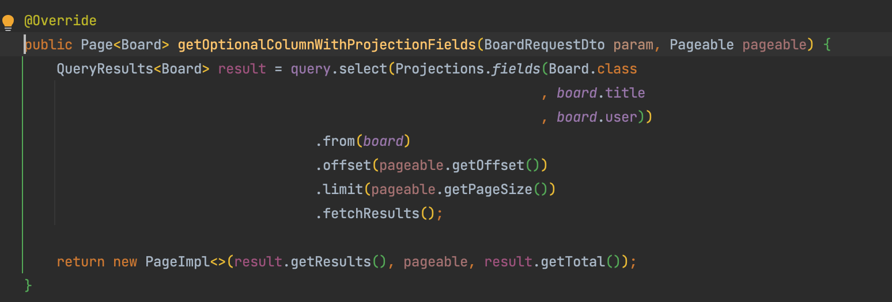

# 개요

- 특정 컬럼만 Select 하여 가져오는 방법으로 Tuple, Projections.fields 방법이 있다.
- Tuple은 일종의 Map같은 QueryDsl 제공 객체이며, Projections.fields는 본인이 작성한 객체에 알아서 매핑이 되는 방식이다

# Tuple

- Tuple.get(엔티티.컬럼)으로 꺼내 옮겨담으면 된다

# Projections.fields

- Select절 내에 `Projections.fields(클래스, 엔티티.컬럼.....)`