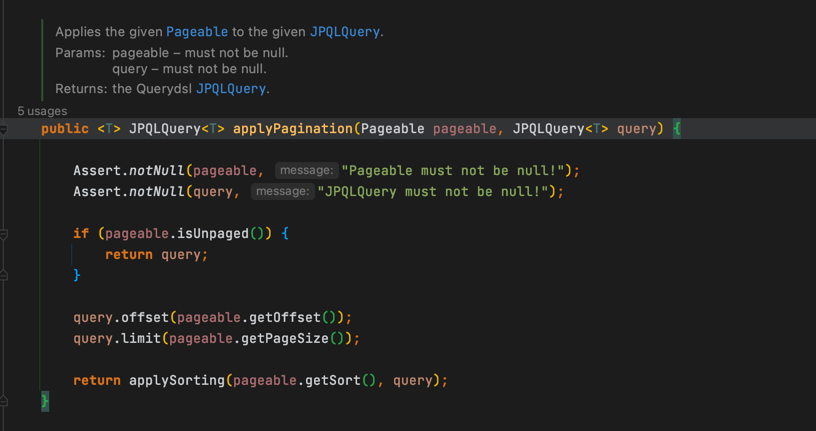

# 요약

- 기존 Querydsl은 페이징과 정렬, 특히 정렬을 동적으로 처리하는게 힘들다.
- 또한 정렬을 위해 Querydsl만의 OrderSpecifier로 다시 한번 변경해줘야 하는 처리가 들어가야 하므로 수고롭다.
- 이를 보완하기 위해 Querydsl은 QuerydslRepositorySupport라는 추상클래스를 제공하나, 이는 JPQL문법으로 적용되어 있다
- 때문에 QuerydslRepositorySupport를 Querydsl 형식으로 재작성하거나, 김영한 강사님의 Querydsl4RepositorySupport를 사용할 수 있다.

# 기존 문제점

```java
        query.select(member)
                .from(member)
                .where(eqIdName(param),
                        containsNickname(param),
                        containsEmail(param),
                        eqAuthLevel(param),
                        betweenCreatedAt(param),
                        betweenModifiedAt(param),
                        betweenDeletedAt(param)))
                .offset(pageable.getOffset())
                .limit(pageable.getPageNumber())
                .orderBy(this.convertToOrderSpecifier(pageable.getSort()))
        .fetchResults();
```

- JPAQueryFactory를 이용해 메소드체이닝을 하여 쿼리를 작성할때, 페이징에 해당하는 offset(), limit() 그리고 정렬에 해당하는 orderBy()를 상황에 따라 체이닝할지 여부를 동적으로 결정할 수 없다
- 또한 Querydsl에서는 정렬에 OrderSpecifier라는, 스프링에서 사용되는 Pageable의 Sort와 다른 인터페이스로 만들어져 있으므로 Pageable.Sort를 OrderSpecifier로 변환해주는 로직에 대한 공수가 들어간다.

# QuerydslRepositorySupport 사용 및 문제점

## 사용

```java
@Repository
public class QMemberRepositoryImpl extends QuerydslRepositorySupport implements QMemberRepository {
    private final JPAQueryFactory query;

    public QMemberRepositoryImpl(JPAQueryFactory query) {
        super(Member.class);
        this.query = query;
    }
```

- 먼저 QuerydslRepositorySupport라는 추상클래스를 상속해주고, 생성자에서 super(Entity.class)로 부모클래스도 생성해준다

```java
public Page<Member> getMembers(final MemberListRequest param, final Pageable pageable) {
        QueryResults<Member> result = getQuerydsl().applyPagination(pageable,
                query.select(member)
                        .from(member)
                        .where(eqIdName(param),
                                containsNickname(param),
                                containsEmail(param),
                                eqAuthLevel(param),
                                betweenCreatedAt(param),
                                betweenModifiedAt(param),
                                betweenDeletedAt(param)))
                .fetchResults();


        return new PageImpl<>(result.getResults(), pageable, result.getTotal());
    }
```

- 그 후, 상속받은 `.getQuerydsl().applyPagination(pageable, query).fetch();`를 수행해주면 된다

## 문제점



- QuerydslRepositorySupport는 기본적으로 JPQLQuery를 다루고 있는데, JPQLQuery는 from()절부터 쿼리를 시작하게 되어있다는 점이 큰 제약.
- 반면 JPAQuery를 다루는 Querydsl은 select절부터 쿼리를 작성하며 원하는 필드만 조회가 가능하고 더 다양한 쿼리를 작성할 수 있기 때문에 쉽게 포기할 수가 없으며, 이를 무시하고 Querydsl을 이용해 JPAQuery로 진행할 시 정렬 적용시 문법 오류가 발생함.
- 때문에 이런 QuerydslRepositorySupport의 단점을 직접 커스터마이징하여 사용할 수 있음.

# Querydsl4RepositorySupport 작성 및 사용

## 사용

```java

/**
 * Querydsl 4.x 버전에 맞춘 Querydsl 지원 라이브러리
 *
 * @author Younghan Kim
 * @see org.springframework.data.jpa.repository.support.QuerydslRepositorySupport
 */
public abstract class Querydsl4RepositorySupport {

    private final Class domainClass;
    private Querydsl querydsl;
    private EntityManager entityManager;
    private JPAQueryFactory queryFactory;

    public Querydsl4RepositorySupport(Class<?> domainClass) {
        Assert.notNull(domainClass, "Domain class must not be null!");
        this.domainClass = domainClass;
    }

    @Autowired
    public void setEntityManager(EntityManager entityManager) {
        Assert.notNull(entityManager, "EntityManager must not be null!");

        JpaEntityInformation entityInformation =
                JpaEntityInformationSupport.getEntityInformation(domainClass, entityManager);

        SimpleEntityPathResolver resolver = SimpleEntityPathResolver.INSTANCE;
        EntityPath path = resolver.createPath(entityInformation.getJavaType());
        this.entityManager = entityManager;
        this.querydsl = new Querydsl(entityManager, new
                PathBuilder<>(path.getType(), path.getMetadata()));
        this.queryFactory = new JPAQueryFactory(entityManager);
    }

    @PostConstruct
    public void validate() {
        Assert.notNull(entityManager, "EntityManager must not be null!");
        Assert.notNull(querydsl, "Querydsl must not be null!");
        Assert.notNull(queryFactory, "QueryFactory must not be null!");
    }

    protected JPAQueryFactory getQueryFactory() {
        return queryFactory;
    }

    protected Querydsl getQuerydsl() {
        return querydsl;
    }

    protected EntityManager getEntityManager() {
        return entityManager;
    }

    protected <T> JPAQuery<T> select(Expression<T> expr) {
        return getQueryFactory().select(expr);
    }

    protected <T> JPAQuery<T> selectFrom(EntityPath<T> from) {
        return getQueryFactory().selectFrom(from);
    }

    protected <T> Page<T> applyPagination(Pageable pageable,
                                          Function<JPAQueryFactory, JPAQuery> contentQuery) {

        JPAQuery jpaQuery = contentQuery.apply(getQueryFactory());

        List<T> content = getQuerydsl().applyPagination(pageable,
                jpaQuery).fetch();

        return PageableExecutionUtils.getPage(content, pageable,
                jpaQuery::fetchCount);
    }

    protected <T> Page<T> applyPagination(Pageable pageable,
                                          Function<JPAQueryFactory, JPAQuery> contentQuery, Function<JPAQueryFactory,
            JPAQuery> countQuery) {

        JPAQuery jpaContentQuery = contentQuery.apply(getQueryFactory());

        List<T> content = getQuerydsl().applyPagination(pageable,
                jpaContentQuery).fetch();

        JPAQuery countResult = countQuery.apply(getQueryFactory());

        return PageableExecutionUtils.getPage(content, pageable,
                countResult::fetchCount);
    }
}
```

- Querydsl4RepositorySupport의 전체 코드이다

```java
@Repository
public class QMemberRepositoryImpl extends Querydsl4RepositorySupport implements QMemberRepository {
    private final JPAQueryFactory query;

    public QMemberRepositoryImpl(JPAQueryFactory query) {
        super(Member.class);
        this.query = query;
    }

    @Override
    public Page<Member> getMembers(final MemberListRequest param, final Pageable pageable) {
        QueryResults<Member> result = getQuerydsl().applyPagination(pageable,
                query.select(member)
                        .from(member)
                        .where(eqIdName(param),
                                containsNickname(param),
                                containsEmail(param),
                                eqAuthLevel(param),
                                betweenCreatedAt(param),
                                betweenModifiedAt(param),
                                betweenDeletedAt(param)))
                .fetchResults();

        return new PageImpl<>(result.getResults(), pageable, result.getTotal());
    }
}
```

- 사용방법은 기존과 완전히 동일함

# 참고

- [https://velog.io/@dhk22/TIL-Day-68-Querydsl-%EC%A0%95%EB%A0%AC%EC%A1%B0%EA%B1%B4-%EB%8F%99%EC%A0%81%EC%9C%BC%EB%A1%9C-%EC%A0%81%EC%9A%A9%ED%95%98%EA%B8%B0-QuerydslRepositorySupport](https://velog.io/@dhk22/TIL-Day-68-Querydsl-%EC%A0%95%EB%A0%AC%EC%A1%B0%EA%B1%B4-%EB%8F%99%EC%A0%81%EC%9C%BC%EB%A1%9C-%EC%A0%81%EC%9A%A9%ED%95%98%EA%B8%B0-QuerydslRepositorySupport)
- [https://velog.io/@dbsrud11/QueryDSL-%EC%8A%A4%ED%94%84%EB%A7%81-%EB%8D%B0%EC%9D%B4%ED%84%B0-JPA%EA%B0%80-%EC%A0%9C%EA%B3%B5%ED%95%98%EB%8A%94-Querydsl-%EA%B8%B0%EB%8A%A5](https://velog.io/@dbsrud11/QueryDSL-%EC%8A%A4%ED%94%84%EB%A7%81-%EB%8D%B0%EC%9D%B4%ED%84%B0-JPA%EA%B0%80-%EC%A0%9C%EA%B3%B5%ED%95%98%EB%8A%94-Querydsl-%EA%B8%B0%EB%8A%A5)
- [https://cheese10yun.github.io/querydsl-support/](https://cheese10yun.github.io/querydsl-support/)
- [https://velog.io/@shining_dr/Querydsl-Repository-expansion](https://velog.io/@shining_dr/Querydsl-Repository-expansion)