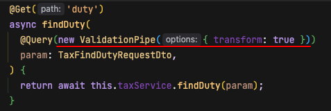
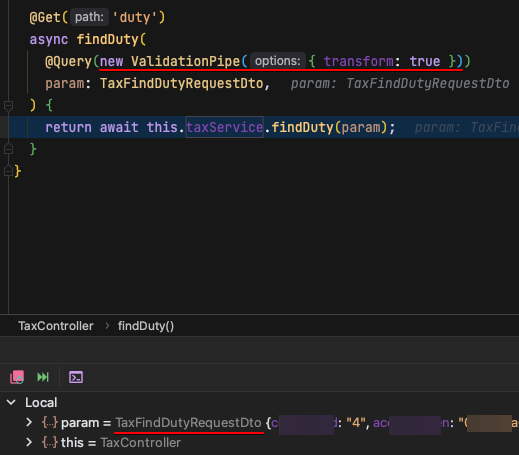
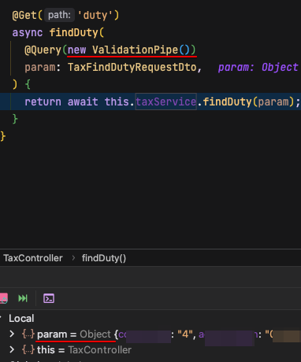

# 개요

- 클라이언트 요청값을 컨트롤러의 파라미터로 받을때 특정 클래스로 받는법을 알아봄 

# 컨트롤러

- new ValidationPipe({ transform:true })를 작성할시 컨트롤러의 파라미터는 해당 클래스의 객체로 생성된다
- transform 없을시 기본 false이므로 해당 클래스 객체가 아닌 object 객체로 생성된다

# 확인

- transform true일시 특정 클래스로 변환되어 매핑됨

- 없을시 false처리되어 object로 들어옴

# 참고

- [https://stackoverflow.com/questions/58377492/query-does-not-transform-to-dto](https://stackoverflow.com/questions/58377492/query-does-not-transform-to-dto)