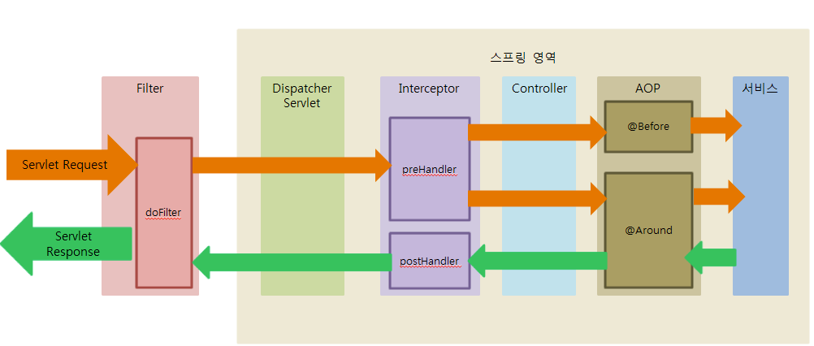

# Bean Scope

- 변수의 생명주기와는 다른 내용 (로컬변수: 메소드 종료때, 인스턴스 변수: 참조 없을, static 변수: 클래스 언로드때)
- 종류는 싱글턴, 프로토타입, 리퀘스트, 세션, 글로벌 세션, 어플리케이션 6가지가 존재
    - singleton: 컨테이너에 딱 하나, 메모리 및 성능 유리
    - request: HTTP Request 별로 하나씩, 요청마다 고유의 빈 
    - session: HTTP Session 별로 하나식
    - application: 서블릿 생명주기 안에 하나
- 객체생성 -> 의존 설정 -> 초기화 -> 사용 -> 소멸(destroyed)
- Application Context가 아닌 Spring context에 관리를 위임할시 스프링이 어노테이션 스캔하여 해당 클래스들에 대한 빈 생성 및 소멸을 관리한다
- @PostConstruct로 생성, @PreDestroy로 소멸
- 컨테이너 생성 -> 빈 생성 -> 의존관계 주입 -> 초기화 콜백 메소드 호출 -> 소멸 전 콜백 메소드 호출 -> 종료

---

# Spring context(스프링 컨테이너)

- 인스턴스의 생명주기 관리를 위임받은 경우, 스프링은 해당 인스턴스들을 spring context에 저장하여 관리한다
- IoC, DI는 스프링 컨테이너에 저장된 인스턴스를 이용하여 처리된다

---

# IoC

- 위의 인스턴스의 생명주기 관련된 생성 및 관리를 위임받아 객체의 생성과 소멸을 대신 처리해주는것을 제어의 역전(IoC)라 함

---

# DI

- 작성한 코드의 의존성을 스프링 컨테이너로부터 주입받는것
- 생성자 주입, 세터 주입, 필드 주입이 있으며 생성자 주입이 권장된다
    - 생성자 주입은 인스턴스를 생성할때 주입되며 final을 붙여 불변으로 만들 수 있기 때문이다
- 의존성은 모듈의 변경시 다른 모듈까지 모두 바뀌어야 되거나 오류가 전염되는등, 이러한 문제를 코드에서 걷어내어 DI를 스프링에게 위임한다

---

# Filter, Interceptor, AOP

## Filter

- 서블릿 이전에 실행된다
- 인코딩 변환 처리, XSS 공격 방어 등의 처리 등에 사용 가능
- WAS 구동시 FilterMap이라는 배열에 등록되어 Filter chain을 구성하여 순차 실행됨
- spring context 외부에 존재하여 Spring과 무관한 자원에 대해 동작
- init()으로 필터 인스턴스를 초기화 -> doFilter()로 필터처리 로직 -> destroy()로 종료

## Interceptor

- 서블릿 이후 컨트롤러 이전에 실행
- spring context 내부에서 컨트롤러의 요청 응답에 관여하며, 모든 bean에 접근 가능
- 예외 발생시 예외핸들러로 처리
- 로그인 체크, 권한 체크, 로그 등에 사용 가능
- preHandler(): 컨트롤러 전, postHandler(): 컨트롤러 후, afterCompletion(): 뷰 렌더링 후

## Filter와 Interceptor 차이

- Filter: WAS단에 설정, Spring과 무관한 자원에 동작
- Interceptor: Spring context에 설정, 컨트롤러 전후에 동작
- Filter는 doFilter()만 존재, Interceptor는 pre, post가 존재
- Interceptor는 AOP와 유사하게 사용 가능
    - handlerMethod(@RequestMapping을 사용해 매핑 된 @Controller의 메소드)를 파라미터로 제공하여 메소드 시그니처 등 추가 정보를 파악해 로직 실행 여부 판단 가능

## AOP

- 반복되는 특정 핵심 로직, 부가기능을 모듈화하여 분리하고 재사용하는것
- 주요 용어
    - Aspect: Advice + PointCut
    - Target: Aspect를 적용할 곳
    - Advice: 수행해야 되는 기능을 담은 구현체
    - JoinPoint: Advice 적용할 위치, 끼어들 지점
    - PointCut: JoinPoint의 상세 정의(어느 메소드, 어느 어노테이션, 어느 파일명 등등)
    - Weaving: PointCut에 의해 결정된 Target의 JoinPoint에 Advice를 끼워넣는 과정

### AOP 적용방식

- AspectJ: 컴파일시 적용(자바를 컴파일하여 바이트코드로 만들때 Adivce 소스가 추가된 바이트코드를 만듬), 로드시 적용(컴파일된 파일을 로딩할때 Advice 소스를 추가)
- Spring AOP: 런타임시 빈을 생성하는데, A라는 빈을 만들때 A라는 타입의 프록시 빈도 생성하고, 프록시빈이 A 메소드 호출 직전에 Advice를 호출한 뒤에 A 메소드를 호출함

### Spring AOP

- 프록시 패턴 기반이다
    - Target 객체에 대한 프록시를 만들어 제공
    - Target을 감싸는 프록시가 런타임시 제공
    - 접근 제어 및 Advice추가를 위해 프록시 객체 사용
- 프록시가 Target 객체 호출을 가로채 Target 수행 전/후에 Advice를 호출
- Spring bean에만 AOP를 적용할 수 있음
- 메소드 JoinPoint만 지원함, 메소드가 호출되는 런타임 시점에만 Advice를 적용할 수 있음
- 모든 AOP를 다 지원하지는 않음

---

# 스프링 프레임워크란

---

# Spring, Spring MVC, Spring Boot의 차이

---

# MVC

---

# POJO

- Plain Old Java Object: 평범한 구식 자바 객체, 인터페이스나 클래스 구현, 확장 없는 단순한 클래스
- Java 제공 API 외에 종속되지 않고, 규약 및 환경에 종속되지 않음
- 환경에 종속되지 않고, 코드가 간결하고, 비즈니스 로직과 분리되고, 자동화 테스트에 유리, 객체지향 설계의 자유로움

---

# 라이브러리와 프레임워크의 차이

---

# DTO와 VO의 차이

---

# Spring JDBC

---

# Spring OSIV

---

# Spring boot 트랜잭션

- 영속성 컨텍스트는 트랜잭션이 시작할때 영속성 컨텍스트가 생성되며, 트랜잭션이 끝날때 영속성 컨텍스트를 종료한다 (트랜잭션의 범위=영속성 컨텍스트의 범위)

---

# Spring boot 영속성 전이

- 영속성 전이를 사용하여 부모 엔티티가 저장될때, 자식 엔티티도 함께 저장되도록 할 수 있다
- 영속성 전이는 연관관계 매핑과는 아무 관련이 없다. 단지 엔티티를 영속화 할때, 연관 엔티티도 같이 영속화하는 편리함을 제공하는 것 뿐이다.

## PERSIST

- 부모와 자식을 한번에 영속화(저장)

## DELETE

- 부모와 자식을 한번에 제거
- 외래키 제약조건을 고려해 자식부터 제거한다

## 고아 객체 제거, orphan removal

- 부모에서 자식에 대한 참조를 제거할시, 자동으로 자식 엔티티의 delete 쿼리가 수행된다
- 부모가 여럿이면 문제가 될 수 있으므로, 1(부모):N, 1:1에만 사용 가능하다

## 영속성전이 + 고아 객체 제거

- 두 옵션을 모두 활성화하면 부모 엔티티만으로 자식의 생명주기를 관리할 수 있다.
- 등록할땐 부모 엔티티에 자식을 추가하고, 제거할땐 부모 엔티티에서 자식에 대한 참조를 끊으면 된다

---

# Spring boot 프록시

## 로딩전략에 사용되는 프록시 

- 지연로딩이 설정된 연관관계 엔티티는, SQL Storage에 조회 쿼리만 미리 쌓아놓고 실제 DB에 요청하는 시점은 해당 엔티티에 접근하는 때에 요청한다
- 지연로딩을 사용하려면 실제 엔티티 대신, 가짜 엔티티 객체가 필요한데 이때 사용되는 가짜 엔티티 객체가 프록시 객체이다.
- 프록시를 이용한 지연로딩 전략은 하이버네이트의 기본 설정이며, 바이트코드를 수정하는 방법도 따로 존재하나 설정이 복잡하며 사용하는일이 매우 드물다.

## 프록시를 이용한 지연로딩 원리

- 지연로딩 설정된 연관관계의 엔티티들은 프록시 객체로 반환되는데, 이 프록시 객체는 실제 엔티티 객체와 겉모양이 똑같다. (그래서 사용자체는 구분하지 않고 사용하면 된다)
- 프록시 객체는 기본적으로 실제 객체에 대한 참조(target)를 보관한다, 그리고 프록시 객체의 메소드를 호출할때 -> 프록시 객체는 영속성 컨텍스트에 엔티티 초기화를 요청 -> DB 조회 -> 실제 엔티티 생성 -> 이후 실제 메소드를 호출(target.method())하여 결과를 반환한다
- 첫 접근때 한번만 초기화된다
- 프록시 객체가 실제 객체로 바뀌는것이 아닌, 프록시 객체를 거쳐 실제 엔티티로 접근이 가능해지는것
- 프록시 객체는 원본 엔티티를 상속받은 객체이다
- 찾는 엔티티가 영속성 컨텍스트에 있을시엔 DB 조회 없이 바로 엔티티를 반환한다
- 초기화는 영속성 컨텍스트를 이용해 이루어진다, 그래서 준영속 상태의 프록시를 초기화하려 할시엔 LazyInitializeException이 발생한다

---

# 하이버네이트 1차 캐시와 2차 캐시

- 네트워크를 통해 DB에 접근하는 비용은, 어플리케이션 서버에서 내부 메모리에 접근하는 비용보다 수만 수십만배 이상 비싸다
- 때문에 조회한 데이터를 메모리에 캐싱하여 DB 접근 횟수를 줄이면 성능 개선에 큰 도움이 된다

## 1차 캐시

- 영속성 컨텍스트 내부에 엔티티 보관 저장소가 있는데, 이것을 1차 캐시라 한다
- 트랜잭션을 시작하고 종료할때까지만 1차 캐시가 유효하다. OSIV를 사용해도 클라이언트의 요청에 응답하는 순간까지만 유효하다.
- 그래서 캐싱을 통한 성능개선 이점을 누리지는 못한다
- 영속성 컨텍스트 자체가 1차 캐시이다. 
- 엔티티가 존재시 그 엔티티 그대로 돌려주므로 객체간의 동일성을 보장한다

## 2차 캐시

- 2차 캐시는 트랜잭션 범위의 캐싱(1차)가 아닌 어플리케이션 범위의 캐시이다
- 2차 캐시로 어플리케이션의 조회 성능을 향상시킬 수 있다
- 2차 캐시는 원본이 아닌 복사본을 반환한다. 따라서 객체간의 동일성을 보장해주지는 않는다.
- 엔티티에 `@Cacheable`

## 원리

- 1차 캐시: DB를 조회해서 영속성 컨텍스트에 캐싱한다
- 2차 캐시: 2차캐시를 조회해서 값이 있으면, 2차 캐시의 내용을 영속성 컨텍스트에 저장(1차캐시), 없을시 DB에서 조회해서 영속성 컨텍스트에 저장(1차캐시)

## EHCACHE

- `https://jojoldu.tistory.com/57`
- Spring cache의 대표주자