# OSI 7 Layer

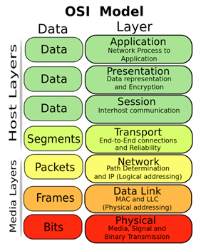

## 7 계층: 응용 계층(Application Layer)

- 사용자가 네트워크에 접근할 수 있도록 해주는 계층. 사용자에게 보이는 부분으로 서비스를 제공하는 사용자 프로그램을 말한다.
    - 프로토콜: DHCP, HTTP, DNS, FTP, SMTP 등

## 6 계층: 표현 계층(Presentation Layer)

- 시스템 간의 데이터 형식상 차이를 다루는 계층. 데이터 표현 양식 제공, 데이터 형태(구조) 통일화/변환(Big/Small Radian, 확장자, 암호화, 압축, 인코딩 등)
    - 프로토콜: JPEG, MPEG, AFP, MIME 등

## 5 계층: 세션 계층(Session Layer)

- 종단 간의 응용 프로세스가 통신을 관리하는 계층. 응용프로그램 또는 네트워크 간에 연결을 맺거나 끊기, 연결을 유지하는 기능을 담당하고, 포트(Port) 연결이라고도 한다.
    - 프로토콜: SSH, TLS, RPC 등

## 4계층: 전송 계층(Transport Layer)

- 종단 간의 통신(End to End)을 제어하는 계층. 데이터 전송의 신뢰성을 보장. 에러 제어, 혼잡 제어, 흐름 제어.
    - 프로토콜:  TCP, UDP 등

## 3계층: 네트워크 계층(Network Layer)

- 논리적 주소(IP주소)를 기반으로 출발지에서 목적지까지 가는 데이터 경로를 제어하는 계층. Path Selection, Routing을 하게 된다.
    - 프로토콜: IP, ICMP 등

## 2계층: 데이터 링크 계층(Data link Layer)

- 물리적 주소(MAC 주소)를 기반으로 노드 대 노드(Point-to-Point)로 데이터 전송 형태를 결정하는 계층. 기기간 처리. Error Control(물리계층에서 발생하는 Error), Flow Control(Ex> 스케줄링).
    - 프로토콜: Ethernet, PPP 등

## 1계층: 물리 계층(Physical Layer)

- 전기적인 접속. 통신 매체에 접근하는데 필요한 기계적이고 전기적인 기능과 절차를 규정한다.
    - 케이블, Voltage 등
  
## 요약

- 망: 1계층(물리, 케이블), 2계층(데이터 링크, 이더넷), 3계층(네트워크, IP)
- 웹: 3계층(네트워크, IP), 4계층(전송, TCP or UDP), 5계층(세션, TLS), 6계층(표현, JPEG), 7계층(응용, HTTP)

---

# 네트워크 망 범위, 구조

- 외부망 > 내부망 > 도커망
- 외부 > 공유기 > 내부 포트포워딩 > 도커 > 컨테이너 포트 포워딩

---

# 포트 포워딩

- 요청 포트를 내부의 특정 포트로 연결해 주는것

---

# 터널링

- 외부망을 타고 내부망으로 들어가 내부의 다른 곳으로 접근

---

# HTTP, HTTPS

## HTTP

- HTTP+TCP+IP+네트워크(API) 혹은 HTTP+UDP+IP+네트워크(스트리밍)
- HTTP로 요청을 정의 -> TCP로 통신 연결 확인, http 데이터 패킷화 -> IP로 위치확인 -> 통신
- TCP는 세번의 통신연결을 확인한다(3way handshake)

### 요청 흐름

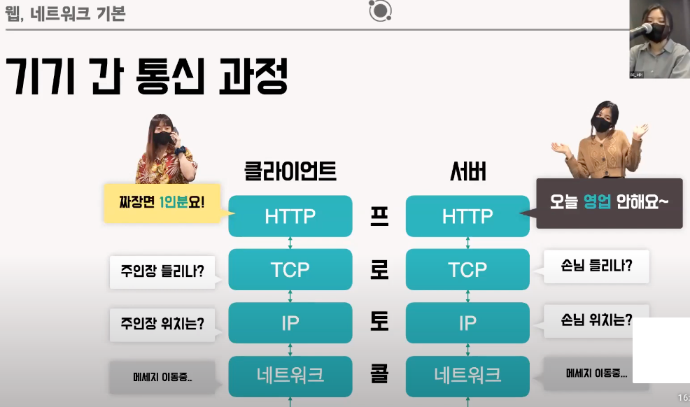

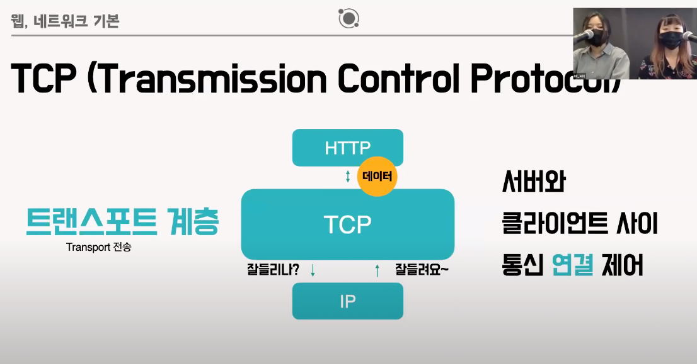

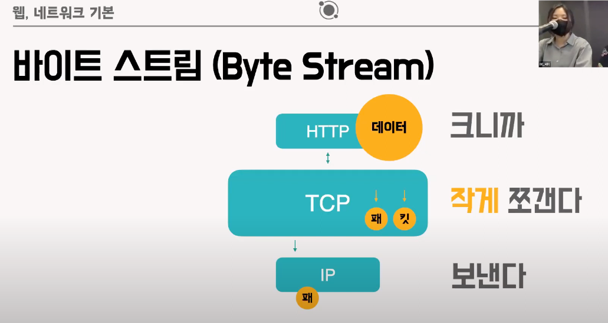

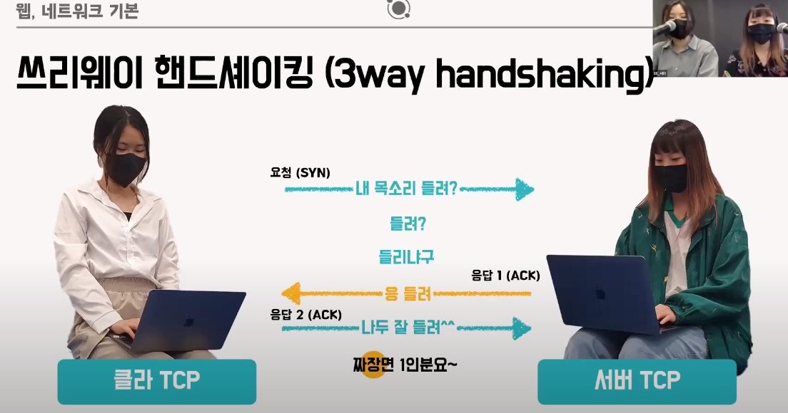

- HTTP로 요청을 정의 -> TCP로 통신 연결 확인, http 데이터 패킷화 -> IP로 위치확인 -> 통신
- TCP는 세번의 통신연결을 확인한다(3way handshake)

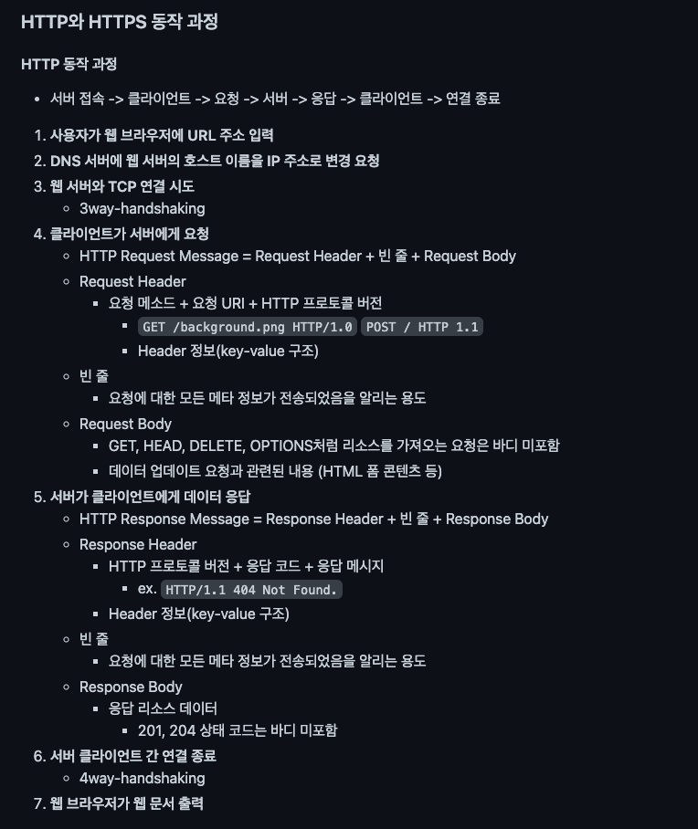

1. 서버 주소를 찾아 HTTP 요청 메시지를 TCP/IP 패킷에 담아 서버에 전달
2. 서버는 받은 메시지를 분석해 HTTP 응답 메시지를 TCP/IP 패킷에 담아 브라우저로 전달
3. 브라우저는 전달받은 데이터로 화면을 출력

### 구조

- 스타트 라인, 헤더, 공백라인(CRLF), 페이로드로 구성

### start-line

- 요청: HTTP Method, 쿼리, HTTP Version
- 응답: HTTP Version, 상태코드, 상태

### Header

#### 요청

- 전송에 필요한 부가 정보를 담고 있음
- Content-type: 미디어 타입 정보 (text/html; application/json...)
- Content-Language: 해당 개체와 가장 잘 어울리는 사용자 언어
- Content-Encoding: 해당 개체 데이터 압축방식 (gzip, deflace..)
- Content-Length: 전달된 해당 개체의 바이트길이 또는 크기(10진수). body 혹은 특정 지정개체의 길이
- Content-Location: 개체가 실제 어디에 위치하는가
- Content-Disposition: Body를 브라우저가 어떻게 표시해야 할지 (inline: 화면, attachment; filename='다운로드 파일명': 다운로드). 파일용 서버일시 자주 사용됨
- Content-Security-Policy: 다른 외부 파일 불러올시 차단할 소스와 불러올 소스를 명시. XSS 공격에 대한 방어가 가능. 
  - default-src https: https를 통해서만 파일을 가져옴
  - default-src 'self': 자신의 도메인의 파일만
  - default-src 'none': 파일을 가져올 수 없음
- Location: 리소스가 리다이렉트 된 때에 이동된 주소 혹은 새로 생성된 리소스 주소. 3xx 응답이나 201 응답일시 어느 페이지로 이동할지 알려주는 헤더
- Last-Modified: 리소스를 마지막으로 갱신한 일시
- Cookie: 서버에 의해 Set-Cookie로 클라이언트에게 설정된 쿠키 정보
- Referer: 바로 직전에 머물었던 웹 링크 주소
- Authorization: 인증 토큰(JWT/Bearer 토큰)을 서버로 보낼 때 사용하는 헤더
  - 토큰의 종류(Basic, Bearer 등) + 실제 토큰 문자를 전송
- Origin:
  - 서버로 POST 요청을 보낼 때, 요청이 어느 주소에서 시작되었는지 나타냄
  - 여기서 요청을 보낸 주소와 받는 주소가 다르면 CORS 에러가 발생
  - 응답 헤더의 Access-Control-Allow-Origin와 관련

#### 응답

- Access-Control-Allow-Origin: 요청을 보내는 프론트 주소와 받는 백엔드 주소가 다르면 CORS 에러가 발생. 서버에서 이 헤더에 프론트 주소를 적어주어야 에러가 나지 않는다.
  - Access-Control-Allow-Origin: *
    - 만약 주소를 일일이 지정하기 싫다면 *으로 모든 주소에 CORS 요청을 허용되지만 그만큼 보안이 취약해진다.
  - 유사한 헤더로 Access-Control-Request-Method, Access-Control-Request-Headers, Access-Control-Allow-Methods, Access-Control-Allow-Headers 등이 있다.
- ETag: HTTP 컨텐츠가 바뀌었는지를 검사할 수 있는 태그
- Allow: 해당 엔터티에 대해 서버 측에서 지원 가능한 HTTP 메소드의 리스트를 나타냄
- Server: 서버 소프트웨어 정보
- Set-Cookie: 서버측에서 클라이언트에게 세션 쿠키 정보를 설정 (RFC 2965에서 규정)
- Expires: 리소스가 지정된 일시까지 캐시로써 유효함

### Method

- GET, POST, PUT, PATCH, DELETE, (+그외 HEAD, OPTIONS, CONNECT, TRACE)
- GET: 조회
- POST: 등록, 성공시 응답헤더 Location에 등록된 자원의 값을 알려줌(e.g. 회원가입시 Location: /users/{신규등록된 회원 번호})
- PUT: 리소스 완전 업데이트, 없을시 생성
- PATCH: 리소스 일부 업데이트
- DELETE: 리소스 삭제
- HEAD: GET과 동일하지만 상태줄과 헤더만 반환
- OPTIONS: 리소스에 대한 통신 가능 옵션 설명(주로 CORS)
- CONNECT: 대상 자원으로 식별되는 서버에 대한 터널을 설정
- TRACE: 대상 리소스에 대한 경로를 따라 메시지 루프백 테스트 수

### HTTP Status

- 1xx: 요청 받았으며 프로세스 처리 진행중 (거의 사용하지 않음)
- 2xx: 성공적으로 처리
- 3xx: 클라이언트의 추가 처리가 필요(헤더의 Location을 통해 리다이렉)
- 4xx: 클라이언트 요청 오류
- 5xx: 서버 오류

### HTTPS 

- HTTP에 암호화를 덧붙인 통신 프로토콜, 서버와 클라이언트간의 메시지를 중간에서 보지 못하게 함
- 기본 포트 443 
- SSL(Secure Socket Layer)/TLS 프로토콜로 세션 데이터를 암호화 한다(TLS는 SSL에서 발전된 상위개념)
  - 두 프로토콜은 ID 및 디지털 인증서를 사용한 인증을 제공하며, 기밀성과 데이터 무결성을 지켜 데이터의 보호를 보장한다
  - 보호의 수준은 브라우저의 구현 정확도와, 소프트웨어 및 지원하는 암호화 알고리즘에 따라 달라진다

### 암호화는 어떤 방식으로 이루어지나?

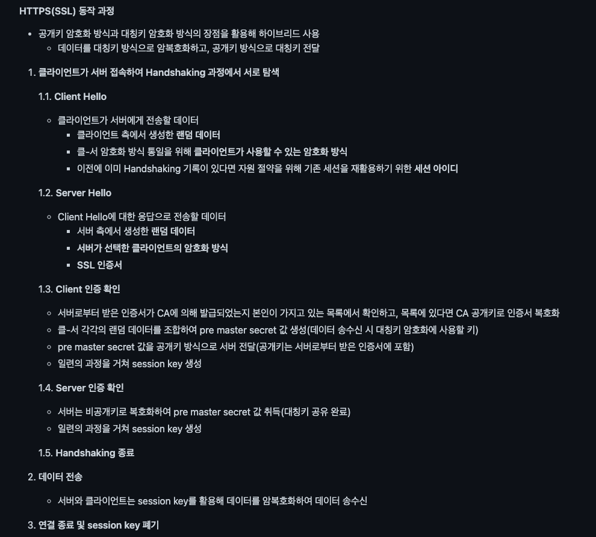

- 인증기관에서 인증서를 발급 받는다
- 암호화, 복호화가 가능한 서로 다른키를 이용해 암호화한다 (공개키, 개인키)
  - 공개키: 모두에게 공개, 공개키 저장소에 등록
  - 개인키: 개인에게만 공개, 클라어언트와 서버 중 서버가 가지고 있음
  - 대칭키: 공개/비공개키 대신 이를 대칭키로 암호화하여 공개/비공개키 대신 대칭키를 사용할 수 있다. 성능상 이득이 있다.
- 클라이언트-> 서버
  1. 데이터를 공개키로 암호화 (공개키를 얻은 인증된 사용자)
  2. 서버로 전송
  3. 서버의 개인키로 복호화하여 처리
  
### HTTPS 장단점

- 보안 강화
- 암호화 과정 추가로 인한 성능 하락
- 인증서 설치 및 유지 필요
- 인터넷 연결 끊겼을시 재인증 소요 
  - HTTP는 비연결형으로 웹페이지 끊겼다 다시 연결되어도 페이지를 계속 볼 수 있지만, HTTPS는 소켓에서 인증하기 때문에 인터넷 연결 끊길시 소켓도 끊어져서 HTTPS 재인증해야함
  
---

# DNS

- 호스트<->도메인이름 간의 전환을 도와주는것

## hosts

- 처음엔 pc에 hosts라는 파일을 만들어 도메인명과 ip를 매칭하고, hosts 파일을 정기적으로 업데이트했다
- 그러나 인터넷의 발전으로 너무나 많은 도메인이 생기면서 한계가 도달하여 DNS 서버가 등장하게 됨
- 이제는 로컬환경에서 특정 도메인을 통한 처리가 필요할때만 사용함

## 도메인 계층

- 도메인에는 계층이 존재한다(루트, 네임, com|net..., www)
- 루트 > 네임 > com|net|co.kr... > www순으로 내려가며 호스트를 탐색한다
- 루트 도메인 서버(최상위 도메인): com, net, org, co.kr, ac.kr
  - 도메인을 구매하려면 해당 루트 도메인 내에서 골라야한다

## 동작방식

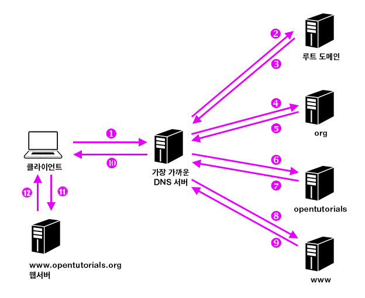

1. 브라우저는 가장 가까운 DNS서버에 해당 도메인에 해당하는 호스트 값을 요청한다
2. DNS 서버가 알고 있는 도메인이면 즉시 응답한다
3. 모르는 도메인일시 DNS 서버는 먼저 루트도메인 서버에 문의한다
4. 루트 도메인은 해당 루트 도메인을 담당하는 DNS 서버 호스트를 알려준다(나는 IP 주소를 가지고 있지 않지만, .org 네임서버에게 물어보면 도와줄꺼야)
5. 해당 루트 도메인에게 문의하면 해당 루트 도메인 서버는 네임서버의 호스트를 알려준다
6. 네임서버는 www 네임서버의 호스트를 알려준다
7. 최종적으로 www 네임서버는 해당 도메인의 IP를 알려주게 되고
8. DNS 서버는 최종적으로 받은 호스트를 브라우저에 전달한다

## 가장 가까운 DNS 서버

- 가장 가까운 DNS 서버의 의미는 클라이언트에 기본적으로 등록되어 있는 DNS 서버를 의미한다. 
- 클라이언트는 최소 한개 이상의 DNS 서버가 등록되어 있어야 이 DNS 서버를 이용해서 접속하고자 하는 도메인에 대한 IP를 알아낼 수 있다. 
- 기본 DNS라고도 하는데 이 정보는 인터넷에 연결하면 인터넷 서비스 제공자(KT, SK브로드밴드 등)에 의해서 자동으로 설정된다. 

---

# TCP, UDP

## TCP

- 네트워크 계층 중 전송 계층에 사용되는 프로토콜
- 느리다
- 패킷으로 데이터를 보낸다
- IP와 함께 사용되는데, TCP는 패킷의 추적 및 관리, IP는 패킷의 전달
- TCP는 세번의 통신연결을 확인한다(3way handshake)
  - 3-way handshaking과정을 통해 연결을 설정하고, 4-way handshaking을 통해 연결을 해제한다.
- 흐름 및 혼잡을 제어한다
- 높은 신뢰성 (요청 및 응답을 모두 확인한다)
- 연속성보다 신뢰성인은 전송이 중요할때 사용

### TCP Header

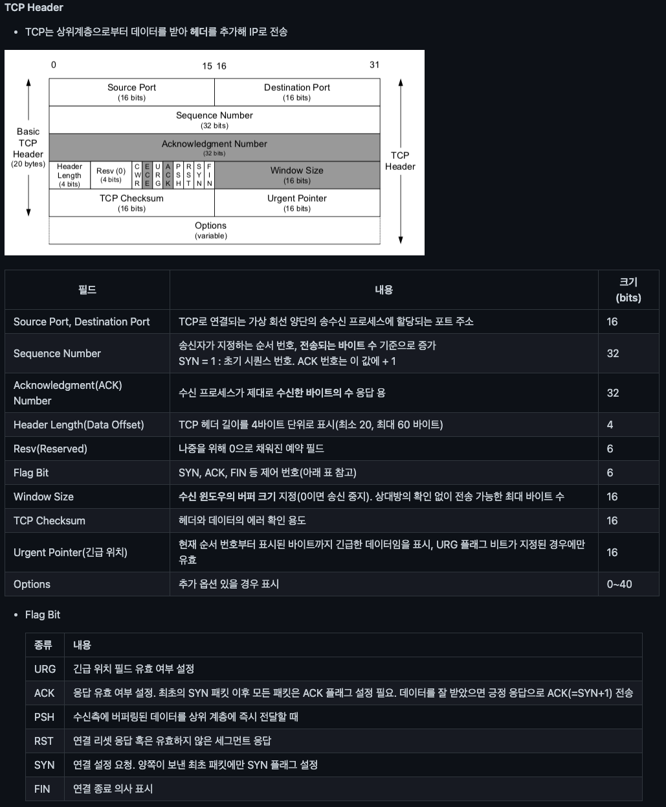

- 보다시피 훨씬 다양하고 자세하게 확인하므로 느리지만 신뢰성이 높음

### TCP 3 way/ 4 way handshake

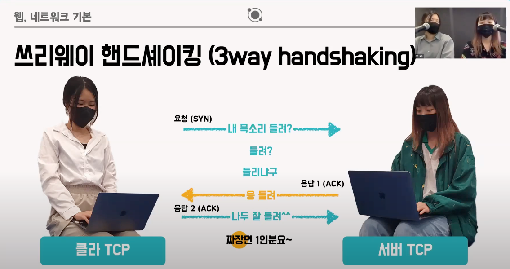

## UDP

- 데이터를 데이터그램 단위로 처리하는 프로토콜이다.
- 비연결형 서비스로 데이터그램 방식을 제공한다.
  - 연결을 위해 할당되는 논리적인 경로가 없다.
  - 그렇기 때문에 각각의 패킷은 다른 경로로 전송되고, 각각의 패킷은 독립적인 관계를 지니게 된다.
  - 이렇게 데이터를 서로 다른 경로로 독립적으로 처리한다.
- 정보를 주고 받을 때 정보를 보내거나 받는다는 신호절차를 거치지 않는다.
- UDP헤더의 CheckSum 필드를 통해 최소한의 오류만 검출한다.
- 신뢰성이 낮다.
- TCP보다 속도가 빠르다.
- 신뢰성보다는 연속성이 중요한 서비스, 예를 들면 실시간 서비스(streaming)에 사용된다.
  - 유튜브나 인터넷방송같은 스트리밍 보다가, 가끔씩 멈추거나 끊어지는 경우가 있고 재접속하면 괜찮아지거나 등등의 문제가 UDP의 특징
  - 스트리밍은 UDP 방식으로 멀티미디어 파일을 분할하여 연속적으로 받아서 계속 재생하는것

### UDP Header

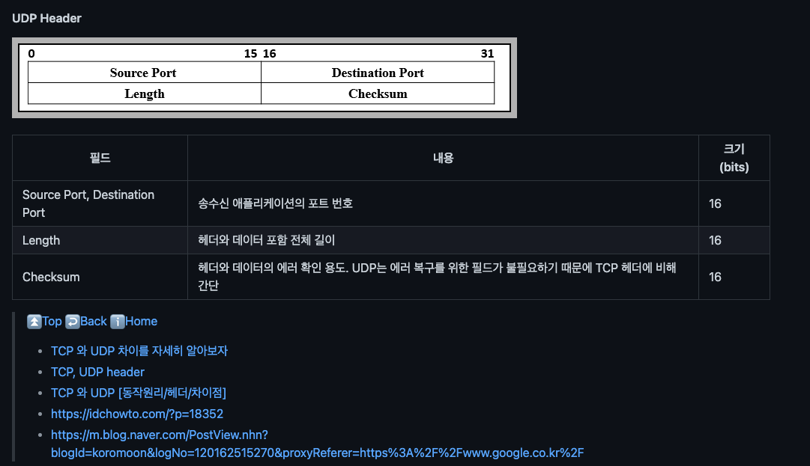

- 최소한의 확인만 거치므로, 신뢰성은 낮으나 신속하다

---

# CORS

- Cross Origin Resource Sharing - 교차 출처 자원 공유
- CSRF, XSS를 막기 위해 CORS, SOP가 등장
- Request Header의 Origin과 Response Header의 Accesss-Controll-Allow-Origin이 동일할시 허용
- CORS 시나리오에는 Preflight Request, Simple Request, Credintialed Request 세가지가 존재

## Preflight

- OPTIONS라는 HTTP Method로 사전 요청을 보내고 헤더를 확인하여 일치할시 본 요청이 들어감
- 불일치할시 브라우저측에서 요청을 차단함

## Simple

- 예비요청없이 본요청에서 두 가지를 다한다
- HTTP Method는 GET, POST, HEAD만 가능
- 특수한 별도의 헤더를 사용할 수 없다
- Content-type에서 form, multipart, text/plain만 가능하다. 이점이 치명적이라 거의 사용 못한다

## Credentialed

- 

---

# Cookie, Session, Token

## 쿠키

- 브라우저에 저장됨.
- 값을 변경할 수 있으므로, 중요한 정보나 변경할 수 없는 정보는 쿠키에 담아두는것은 바람직하지 않음.
- 쿠키 스토리지 크기 제한이 있음.
- 유효기간 존재.

## stateless

- 기본적으로 모든 HTTP 프로토콜은 stateless이다.
- stateless는 모든 요청이 다른 요청과 관련없이 독립적으로 다뤄진다는 뜻.
- 서버는 모든 요청에 대해, 해당 요청이 누구의 요청인지 특정하게 기억해주지 못한다.
- 때문에 누구의 요청인지, 어떤 특정한 요청인지를 알려주고 싶을때 세션이나 토큰을 사용하여 알려주는것이다.

## 세션

- 세션은 서버에서 관리한다.
- 서버는 세션 스토리지에 원하는 값들을 저장한 후, 해당 세션의 id를 클라이언트에 보냄.
- 클라이언트는 해당 세션 id를 쿠키로 저장하고 사용한다.
- 세션 스토리지가 서버에 있으므로, 세션 데이터들을 서버가 관리하므로 보안에 안전.
- 세션 스토리지의 사이즈가 존재하므로 사용자가 많을시 부담이 있을수 있다.
- 보통 이를 해결하기 위해 주로 Redis같은 세션 DB를 별도 구축하여 세션 클러스터링 하여 사용함.

## 토큰

- 서버는 인증 등에 필요한 정보들을 비공개키를 이용해, 토큰으로 인코딩하여 클라이언트에 전달한다.
- 토큰은 header와 payload, signature 3 구조로 되어있다 (header.payload.signature)
  - header: 알고리즘 정보
  - payload: 사용 데이터, 유효기간
  - signature: 보안 서명을 통해 토큰이 변조되지 않았음을 증명
- JWT의 가장 큰 장점은 서버와 DB에 의존하지 않는 쉬운 인증 및 인가방법이라는것.
- JWT 토큰 검증에 필요과 검증에 필요한 비공개키를 처리하는 미들웨어가 필요하다.
- 토큰은 클라이언트에 저장된다.
- 페이로드에 많은 데이터가 추가될수록 토큰이 커진다.
- stateless 앱에서 토큰은 거의 모든 요청에 사용되므로 데이터 트래픽 크기가 커질수 있다.
- 클라이언트와 서버는, 비공개키를 이용해 데이터를 인코딩/디코딩하여 토큰을 만들거나, 토큰의 페이로드에서 필요한 데이터를 꺼내 쓸 수 있다.
- signature에서 변조여부를 확인하고, payload에서 유효기간 또한 확인할 수 있다.
- 토큰은 브라우저나 서버 스토리지를 사용하지 않는다, 문자열의 길이 제한도 없다. 훨씬 간단하다.
- 쿠키는 브라우저에만 존재한다, 그래서 앱들은 토큰을 사용할 수 있다.
- JWT는 세션 스토리지를 사용하지 않으므로, 세션 스토리지 사이즈가 부담될때도 토큰을 사용할 수 있다.
- 토큰은 암호화 된 것이 아니므로, 중요정보는 넣지 않아야한다.

---

# REST, RESTFul, REST API

---

# Socket

---

# WebSocket

---

# Frame, Packet, Segment, Datagram

---
