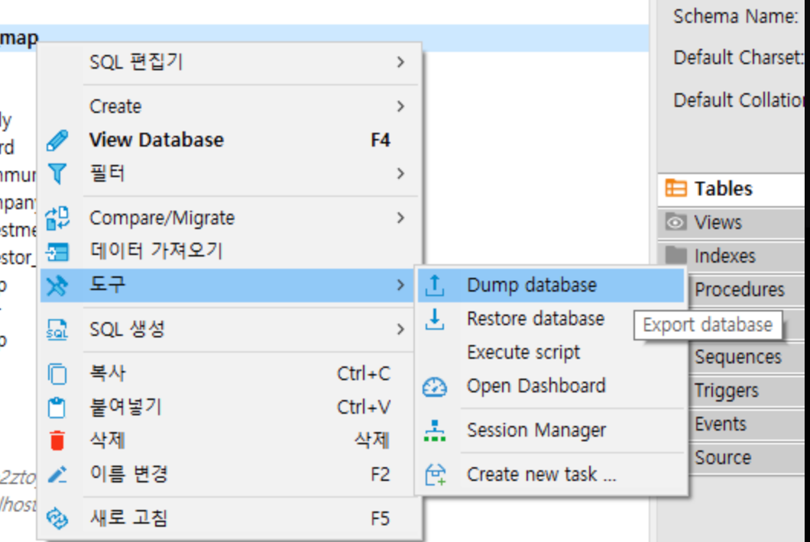
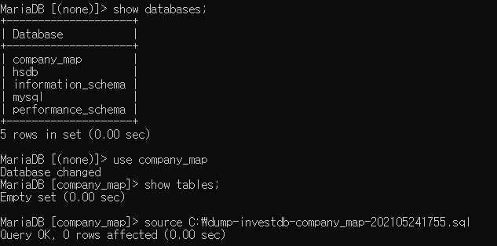
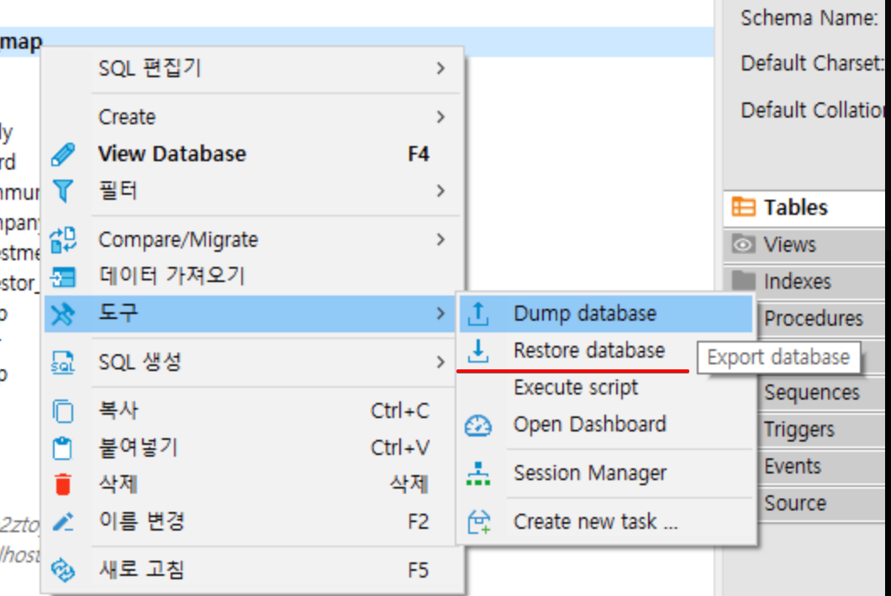

# dump

## CLI

- `mysqldump -u 아이디 -p > 파일경로/파일명.sql` 후 비밀번호 입력

## DBeaver

- db(스키마) 우클릭 후 dump database

# .sql 실행

## CLI

- MySQL 접속 후 `use databases 데이터베이스명`으로 sql파일 실행할 스키마 선택 후 `source 파일경로/파일명.sql`
- 혹은 `mysql -u 아이디 -p < 파일경로/파일명.sql` 후 비밀번호 입력

## DBeaver

- db(스키마) 우클릭 후 restore database 하여 dump한 파일 선택