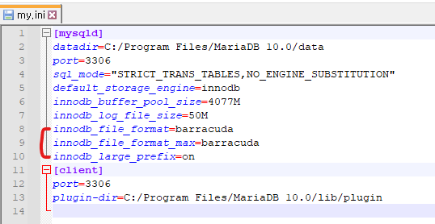
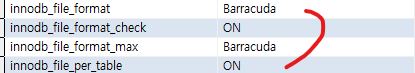
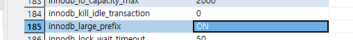

# 개요

- MySQL innodb의 인덱스 대상 컬럼의 길이제한의 기본 설정은 191
    - 컬럼크기를 최대 191로 쓰는건 곤란하니까 DB설정에서 인덱스 길이 제한을 늘려줌

# 설정 파일

- 윈도우는 my.conf, 리눅스는 my.ini 열고 다음과 같은 설정 추가 작성

    ```bash
    innodb_file_format = barracuda
    innodb_file_format_max = barracuda
    innodb_large_prefix = on
    ```

  

- 재가동 후 적용여부 확인

    ```sql
    SHOW VARIABLES; # 전체 설정 보기
    SHOW VARIABLES LIKE 'innodb_lar%';
    SHOW VARIABLES LIKE 'innodb_file%';
    ```

  

  

- 잘 안될시 SQL로 설정 변경

    ```jsx
    SET GLOBAL innodb_file_format_max = "Barracuda";
    SET GLOBAL innodb_large_prefix = on
    SET GLOBAL innodb_file_per_table = 1
    ```

- 테이블 생성시 `ROW_FORMAT=DYNAMIC` 추가되어야함

    ```sql
    CREATE TABLE `테이블명` (
    	컬럼 생성 문구...
    ) ENGINE=InnoDB DEFAULT CHARSET=utf8mb4 ROW_FORMAT=DYNAMIC;
    ```

# 덤프뜰시 오류가 발생할 경우

- 기존 DB를 덤프뜨는데 오류가 발생할경우 → 해당 DB의 인덱스가 너무 많아서
- 이 경우, 해당 DB의 인덱스를 제거하여 덤프뜬 후 인덱스를 재생성해준다

# 참고

- [https://heum-story.tistory.com/136](https://heum-story.tistory.com/136)