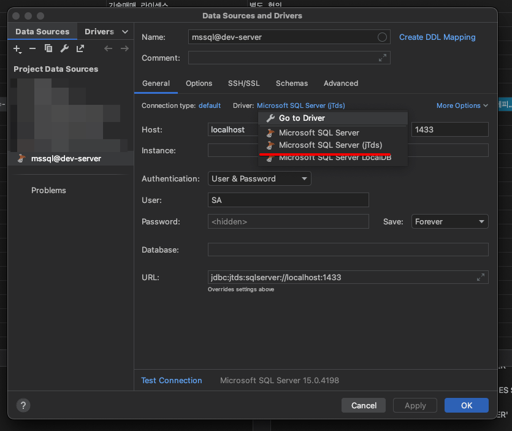
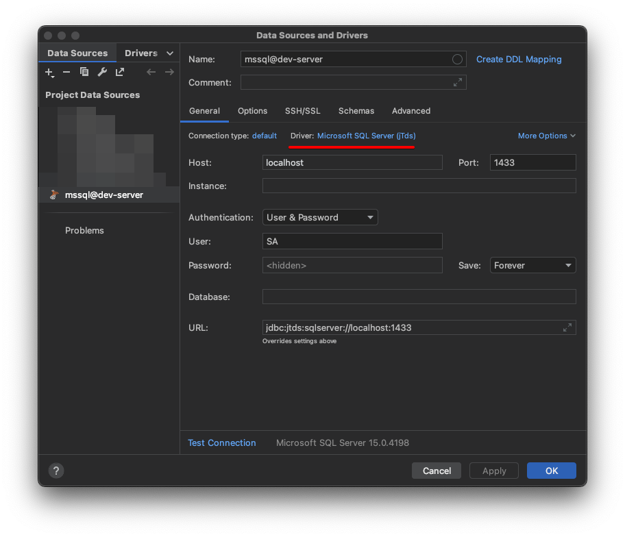

# 개요

- MSSQL 컨테이너 구동법과 DataGrip을 통한 접속 방법.

# 컨테이너 구동

## pull docker image

````shell
docker pull mcr.microsoft.com/mssql/server:2019-latest
````

## run docker container

```shell
docker run -d -p 1433:1433 \
-e "ACCEPT_EULA=Y" \
-e "SA_PASSWORD=SA 계정 비밀번호" \
-v "꺼낸 데이터 저장할 위치":"/var/opt/mssql/data" \
--network="docker network" \
--restart=unless-stopped \
--name mssql mcr.microsoft.com/mssql/server:2019-latest
```

- SA는 MSSQL의 ROOT 계정.

## test

````shell
# 1
docker exec -it mssql bash

# 2
/opt/mssql-tools/bin/sqlcmd -S localhost -U SA -P 비밀번호
````

# DataGrip을 통한 MSSQL 접속





- 일반적인 DataSource 설정과 크게 다른점은 없으나, 한가지 유의할 점이 접속 드라이버 선택.
- 일반적은 Microsoft SQL Server 드라이버가 아닌, Microsoft SQL Server (jTds)를 선택하여야 하며, 그러지 않을시 암호화 관련 오류가 발생하여 접속 오류가 발생함. 
