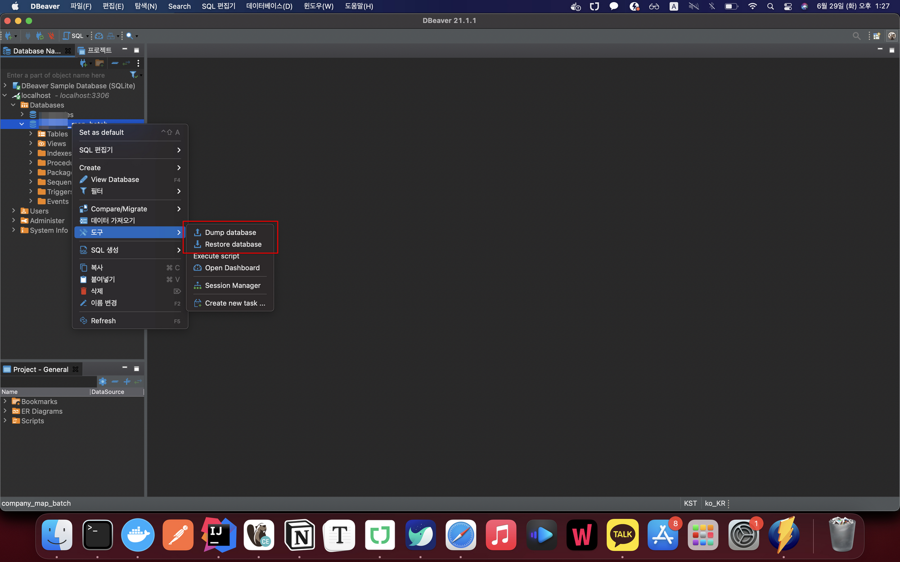

# CLI

## dump

- `mysql -u사용자명 -p비밀번호 스키마명 > 파일경로.sql`
- `mysqldump -u사용자명 -p비밀번호 스키마명 > 파일경로.sql`

## restore

- `mysql -u사용자명 -p비밀번호 스키마명 < 파일경로.sql`
- `mysql -u사용자명 -p비밀번호`로 db접속
    - `use 스키마명`으로 스키마 접속
    - `source 파일경로.sql`

# DBeaver

- 스키마 우클릭 후, dump 혹은 restore 진행