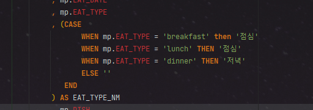

# 개요

조건에 해당하는 값을 반환하는 오라클 SQL문.

if elseif else문.

# SQL

SELECT CASE WHEN col THEN val

                 .....

           ELSE val

        END

# 예

```sql
SELECT CASE WHEN MATH IN (90,91,92,93,94,95,96,97,98,99,100) THEN '수'
						WHEN MATH > 80 AND MATH <= 90 THEN '우'
						WHEN MATH > 70 AND MATH <= 80 THEN '미'
						WHEN MATH > 60 AND MATH <= 70 THEN '양'
						ELSE '가'
			 END as SCORE
FROM TEST
```

