# OSI 7 Layer

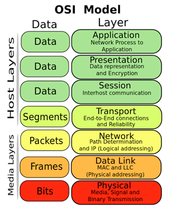

## 7 계층: 응용 계층(Application Layer)

- 사용자가 네트워크에 접근할 수 있도록 해주는 계층. 사용자에게 보이는 부분으로 서비스를 제공하는 사용자 프로그램을 말한다.
    - 프로토콜: DHCP, HTTP, DNS, FTP, SMTP 등

## 6 계층: 표현 계층(Presentation Layer)

- 시스템 간의 데이터 형식상 차이를 다루는 계층. 데이터 표현 양식 제공, 데이터 형태(구조) 통일화/변환(Big/Small Radian, 확장자, 암호화, 압축, 인코딩 등)
    - 프로토콜: JPEG, MPEG, AFP, MIME 등

## 5 계층: 세션 계층(Session Layer)

- 종단 간의 응용 프로세스가 통신을 관리하는 계층. 응용프로그램 또는 네트워크 간에 연결을 맺거나 끊기, 연결을 유지하는 기능을 담당하고, 포트(Port) 연결이라고도 한다.
    - 프로토콜: SSH, TLS, RPC 등

## 4계층: 전송 계층(Transport Layer)

- 종단 간의 통신(End to End)을 제어하는 계층. 데이터 전송의 신뢰성을 보장. 에러 제어, 혼잡 제어, 흐름 제어.
    - 프로토콜:  TCP, UDP 등

## 3계층: 네트워크 계층(Network Layer)

- 논리적 주소(IP주소)를 기반으로 출발지에서 목적지까지 가는 데이터 경로를 제어하는 계층. Path Selection, Routing을 하게 된다.
    - 프로토콜: IP, ICMP 등

## 2계층: 데이터 링크 계층(Data link Layer)

- 물리적 주소(MAC 주소)를 기반으로 노드 대 노드(Point-to-Point)로 데이터 전송 형태를 결정하는 계층. 기기간 처리. Error Control(물리계층에서 발생하는 Error), Flow Control(Ex> 스케줄링).
    - 프로토콜: Ethernet, PPP 등

## 1계층: 물리 계층(Physical Layer)

- 전기적인 접속. 통신 매체에 접근하는데 필요한 기계적이고 전기적인 기능과 절차를 규정한다.
    - 케이블, Voltage 등
  
## 요약

- 망: 1계층(물리, 케이블), 2계층(데이터 링크, 이더넷), 3계층(네트워크, IP)
- 웹: 3계층(네트워크, IP), 4계층(전송, TCP or UDP), 5계층(세션, TLS), 6계층(표현, JPEG), 7계층(응용, HTTP)

---

# 네트워크 망 범위, 구조

- 외부망 > 내부망 > 도커망
- 외부 > 공유기 > 내부 포트포워딩 > 도커 > 컨테이너 포트 포워딩

---

# 포트 포워딩

- 요청 포트를 내부의 특정 포트로 연결해 주는것

---

# 터널링

- 외부망을 타고 내부망으로 들어가 내부의 다른 곳으로 접근

---

# HTTP, HTTPS

## HTTP

- HTTP+TCP+IP+네트워크(API) 혹은 HTTP+UDP+IP+네트워크(스트리밍)
- HTTP로 요청을 정의 -> TCP로 통신 연결 확인, http 데이터 패킷화 -> IP로 위치확인 -> 통신
- TCP는 세번의 통신연결을 확인한다(3way handshake)

### 요청 흐름

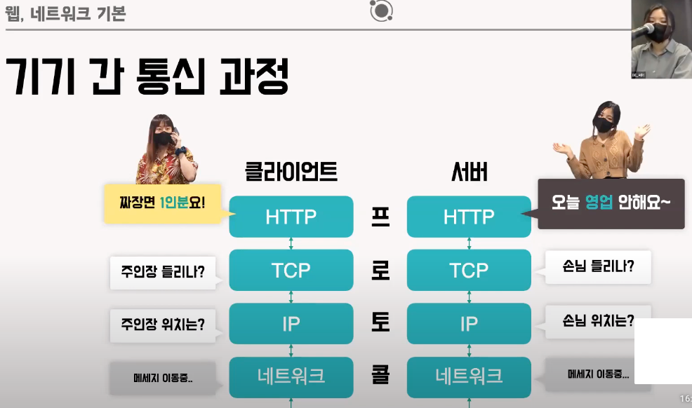

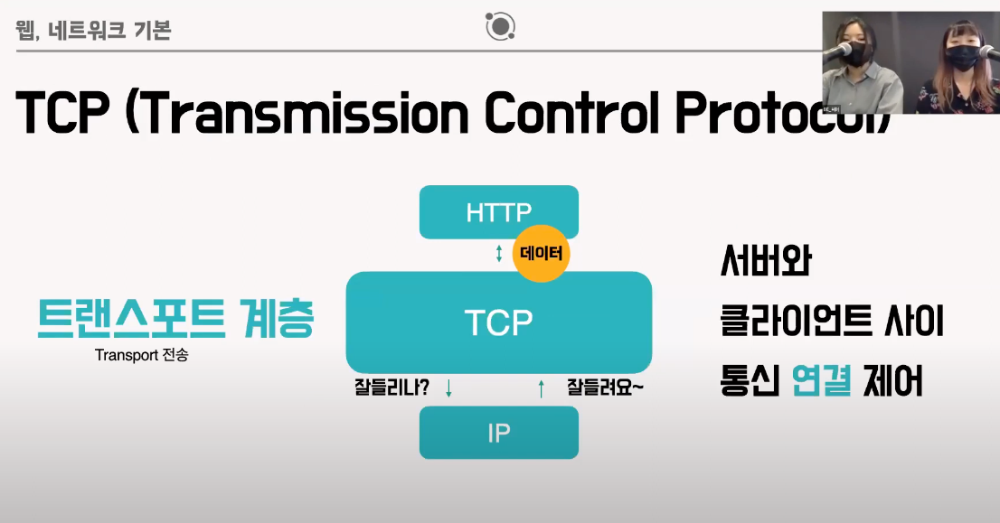

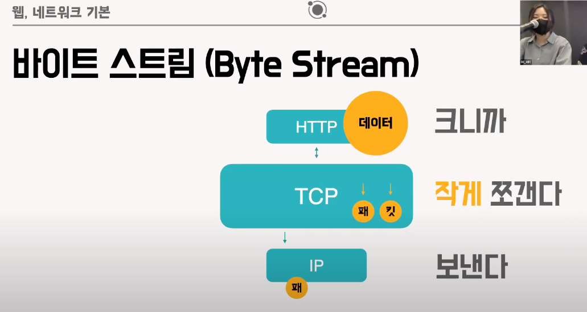

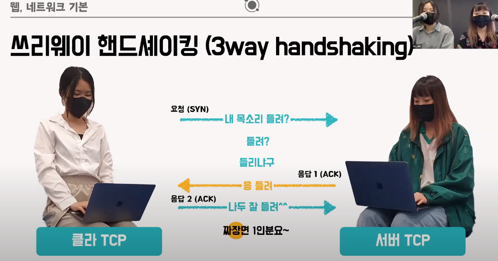

- HTTP로 요청을 정의 -> TCP로 통신 연결 확인, http 데이터 패킷화 -> IP로 위치확인 -> 통신
- TCP는 세번의 통신연결을 확인한다(3way handshake)

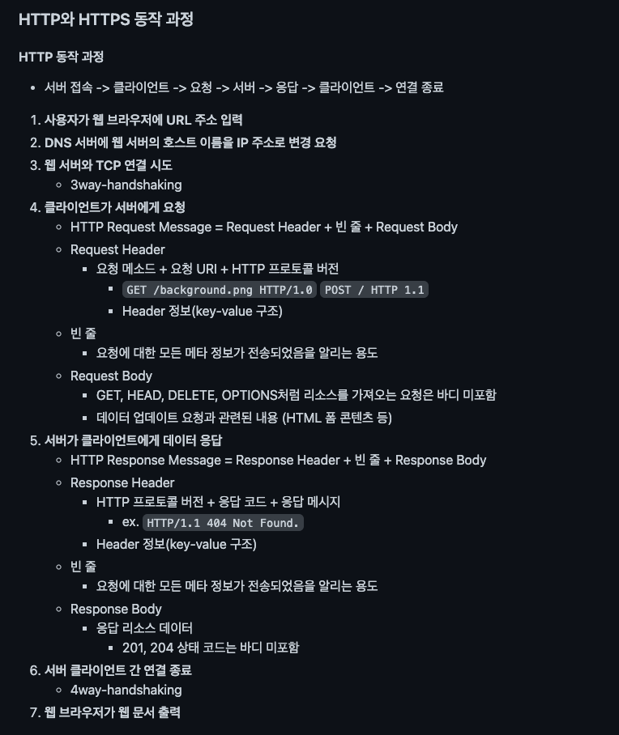

1. 서버 주소를 찾아 HTTP 요청 메시지를 TCP/IP 패킷에 담아 서버에 전달
2. 서버는 받은 메시지를 분석해 HTTP 응답 메시지를 TCP/IP 패킷에 담아 브라우저로 전달
3. 브라우저는 전달받은 데이터로 화면을 출력

### 구조

- 스타트 라인, 헤더, 공백라인(CRLF), 페이로드로 구성

### start-line

- 요청: HTTP Method, 쿼리, HTTP Version
- 응답: HTTP Version, 상태코드, 상태

### Header

#### 요청

- 전송에 필요한 부가 정보를 담고 있음
- Content-type: 미디어 타입 정보 (text/html; application/json...)
- Content-Language: 해당 개체와 가장 잘 어울리는 사용자 언어
- Content-Encoding: 해당 개체 데이터 압축방식 (gzip, deflace..)
- Content-Length: 전달된 해당 개체의 바이트길이 또는 크기(10진수). body 혹은 특정 지정개체의 길이
- Content-Location: 개체가 실제 어디에 위치하는가
- Content-Disposition: Body를 브라우저가 어떻게 표시해야 할지 (inline: 화면, attachment; filename='다운로드 파일명': 다운로드). 파일용 서버일시 자주 사용됨
- Content-Security-Policy: 다른 외부 파일 불러올시 차단할 소스와 불러올 소스를 명시. XSS 공격에 대한 방어가 가능. 
  - default-src https: https를 통해서만 파일을 가져옴
  - default-src 'self': 자신의 도메인의 파일만
  - default-src 'none': 파일을 가져올 수 없음
- Location: 리소스가 리다이렉트 된 때에 이동된 주소 혹은 새로 생성된 리소스 주소. 3xx 응답이나 201 응답일시 어느 페이지로 이동할지 알려주는 헤더
- Last-Modified: 리소스를 마지막으로 갱신한 일시
- Cookie: 서버에 의해 Set-Cookie로 클라이언트에게 설정된 쿠키 정보
- Referer: 바로 직전에 머물었던 웹 링크 주소
- Authorization: 인증 토큰(JWT/Bearer 토큰)을 서버로 보낼 때 사용하는 헤더
  - 토큰의 종류(Basic, Bearer 등) + 실제 토큰 문자를 전송
- Origin:
  - 서버로 POST 요청을 보낼 때, 요청이 어느 주소에서 시작되었는지 나타냄
  - 여기서 요청을 보낸 주소와 받는 주소가 다르면 CORS 에러가 발생
  - 응답 헤더의 Access-Control-Allow-Origin와 관련

#### 응답

- Access-Control-Allow-Origin: 요청을 보내는 프론트 주소와 받는 백엔드 주소가 다르면 CORS 에러가 발생. 서버에서 이 헤더에 프론트 주소를 적어주어야 에러가 나지 않는다.
  - Access-Control-Allow-Origin: *
    - 만약 주소를 일일이 지정하기 싫다면 *으로 모든 주소에 CORS 요청을 허용되지만 그만큼 보안이 취약해진다.
  - 유사한 헤더로 Access-Control-Request-Method, Access-Control-Request-Headers, Access-Control-Allow-Methods, Access-Control-Allow-Headers 등이 있다.
- ETag: HTTP 컨텐츠가 바뀌었는지를 검사할 수 있는 태그
- Allow: 해당 엔터티에 대해 서버 측에서 지원 가능한 HTTP 메소드의 리스트를 나타냄
- Server: 서버 소프트웨어 정보
- Set-Cookie: 서버측에서 클라이언트에게 세션 쿠키 정보를 설정 (RFC 2965에서 규정)
- Expires: 리소스가 지정된 일시까지 캐시로써 유효함

### Method

- GET, POST, PUT, PATCH, DELETE, (+그외 HEAD, OPTIONS, CONNECT, TRACE)
- GET: 조회
- POST: 등록, 성공시 응답헤더 Location에 등록된 자원의 값을 알려줌(e.g. 회원가입시 Location: /users/{신규등록된 회원 번호})
- PUT: 리소스 완전 업데이트, 없을시 생성
- PATCH: 리소스 일부 업데이트
- DELETE: 리소스 삭제
- HEAD: GET과 동일하지만 상태줄과 헤더만 반환
- OPTIONS: 리소스에 대한 통신 가능 옵션 설명(주로 CORS)
- CONNECT: 대상 자원으로 식별되는 서버에 대한 터널을 설정
- TRACE: 대상 리소스에 대한 경로를 따라 메시지 루프백 테스트 수

### HTTP Status

- 1xx: 요청 받았으며 프로세스 처리 진행중 (거의 사용하지 않음)
- 2xx: 성공적으로 처리
- 3xx: 클라이언트의 추가 처리가 필요(헤더의 Location을 통해 리다이렉)
- 4xx: 클라이언트 요청 오류
- 5xx: 서버 오류

### HTTPS 

- HTTP에 암호화를 덧붙인 통신 프로토콜, 서버와 클라이언트간의 메시지를 중간에서 보지 못하게 함
- 기본 포트 443 
- SSL(Secure Socket Layer)/TLS 프로토콜로 세션 데이터를 암호화 한다(TLS는 SSL에서 발전된 상위개념)
  - 두 프로토콜은 ID 및 디지털 인증서를 사용한 인증을 제공하며, 기밀성과 데이터 무결성을 지켜 데이터의 보호를 보장한다
  - 보호의 수준은 브라우저의 구현 정확도와, 소프트웨어 및 지원하는 암호화 알고리즘에 따라 달라진다

### 암호화는 어떤 방식으로 이루어지나?

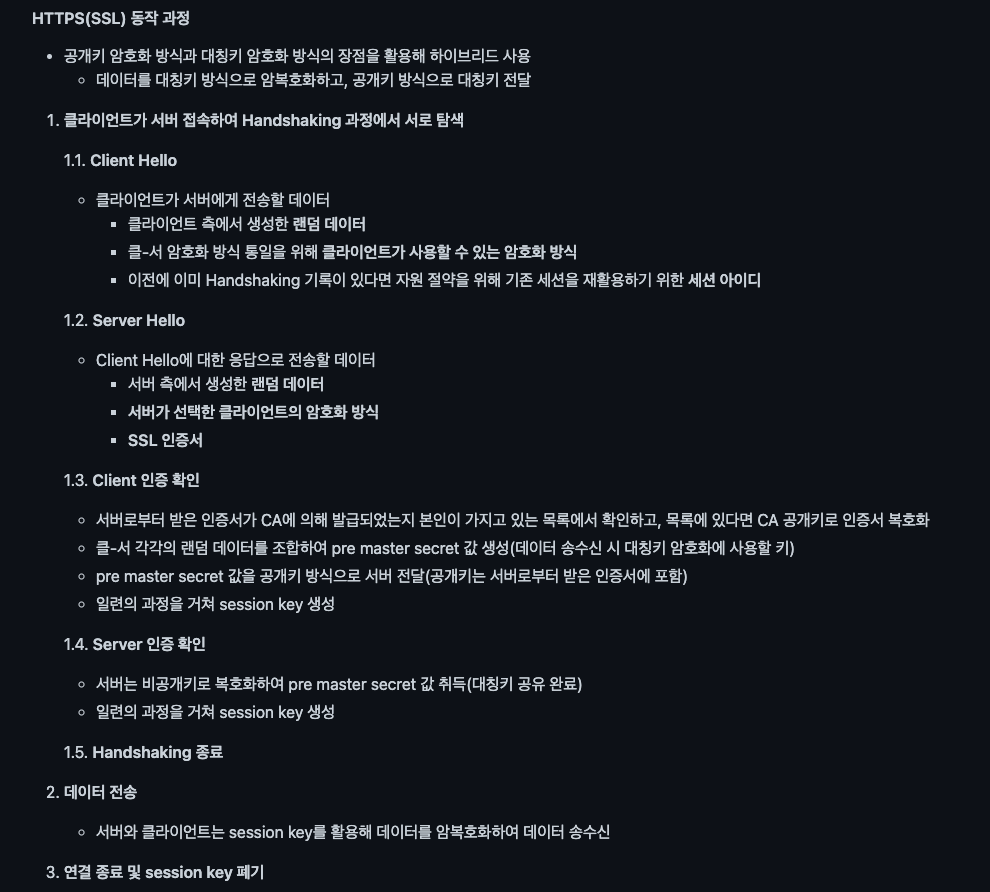

- 인증기관에서 인증서를 발급 받는다
- 암호화, 복호화가 가능한 서로 다른키를 이용해 암호화한다 (공개키, 개인키)
  - 공개키: 모두에게 공개, 공개키 저장소에 등록
  - 개인키: 개인에게만 공개, 클라어언트와 서버 중 서버가 가지고 있음
  - 대칭키: 공개/비공개키 대신 이를 대칭키로 암호화하여 공개/비공개키 대신 대칭키를 사용할 수 있다. 성능상 이득이 있다.
- 클라이언트-> 서버
  1. 데이터를 공개키로 암호화 (공개키를 얻은 인증된 사용자)
  2. 서버로 전송
  3. 서버의 개인키로 복호화하여 처리
  
### HTTPS 장단점

- 보안 강화
- 암호화 과정 추가로 인한 성능 하락
- 인증서 설치 및 유지 필요
- 인터넷 연결 끊겼을시 재인증 소요 
  - HTTP는 비연결형으로 웹페이지 끊겼다 다시 연결되어도 페이지를 계속 볼 수 있지만, HTTPS는 소켓에서 인증하기 때문에 인터넷 연결 끊길시 소켓도 끊어져서 HTTPS 재인증해야함
  
---

# DNS

- IP 주소에 이름을 붙힌다

---

# TCP, UDP

## TCP

- 네트워크 계층 중 전송 계층에 사용되는 프로토콜
- 느리다
- 패킷으로 데이터를 보낸다
- IP와 함께 사용되는데, TCP는 패킷의 추적 및 관리, IP는 패킷의 전달
- TCP는 세번의 통신연결을 확인한다(3way handshake)
  - 3-way handshaking과정을 통해 연결을 설정하고, 4-way handshaking을 통해 연결을 해제한다.
- 흐름 및 혼잡을 제어한다
- 높은 신뢰성 (요청 및 응답을 모두 확인한다)
- 연속성보다 신뢰성인은 전송이 중요할때 사용

### TCP Header

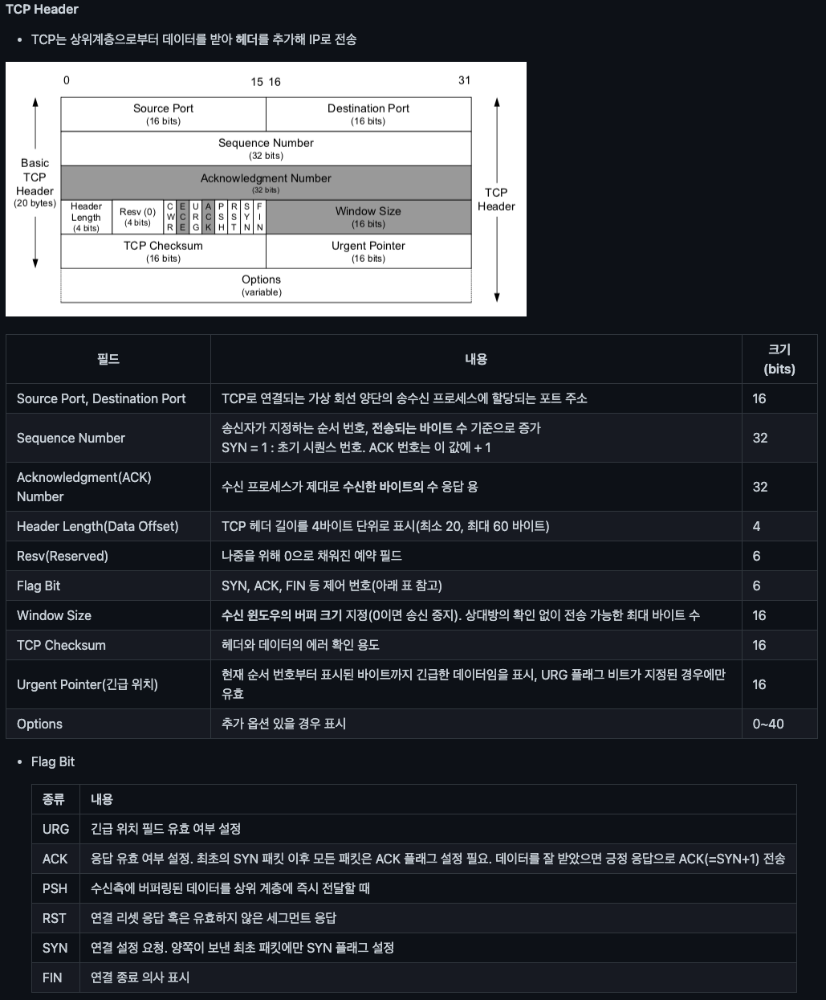

- 보다시피 훨씬 다양하고 자세하게 확인하므로 느리지만 신뢰성이 높음

### TCP 3 way/ 4 way handshake

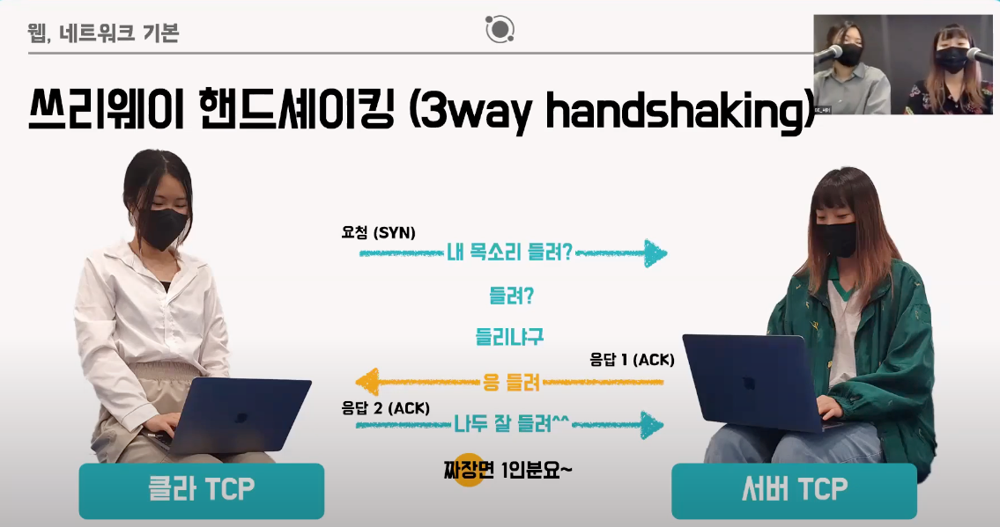

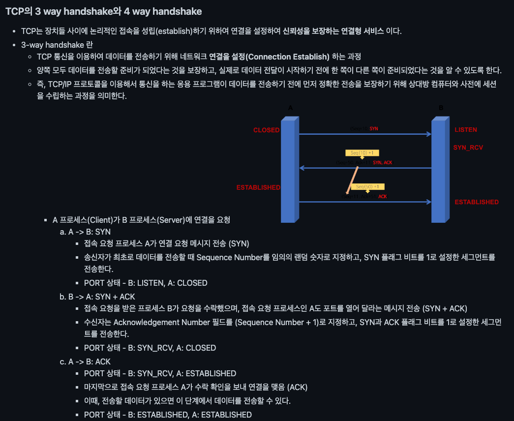

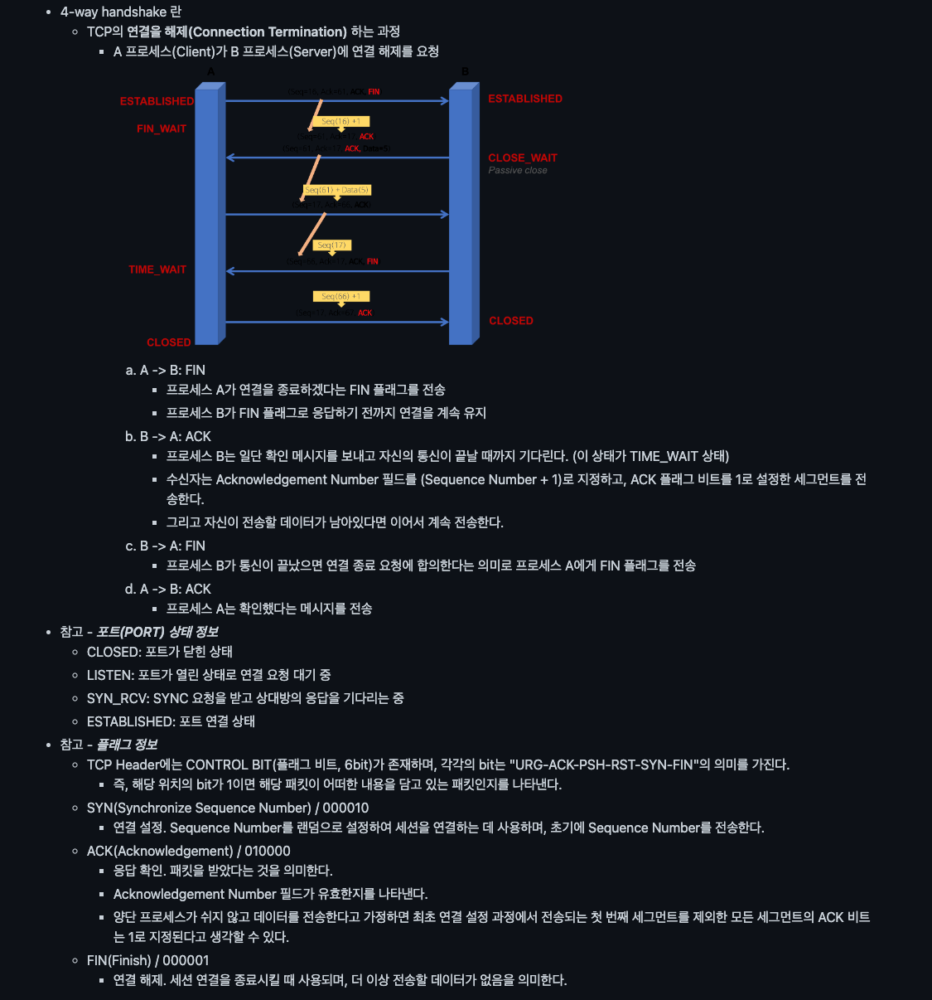

## UDP

- 데이터를 데이터그램 단위로 처리하는 프로토콜이다.
- 비연결형 서비스로 데이터그램 방식을 제공한다.
  - 연결을 위해 할당되는 논리적인 경로가 없다.
  - 그렇기 때문에 각각의 패킷은 다른 경로로 전송되고, 각각의 패킷은 독립적인 관계를 지니게 된다.
  - 이렇게 데이터를 서로 다른 경로로 독립적으로 처리한다.
- 정보를 주고 받을 때 정보를 보내거나 받는다는 신호절차를 거치지 않는다.
- UDP헤더의 CheckSum 필드를 통해 최소한의 오류만 검출한다.
- 신뢰성이 낮다.
- TCP보다 속도가 빠르다.
- 신뢰성보다는 연속성이 중요한 서비스, 예를 들면 실시간 서비스(streaming)에 사용된다.
  - 유튜브나 인터넷방송같은 스트리밍 보다가, 가끔씩 멈추거나 끊어지는 경우가 있고 재접속하면 괜찮아지거나 등등의 문제가 UDP의 특징
  - 스트리밍은 UDP 방식으로 멀티미디어 파일을 분할하여 연속적으로 받아서 계속 재생하는것

### UDP Header

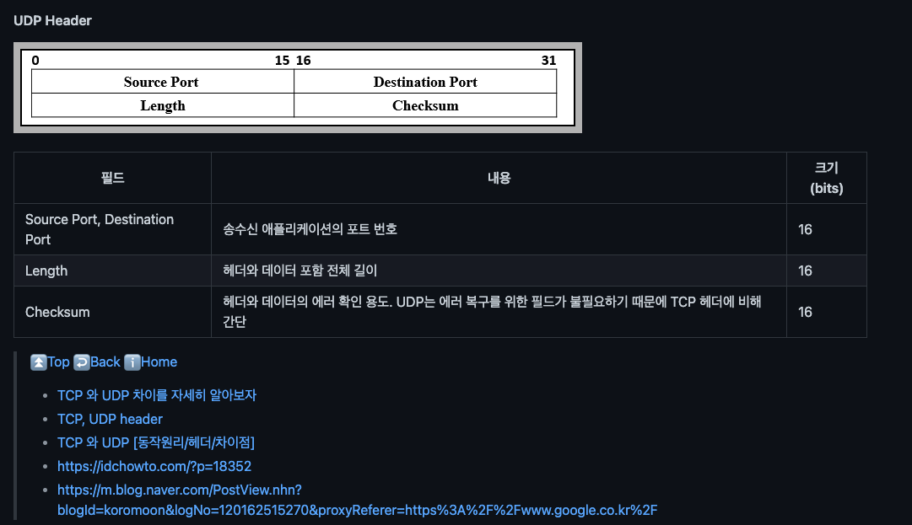

- 최소한의 확인만 거치므로, 신뢰성은 낮으나 신속하다

---

# CORS

- Cross Origin Resource Sharing - 교차 출처 자원 공유
- CSRF, XSS를 막기 위해 CORS, SOP가 등장
- Request Header의 Origin과 Response Header의 Accesss-Controll-Allow-Origin이 동일할시 허용
- CORS 시나리오에는 Preflight Request, Simple Request, Credintialed Request 세가지가 존재

## Preflight

- OPTIONS라는 HTTP Method로 사전 요청을 보내고 헤더를 확인하여 일치할시 본 요청이 들어감
- 불일치할시 브라우저측에서 요청을 차단함

## Simple

- 예비요청없이 본요청에서 두 가지를 다한다
- HTTP Method는 GET, POST, HEAD만 가능
- 특수한 별도의 헤더를 사용할 수 없다
- Content-type에서 form, multipart, text/plain만 가능하다. 이점이 치명적이라 거의 사용 못한다

## Credentialed

- 

---

# Cookie, Session, Token

## 쿠키

- 브라우저에 저장됨.
- 값을 변경할 수 있으므로, 중요한 정보나 변경할 수 없는 정보는 쿠키에 담아두는것은 바람직하지 않음.
- 쿠키 스토리지 크기 제한이 있음.
- 유효기간 존재.

## stateless

- 기본적으로 모든 HTTP 프로토콜은 stateless이다.
- stateless는 모든 요청이 다른 요청과 관련없이 독립적으로 다뤄진다는 뜻.
- 서버는 모든 요청에 대해, 해당 요청이 누구의 요청인지 특정하게 기억해주지 못한다.
- 때문에 누구의 요청인지, 어떤 특정한 요청인지를 알려주고 싶을때 세션이나 토큰을 사용하여 알려주는것이다.

## 세션

- 세션은 서버에서 관리한다.
- 서버는 세션 스토리지에 원하는 값들을 저장한 후, 해당 세션의 id를 클라이언트에 보냄.
- 클라이언트는 해당 세션 id를 쿠키로 저장하고 사용한다.
- 세션 스토리지가 서버에 있으므로, 세션 데이터들을 서버가 관리하므로 보안에 안전.
- 세션 스토리지의 사이즈가 존재하므로 사용자가 많을시 부담이 있을수 있다.
- 보통 이를 해결하기 위해 주로 Redis같은 세션 DB를 별도 구축하여 세션 클러스터링 하여 사용함.

## 토큰

- 서버는 인증 등에 필요한 정보들을 비공개키를 이용해, 토큰으로 인코딩하여 클라이언트에 전달한다.
- 토큰은 header와 payload, signature 3 구조로 되어있다 (header.payload.signature)
  - header: 알고리즘 정보
  - payload: 사용 데이터, 유효기간
  - signature: 보안 서명을 통해 토큰이 변조되지 않았음을 증명
- JWT의 가장 큰 장점은 서버와 DB에 의존하지 않는 쉬운 인증 및 인가방법이라는것.
- JWT 토큰 검증에 필요과 검증에 필요한 비공개키를 처리하는 미들웨어가 필요하다.
- 토큰은 클라이언트에 저장된다.
- 페이로드에 많은 데이터가 추가될수록 토큰이 커진다.
- stateless 앱에서 토큰은 거의 모든 요청에 사용되므로 데이터 트래픽 크기가 커질수 있다.
- 클라이언트와 서버는, 비공개키를 이용해 데이터를 인코딩/디코딩하여 토큰을 만들거나, 토큰의 페이로드에서 필요한 데이터를 꺼내 쓸 수 있다.
- signature에서 변조여부를 확인하고, payload에서 유효기간 또한 확인할 수 있다.
- 토큰은 브라우저나 서버 스토리지를 사용하지 않는다, 문자열의 길이 제한도 없다. 훨씬 간단하다.
- 쿠키는 브라우저에만 존재한다, 그래서 앱들은 토큰을 사용할 수 있다.
- JWT는 세션 스토리지를 사용하지 않으므로, 세션 스토리지 사이즈가 부담될때도 토큰을 사용할 수 있다.
- 토큰은 암호화 된 것이 아니므로, 중요정보는 넣지 않아야한다.

---

# REST, RESTFul, REST API

---

# Socket

---

# WebSocket

---

# Frame, Packet, Segment, Datagram

---
